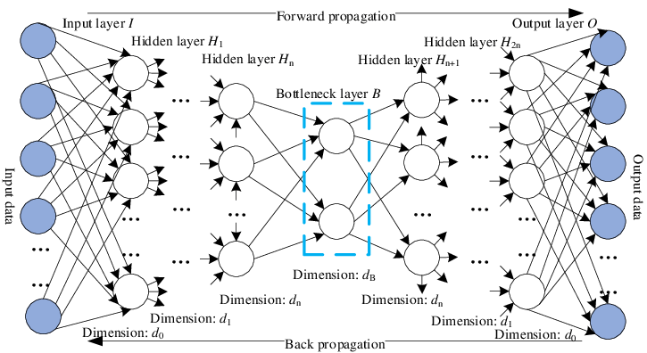

# AutoEncoder

## What is that?
okay, before we talk the math. lets first understand what an AutoEncoder actually is. as the name already states, the idea is to automatically encode the data. so, the model have a purpose to compress high dimensional data (remember image basically a giant matrix) into a smaller set of features. you can think of this process like explaining a panda to someone who has never seen one, at first you might describe many details like it is a mammal, it have a weight of certain amount of kg, have a round ear, it has black and white fur, have a round body, and so on. and this just a lot of explaination, at the end we can "summarize" it by just saying 2 key features "having a black and white fur and having a round body". not really a good explaination/representation to be honest, because our poor friend can mistaken a zebra with panda. but at least it this short description still captures the most important information and allows them to reconstruct the imagination about what is a panda

this is exactly what an Autoencoder does, Its architecture consists of 3 main components. **the encoder** (we trying to tell what is panda), **latent space / Bottleneck** (a very short explaination about panda), and **the decoder** (our dear friend trying to reconstruct the panda). okay that was fun, but lets forget about panda for now. okay, the encoder have a task to compress the input data (for our task, the input data is an image) into a latent space representation. a latent space is a low-dimensional space that should/must captures the essentional/importance features. and the decoder, it task is to reconstruct the input data from the latent space (the compressed representation)

## How we train this network
the main purpose of this network is to be able to reconstruct a new image ($\hat{x}$) from input data ($x$), so the target just basically $x \approx \hat{x}$.. lets split the discussion into three parts. And btw I use fully connected (FC). 

### The Encoder
okay, dont imagining it will be using a hard math. how this part can squeeze the size from the input? the encoder basically just reduce the use of neuron by every layer. so if you read the paper (by Hinton and Salakhutdinov, 2006) titled "Reducing the Dimensionality of Data with Neural Networks" as you see from the title itself, "Neural Networks" and also you gonna see they use term of "The autoencoder consisted of an encoder with layers of size $(28 \times 28) \rightarrow 400 \rightarrow 100 \rightarrow 6$ and a symmetric decoder". this mean, the image size is 28x28 (so, 784 features) connected to 400 neuron in first layer, then the 400 neurons connected to 200 neurons and so on, all the way to 6 neurons. mathematically for 1 layer

$$h = \sigma(W_e \cdot x + b_e)$$

this for neuron not layer, because $h$ means an output vector (containing all output scalar in this layer). $W_e$ is an encoder's weight matrix and $\sigma$ is an activation function (like ReLu) 

### The BottleNeck (The Latent Space)
and then, what happens to the last 6 features? they form the latent space. and it contains a vector $1 x\times n$ where $n$ depends on the number of neurons in the final encoder layer and it dont have to be 2 (e.g. because we have 6 neurons it will form in a vector $z \in \mathbb{R}^6$ so $z = [z_1, z_2, z_3, z_4, z_5, z_6]$ with 6 elements). and This vector contains compressed information that captures the most relevant features of the input. After sufficient training, samples with similar structures often tend to be close to each other in the latent space, although this behavior is not explicitly enforced in a standard autoencoder

### The Decoder 
Decoder, the opposite of encoder. it purpose is just to reconstruct image just with information from the latent space. so it expand the vector contains 6 value back into 784 value

$$\hat{x} = \sigma(W_d \cdot z + b_d)$$

our main target to make the reconstruction $\hat{x}$ more similar to input $x$. how does it really works? okay, back to the Hilton's paper, because of symmetrical architecture if the encoder $784 \rightarrow 400 \rightarrow 100 \rightarrow 6$, so the decoder would be $6 \rightarrow 100 \rightarrow 400 \rightarrow 784$. and we use <a href="LinearTransformation.md">Linear Transformation"</a> followed by activation.

as an example, from latent space ($z$, contain 1x6 vector) into first decoder's layer (100 neuron). first 6 value from the vector in latent space we multipy with a different weights (remember the backboned is not CNN but FC) to get new 100 number, so weight's matrix ($W_{d1}$) have a size of 100x6 (100 from first layer of decoder and 6 from latent space). so for the first layer it will form 

$$h_{d1} = \text{ReLU}(W_{d1} \cdot z + b_{d1})$$

for the second layer (100 neurons to 400 neurons)

$$h_{d2} = \text{ReLU}(W_{d2} \cdot h_{d1} + b_{d2})$$

et cetera

the logic behind this process is, 6 value inside the vector acts like a coordinate. even though we cant make a raw interpretation but let say the first scalar represent the top curve, second scalar represent the the bottom line and so on. you got the idea, and so the weights $W_d$ have to "translate" the coordinat, into more complex pixels pattern. and after going layer after layer, the Decoder reach the last layer with 784 neuron (like the input 28x28). this part have some special with the activation function, because we have to consider the normalize we used in the image. and let say we use MNIST dataset, because this only consist black and white (and between) colours. MNIST often got normalize to the range of 0 until 1. so by this reason alone, we use the Sigmoid activation

$$\hat{x} = \sigma(W_{final} \cdot h_{prev} + b_{final})$$

Sigmoid make every neurons in last layer represents the light intencity of one pixel. so if the output neuron in index 10 is 0.95, it means pixel in index 10 has to be a very bright white. and if the neuron in index 50 is 0.05, it means pixel in index 50 have to be dark. and thats it. ... Well of course the first training it will just construct a random noise. thats why a process called "Backpropagation" will help us fix thats problem. by having the loss, for this problem because of we use MNIST, we can compute by comparing every pixel from the real image into the reconstruction image, will result in a scalar that reprsent the loss. and again we compute the gradien and lastly we updated the weights. for more details, lets discuss it

### Backpropagation

even though this network contain 3 main parts, only 2 trainable (because latent space dont have Weight) and the backpropagation need a loss so it start from the decoder all the way to the encoder. in this case because we compare the images by every pixel, and for this we assume the pixels normalised into [0,1] so 0 (for black) to 1 (for white). so we use Binary Cross Entropy (BCE) for the loss

$$L = -[x \log(\hat{x}) + (1-x) \log(1-\hat{x})]$$

if we use BCE with Sigmoid as actifation function. the final derivative will output-ed simple equation $\hat{x} - x$. this happened because the effect called cancelling out (where the same term appears in both the numerator and the denominator and therefore simplifies to 1. so we can removed it). in Neural Networks we not only looking for the derivative respect of $\hat{x}$, but also with the respect of logit ($z$) (which a value before process by activation function (sigmoid))

**🐻 You can skip this part, i just want to detailing the gradien process**
**I might talk about derivative but maybe later 🦦**
lets make sure we are on the same page, so here are the variables
- Logit ($z$): Input to activation function
- Sigmoid Activation: ($\hat{x}$): $\hat{x} = \sigma(z) = \frac{1}{1 + e^{-z}}$
- Loss ($L$): $L = -[x \log(\hat{x}) + (1-x) \log(1-\hat{x})]$

because we have 2 main components:
1. first part = $x \log(\hat{x})$
2. second part = $(1-x) \log(1-\hat{x})$

now the derivative process, remember derivative from $\log(u)$ is $\frac{1}{u} \cdot \frac{du}{d\hat{x}}$

so, derivative for first part:

$$\frac{d}{d\hat{x}} [x \log(\hat{x})] = x \cdot \frac{1}{\hat{x}} = \frac{x}{\hat{x}}$$

and, for second part we gonna have to use chain rule, we focus to derivate the $\log(1-\hat{x})$ part, hance the derivate of $\log$ is $\frac{1}{1-\hat{x}}$  then we multiply with the derivative inside it (the $1-\hat{x}$, we derivate into -1). so at the end we have the result of $-\frac{1}{1-\hat{x}}$. dont forget with the $(1-x)$ part. so we multiply the both side $(1-x) \cdot \frac{-1}{1-\hat{x}}$ 

and so we got the final result for second part:

$$-\frac{1-x}{1-\hat{x}}$$

Now we have both in form after derivative, then we have to combine it, 

so from

$$-[x \log(\hat{x}) + (1-x) \log(1-\hat{x})]$$

transform into

$$\frac{dL}{d\hat{x}} = -\left[ \frac{x}{\hat{x}} - \frac{1-x}{1-\hat{x}} \right]$$

we can continue it to do simplification, we can make the dominator to be equal 

$$\frac{dL}{d\hat{x}} = -\left[ \frac{x(1-\hat{x}) - \hat{x}(1-x)}{\hat{x}(1-x)} \right]$$

after multiplying the outsider with insider (hehe i dont know how to say it)

$$\frac{dL}{d\hat{x}} = -\left[ \frac{x - x\hat{x} - \hat{x} + x\hat{x}}{\hat{x}(1-\hat{x})} \right]$$

we got 

$$\frac{dL}{d\hat{x}} = -\left[ \frac{x - \hat{x}}{\hat{x}(1-\hat{x})} \right]$$

the negatif ("-") we multiply with the numerator result in 

$$\frac{dL}{d\hat{x}} = \frac{\hat{x} - x}{\hat{x}(1-\hat{x})}$$

now we want to look for derivative of L with respect of z ($\frac{dL}{dz}$). because we want to see what would happen if we change the z, and for this we have to use chain rule:

$$\frac{dL}{dz} = \frac{dL}{d\hat{x}} \times \frac{d\hat{x}}{dz}$$

because to get $z$ to be responsible to the loss $L$ first we have to create a bridge with $\hat{x}$ because reconstruction image is create the lose (so its responsible to the loss) and it also created by the input $z$ (from the neuron, so the input are responsible to it) 

and remember we already computed the first part $\frac{dL}{d\hat{x}}$ so now all we have to do is just doing the derivative for sigmoid to the respect of $z$ ($\frac{d\hat{x}}{dz}$), and what so special about sigmoid is, the derivative can be written as the function it self.

$$\frac{d\hat{x}}{dz} = \hat{x}(1 - \hat{x})$$

now if we multiply both of this derivative

$$\frac{dL}{dz} = \underbrace{\left( \frac{\hat{x} - x}{\hat{x}(1 - \hat{x})} \right)}_{\frac{dL}{d\hat{x}}} \times \underbrace{\hat{x}(1 - \hat{x})}_{\frac{d\hat{x}}{dz}}$$

and so we got the final result of 

$$\frac{dL}{dz} = \hat{x} - x$$

**Ok lets continue our journey**

basically all i want to say is 

$$\delta_{out} = \frac{\partial L}{\partial z_{out}} = \hat{x} - x$$

