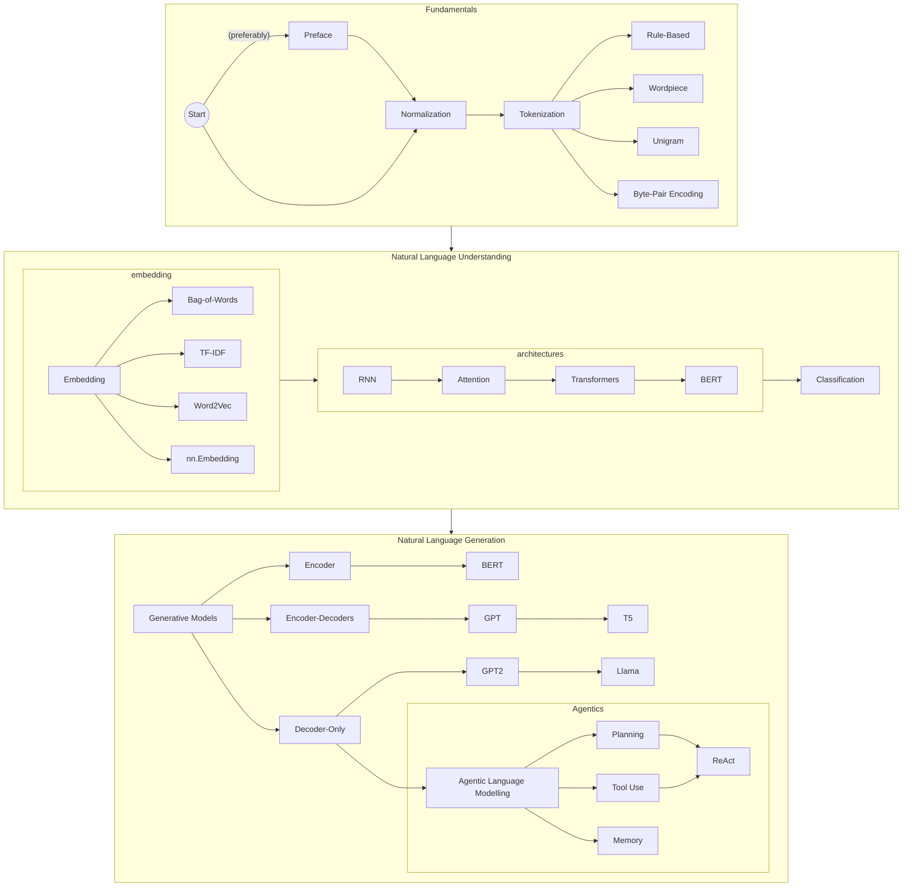

# 🤵‍♀️ Natural Language Processing

Corresponding Author: [Faiz Kautsar](https://github.com/spuuntries)

| Previous Material |   Current   |         Next Material         |
| :---------------: | :---------: | :---------------------------: |
|         ◁         | "NLP Intro" | [▷](./Topics/fundamentals/README.md) |

Natural Language Processing (NLP) is the branch of computer science which deals with processing of natural language information. This module will teach you from the basics of NLP to some of the more recent developments within this space. By the end of this module, the hope is that you'll be able to have a good grasp of the concepts discussed within NLP and be able to create NLP products with extensive understanding of its components.

This module will be divided into two main chapters, of which each correspond to a sub-branch of NLP: `nlu` and `nlg`. Included prior to those two, is also a `fundamentals` chapter which act as a prerequisite. You're expected to follow this flow in exploring this module:

We'll primarily be using [PyTorch](http://pytorch.org/) as our framework of choice for its simplicity in the execution graph representations (i.e., it's dynamically done, and although TF has sorta moved toward this in recent years w/ 2.x, we believe that torch all in all is still much more beginner-friendly, especially for those who are doing experiments) and object-oriented/pythonic, though the concepts explored will be universally-applicable.

To start, go over to [the fundamentals preamble](./Topics/fundamentals/README.md).
