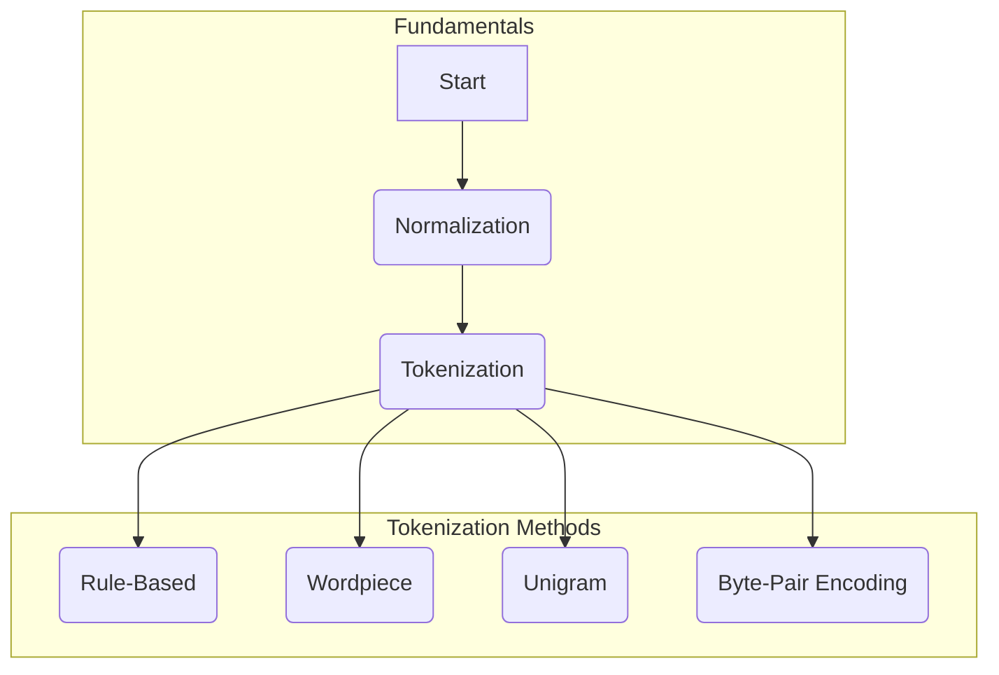

# 📃 Preface

| Previous Material |        Current         |         Next Material          |
| :---------------: | :--------------------: | :----------------------------: |
| [◁](../../README.md) | "Fundamentals Preface" | [▷](./normalization/README.md) |

In NLP, like in other branches of machine learning, prior to actually processing the data, what we need to do is turn the modality of natural text into representations which can be analyzed and modelled numerically, AKA., pre-processing.

Simply put, there's a modality gap from the raw lingustic form of, say, `the quick brown fox jumps over the lazy dog` into the numbers which computers and math can model.

In this chapter, we'll learn how to clean textual data up for processing, then to turn them into representations which would be compatible with mathematically-computed representation modelling. Specifically, refer to the following graph for the materials we'll cover:

Next, go to [**[Normalization]**](./normalization/README.md) for your first material.
