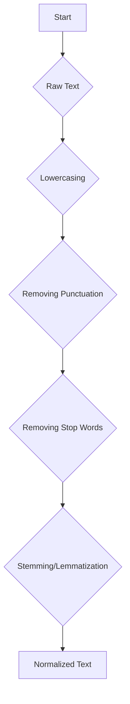

# 🧼 Normalization

| Previous Material |     Current     |         Next Material          |
| :---------------: | :-------------: | :----------------------------: |
| [◁](../README.md) | "Normalization" | [▷](../tokenization/README.md) |

Before tokenizing text, sometimes it's beneficial to normalize it. Normalization is the process of converting a text to a more uniform or canonical form. This helps in reducing the vocabulary size and consolidating words that have the same meaning but are represented differently, getting us faster convergence.

## ⚠️ Normalization and Deep Learning

In classical NLP, normalization is a crucial step to reduce the vocabulary size and improve model performance. However, with the rise of deep learning models, especially large language models (LLMs), the need for aggressive normalization has decreased.

LLMs are trained on massive amounts of data and can learn to handle different forms of words. For example, they can learn that "run", "running", and "ran" are related without needing them to be stemmed to the same root.

Especially in deep learning, excessive normalization, can often result in _worse_ generalization. This is because noise acts as an implicit regularizer. By removing "noise", i.e., irregularities in your data, you can end up "homogenizing" the distribution, resulting in worse real-world performance. [^1] In fact, adding noise can help in your model's generalizability, as the idea is that for _any_ parametrized non-linear mapping $y(x)$, adding noise of $\xi$ gets us an equivalent to a Tikhonov regularizer. [^2]

You can [skip the following bit](#morecontent) if you're not interested in the maths— but for those who are, let's take the mapping $y(x+\xi)$, where $x$ is a $d$-dimensional vector. This is a vector at some $c$ dim. For each $k$ in the vec, we get a sum-squared error (SSE) at

$$
E = \frac{1}{2} \sum_{k} \int \int \{y_k(\mathbf{x}) - t_k\}^2 p(t_k | \mathbf{x}) p(\mathbf{x}) d\mathbf{x} dt_k
$$

where $y_k$ denotes each term in the $c$-dim vec, $t_k$ the target, and $p(\mathbf{x})$ and $p(t_k|\mathbf{x})$ denoting the unconditional and conditional prob densities respectively. For a finite discrete data set of $n$ sample, this becomes
$$E = \frac{1}{2n} \sum_{q} \|\mathbf{y}(\mathbf{x}^q) - \mathbf{t}^q\|^2$$

Assume the conditional averages of the terms are defined as
$$\langle t_{k} \mid \mathbf{x}\rangle \equiv \int t_{k} p\left(t_{k} \mid \mathbf{x}\right) d t_{k}$$
$$\langle t_{k}^{2} \mid \mathbf{x}\rangle \equiv \int t_{k}^{2} p\left(t_{k} \mid \mathbf{x}\right) d t_{k}$$

Taking that first SSE equation and expanding the $\{y_k(\mathbf{x}) - t_k\}^2$ term,

> (via law of total expectation, we condition on $\mathbb{x}$, getting $\mathbb{E}_{\mathbf{x}}[\mathbb{E}_{t_{k}|\mathbf{x}}[(y_{k}(\mathbf{x})-t_{k})^{2}]]$,  
> where expanding by the averages above, we can get $\mathbb{E}_{t_{k}|\mathbf{x}}[(y_{k}(\mathbf{x})-\langle t_{k}|\mathbf{x}\rangle +\langle t_{k}|\mathbf{x}\rangle -t_{k})^{2}]$,  
> then expanding again, $\mathbb{E}_{t_{k}|\mathbf{x}}[(y_{k}(\mathbf{x})-\langle t_{k}|\mathbf{x}\rangle )^{2}]+\mathbb{E}_{t_{k}|\mathbf{x}}[(\langle t_{k}|\mathbf{x}\rangle -t_{k})^{2}]+2\mathbb{E}_{t_{k}|\mathbf{x}}[(y_{k}(\mathbf{x})-\langle t_{k}|\mathbf{x}\rangle )(\langle t_{k}|\mathbf{x}\rangle -t_{k})]$)

we get

$$E=\frac{1}{2}\sum _{k}\iint \{y_{k}(\mathbf{x})-\langle t_{k}|\mathbf{x}\rangle \}^{2}p(t_{k}|\mathbf{x})p(\mathbf{x})d\mathbf{x}dt_{k}+\frac{1}{2}\sum _{k}\iint \{\langle t_{k}^{2}|\mathbf{x}\rangle -\langle t_{k}|\mathbf{x}\rangle ^{2}\}p(t_{k}|\mathbf{x})p(\mathbf{x})d\mathbf{x}dt_{k}$$

As only the first term deals with $y_k(\mathbb{x})$, we take this error and minimize it, the converged upon point is:
$$y^k_{\text{min}}(\mathbf{x}) = \langle t_k | \mathbf{x} \rangle$$

Which is just, the average conditional of the target. _However_, you'll come to notice that there's another term to that

$$E = ... + \underbrace{\frac{1}{2} \sum_{k} \int \int \{\langle t^2_k | \mathbf{x} \rangle - \langle t_k | \mathbf{x} \rangle^2\} p(t_k | \mathbf{x}) p(\mathbf{x}) d\mathbf{x} dt_k}_{\text{Term 2}}$$

This, is the residual error. When this is minimized on, this what _technically_ is being overfit in models, as all that this _is_, is the mean variance of the target data around its conditional average value. It's the inherent noise of the data. It _can't_ be optimized on, and if you do, you'll break your generalization.

Anyway, adding noise $\xi$ to this turns the initial $E$ SSE equation into $\tilde{E}$, where
$$\tilde{E} = \frac{1}{2} \int \int \int \sum_{k} \{y_k(x + \xi) - t_k\}^2 p(t_k | x) p(x) \tilde{p}(\xi)dx d t_k d \xi$$

assuming zero mean and uncorrelated noise terms with variance controlled with $\eta^2$, we get

$$\tilde{E} = E + \eta^2 E_R $$

where

$$E_R = \frac{1}{2} \iint \sum_{k}\sum_{i} \left\{    \left( \frac{\partial y_k}{\partial x_i} \right)^2   + \frac{1}{2} \left\lbrace y_k(x) - t_k \right\rbrace     \frac{\partial^2 y_k}{\partial x_i^2} \right\} p(t_k\mid x) p(x)\,dx\,dt_k$$

this becomes a regularization term as $\left(\frac{\partial y_k}{\partial x_i} \right)^2$ scales with the magnitude of the network's sensitivity. (This can further then be reduced into an equivalent Tikhonov regularizer, as only that term deals with the network, but I digress.)

_However_, interestingly, contrary to the simple derivation above, even _only_ for term 2 for $E$ under deep learning, it's an implicit regularization term. How? In this view, you're often working with optimizers, which don't deal with the raw error function itself, rather, you're dealing with the optimization dynamics: the gradients.

Let's take that finite definition of the SSE,
$$E = \frac{1}{2n} \sum_{q} \|\mathbf{y}(\mathbf{x}^q) - \mathbf{t}^q\|^2$$

ignoring the $\frac{1}{2n}$ for simplicity, the loss looks like

$$L_q(\mathbf{w}) = \frac{1}{2} \|\mathbf{y}(\mathbf{x}^q; \mathbf{w}) - \mathbf{t}^q\|^2$$

where $\mathbf{w}$ are the model parameters. The gradient $\mathbf{g}_q$ that updates the weights is found using the chain rule:

$$\mathbf{g}_q(\mathbf{w}) = \nabla_{\mathbf{w}} L_q(\mathbf{w}) = (\mathbf{y}(\mathbf{w}) - \mathbf{t}^q)^T \cdot \nabla_{\mathbf{w}} \mathbf{y}(\mathbf{w})$$

(Where $\mathbf{y}(\mathbf{w})$ is just shorthand for $\mathbf{y}(\mathbf{x}^q; \mathbf{w})$ and $\nabla_{\mathbf{w}} \mathbf{y}(\mathbf{w})$ is the Jacobian of the network output w.r.t. its weights).

With noise, we split the target $\mathbf{t}^q$ into its true signal and inherent noise:

$$\mathbf{t}^q = \langle \mathbf{t}|\mathbf{x}^q \rangle + \epsilon^q$$

where $\langle \mathbf{t}|\mathbf{x}^q \rangle$ is the _true, clean_ signal and $\epsilon^q$ is the random noise vector (with $\mathbb{E}[\epsilon^q] = 0$).

let's plug this into our gradient equation $\mathbf{g}_q(\mathbf{w})$:

$$\mathbf{g}_{noisy}(\mathbf{w}) = (\mathbf{y}(\mathbf{w}) - (\langle \mathbf{t} \rangle + \epsilon^q))^T \cdot \nabla_{\mathbf{w}} \mathbf{y}(\mathbf{w})$$

now, let's just distribute that term:

$$\mathbf{g}_{noisy}(\mathbf{w}) = \underbrace{\left[ (\mathbf{y}(\mathbf{w}) - \langle \mathbf{t} \rangle)^T \cdot \nabla_{\mathbf{w}} \mathbf{y}(\mathbf{w}) \right]}_{\text{Term A: "Signal" Gradient}} - \underbrace{\left[ (\epsilon^q)^T \cdot \nabla_{\mathbf{w}} \mathbf{y}(\mathbf{w}) \right]}_{\text{Term B: "Noise" Gradient}}$$

- **Term A** is the "true" gradient. It's the gradient you would get if you trained on the _perfectly clean_ data. It points the optimizer towards the "true" generalizable solution.
- **Term B** is a **random noise vector**. Its direction and magnitude depend on the random data noise $\epsilon^q$.

this means that training on noisy data is _mathematically equivalent_ to training on _clean data_ and _adding random noise to the gradients_, regularizing the optimization dynamics. Without this term, your model will (almost, if not) immediately overfit to the first term.

---

It is important to note, however, that normalization can still be useful in certain scenarios:

- **Smaller datasets**: When working with smaller datasets, normalization can help to reduce sparsity and improve model generalization.
- **Specific tasks**: For some tasks, like information retrieval, normalization can still be beneficial.
- **Computational resources**: Normalization can reduce the vocabulary size, which can lead to smaller models and faster training times.

In general, it's a good practice to experiment with different levels of normalization to see what works best for your specific task and dataset.

Anyway, back to it. Other techniques exist, but common normalization techniques include:

- **Lowercasing**: Converting all characters to lowercase. For example, "The" and "the" become the same word.
- **Stemming**: Reducing words to their root form. For example, "running", "ran", and "runner" might all be stemmed to "run".
- **Lemmatization**: Similar to stemming, but it reduces words to their _dictionary_ form (lemma). For example, "better" would be lemmatized to "good".
- **Removing punctuation**: Deleting punctuation marks from the text.
- **Removing stop words**: Eliminating common words that don't carry much meaning, these are practically filler words which require other words to carry any semantical weight. Some examples are "the", "a", and "is".

In essence, it's really just all about cleaning up your data and consolidating redundancies. Next, you can move to the next material at [**[Tokenization]**](../tokenization/README.md), _or_, check out the [normalization notebook](./normalization.ipynb) to see how to do this in code and some more notes. We'll be implementing the following pipeline:

[^1]: Sietsma, J., & Dow, R. J. (1991). Creating artificial neural networks that generalize. Neural Networks, 4(1), 67–79. https://doi.org/10.1016/0893-6080(91)90033-2

[^2]: [Chris M. Bishop; Training with Noise is Equivalent to Tikhonov Regularization. Neural Comput 1995; 7 (1): 108–116. doi: https://doi.org/10.1162/neco.1995.7.1.108](https://direct.mit.edu/neco/article/7/1/108/5828/Training-with-Noise-is-Equivalent-to-Tikhonov)
