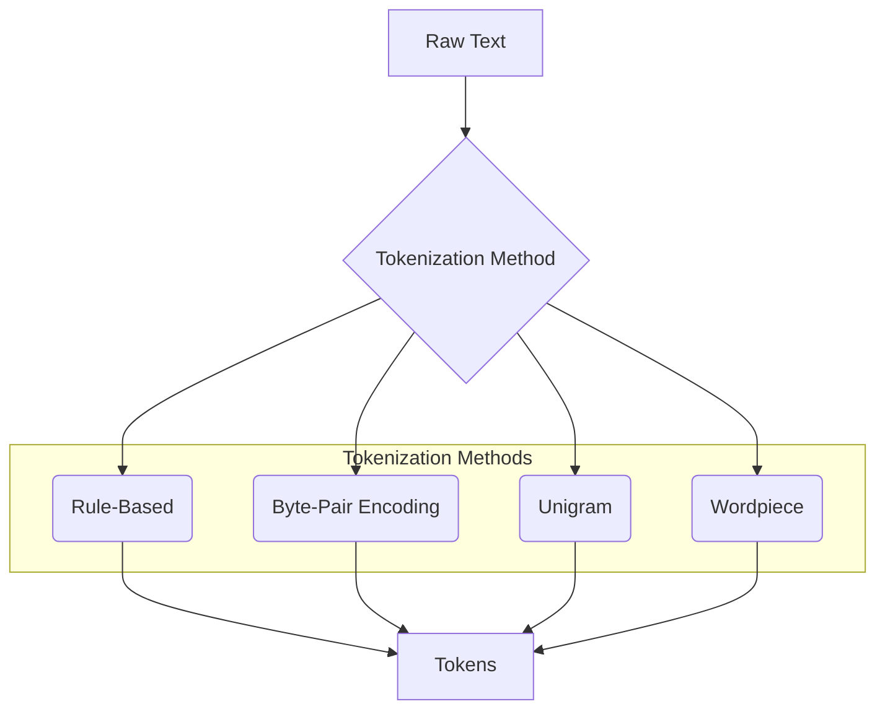

# 🧱 Tokenization

|        Previous Material        |         Current         |    Next Material    |
| :-----------------------------: | :---------------------: | :-----------------: |
| [◁](../normalization/README.md) | "Tokenization Preamble" | [▷](./rulebased.md) |

When we talk about NLP, a core preprocessing task is to turn raw text into a sequence of smaller units called tokens. This process is known as tokenization. These tokens can be words, characters, or subwords. For example, the sentence "The quick brown fox" can be tokenized into the following list of words: `["The", "quick", "brown", "fox"]`.

Tokenization is a fundamental step in many NLP pipelines because it breaks down the text into manageable pieces that can be easily analyzed and processed by machine learning models. Without this step, your model would need to interpret an _astronomical_ amount of possibilities for any given position.

There are several tokenization methods, each with its own strengths and weaknesses. In the following sections, we will explore some of the more commonly used tokenization techniques, including:

- **Rule-Based Tokenization**: Using a set of rules, such as splitting by spaces or punctuation.
- **Byte-Pair Encoding (BPE)**: A data compression technique that is adapted for tokenization, which merges frequent pairs of characters or character sequences.
- **Unigram**: A probabilistic tokenization method that learns to segment text into a vocabulary of unigrams.
- **Wordpiece**: A data-driven tokenization method that breaks words into smaller, more manageable subword units.

Especially in deep learning models like LLMs, tokenization is a huge driver in how well your model could converge. [^1] This is because in language, we don't write things character-by-character, but by subword units: phonemes, graphemes, morphemes.

A character-by-character understanding of linguistics can cause brittle learning dynamics as the subword relationship to be modelled has to be much more tightly-coupled and puts more burden on the explicit representation by your models— it forces the model to learn linguistics from scratch. Another concern is computational costs, a 100-word sentence might be ~130 subword tokens but ~600 character tokens, for architectures where the asymptotic complexity is heavy, this is very undesirable. E.g., in transformers, where it's $O(n^2)$, an $\times 5$ increase in length already constitutes $\times 25$ more memory and compute allocated for it.

Word-level, on the other hand, becomes very brittle in how it represents the _data_. For a word-level model, it will be assumed that _all_ _possible_ words in the data is recorded. Otherwise, it'll collapse into an `<unk>` token (or unknown token, whatever representation you choose to use). This means that, unless you can guarantee that only _words_ will be inputted, your model won't be able to generalize OOV (Out-of-Vocabulary). Assume we had the sequence `The quick brown fox jumped over brittle`. If `brittle` wasn't in our training corpus, the entire word is collapsed into `<unk>`.

Subword tokenization handles these two problems. Rare words by breaking them down (e.g., `tokenization` $\rightarrow$ `["token", "ization"]`) instead of collapsing them to an `<unk>` token, but also reducing the number of subword units that the model has to process per input. This gives the model a huge head start, while also not being too pedantic in how it represents information, by allowing it to focus on learning semantics from meaningful units.

Essentially, tokenization is about the trade-off between _Vocabulary Size ($V$)_ and _Sequence Length ($n$)_, and how they impact a model's _memory_ and _compute_. 

Next, you can either go thru the following for the maths, _or_, you can check out the next material, [Rule-based Tokenization](./rulebased.md) to check out the most basic form of tokenization. Afterwards, check out the [Tokenization notebook](./tokenization.ipynb) to see how we do this in code.

Let's look at this in practice, we'll work with an [RNN](../../nlu/rnn.md) and a [Transformer](../../nlu/transformers.md), both of which are going to be explored more in-depth in the following chapters.

<!-- prettier-ignore -->
A common part of these two is an Embedding layer. Embedding layers turn token ids into high-dimensional vectors (so you tokenize $\rightarrow$ token_id $\rightarrow$ embedding). This can be represented as a matrix $V \times d_{\text{model}}$.

With word-level tokenization, this matrix, say we took in the entire english vocabulary, would scale up _quick_. Assuming $V\geq1,000,000$ with $512$ alone already takes up to $\approx 2$ gigabytes (assuming $1,000,000 \times 512 \times 4 \text{ bytes/float }$).

Under char-level tokenization, the matrix _can_ be better, where, assuming just, basic ascii $V \approx 128$, so $\approx 262$ kilobytes, _but_, you have to also take into consideration the mechanisms which process these tokens: the computational burden.

For self-attention, it computes the relationships between all tokens., so $\propto O(n^2 \cdot d_{\text{model}})$ where $n$ is your sequence length.

Let's take the previous example, in word-level, this is actually pretty good, `["The", "quick", "brown", "fox", "jumped", "over", "brittle"]`, we get only 7 tokens to compute, getting us a small amount of compute requirement. The trade-off here is that you have to ensure `brittle` and many others are in your training corpus, otherwise they'll all collapse into this `<unk>` token which will become a "no-info" sink that your model will inadvertently converge to.

_However,_ let's take a look under char-level, `['T', 'h', 'e', ' ', 'q', 'u', 'i', 'c', 'k', ' ', ..., 'b', 'r', 'i', 't', 't', 'l', 'e']`, with transformers, this is _bad_ because assuming, say, average length of the words is $k$, we get

$$O(n_{\text{char}}^2) = O((k \cdot n_{\text{word}})^2) = O(k^2 \cdot n_{\text{word}}^2)$$

so at _least_, if we had $k\approx5$, this is already _1225_ operations on "average".

Under RNNs, this problem is exacerbated, you can check out the RNNs in later chapters for how this happens, but the learning process is defined by a BPTT gradient term $\frac{\partial h_T}{\partial h_k} = \prod_{i=k+1}^{T} \frac{\partial h_i}{\partial h_{i-1}}$ where that length is $T-k$ where $T=n$. To get the full gradient, the model has to, essentially (this is a bit reductive, but you'll get to understand this later on in further chapters, so I'm simplifying), "accumulate" gradients by multiplying them across _all_ tokens. If _any_ of your gradients were to be unstable (i.e., $>1$ or $<1$), this accumulates _fast_. Even for, say, $0.9$ for each term, after 100 characters, your gradient turns into $\approx 0.000026$. The model _cannot_ learn.

Another problem is that, while RNNs are inherently linear, i.e. $O(n \cdot d_{\text{model}}^2)$ in space, they are also inherently _sequentially_ linear. Assuming a vanilla implementation with some form of non-linearity, this means that you _cannot_ parallelize the computation of terms, so you _have_ to pass inputs _one, by, one,_ into the model, so, say for some char-level sequence that is $6 \times$ longer than a word-level one, it will _literally_ take $6 \times$ _more time_ to run through the rnn layers (for both forward and backward passes)

[^1]: [Tao C, Liu Q, Dou L, Muennighoff N, Wan Z, Luo P, Lin M, Wong N (2024) Scaling Laws with Vocabulary: Larger Models Deserve Larger Vocabularies. In: The Thirty-eighth Annual Conference on Neural Information Processing Systems](https://openreview.net/forum?id=sKCKPr8cRL)
