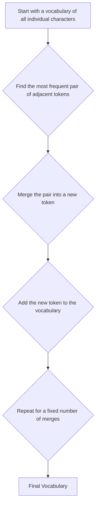

# 🧬 Byte-Pair Encoding (BPE)

|  Previous Material  |      Current       |   Next Material   |
| :-----------------: | :----------------: | :---------------: |
| [◁](./rulebased.md) | "BPE Tokenization" | [▷](./unigram.md) |

Byte-Pair Encoding (BPE) is a super common subword tokenization method that, funny enough, started as a data compression algorithm back in the 90s. [^1] It's a **data-driven** approach, meaning it _learns_ its vocabulary directly from the training corpus.

The core idea is... actually pretty simple. It's a greedy algorithm that just finds the most common pair of _adjacent_ tokens (starting with characters) and merges them into a new, single token. It just does this over and over until it hits a vocabulary size you've set.

To explain this in practice, let's trace an example. Imagine our training corpus just has these words, with these counts (this is a commonly-used example, where the key here is the token sequence and the value is the frequency/"count" in the corpus):

`corpus = {'l o w </w>': 5, 'l o w e r </w>': 2, 'n e w e s t </w>': 6, 'w i d e s t </w>': 3}`

Where `</w>` is a special token that marks the end of a word. This is important because it lets the model learn the difference between `es` in the middle of a word (like "test") and `es` at the end (like "goes").

1.  **Step 1: Init Vocab**  
    Our starting vocabulary ($V$) is just all the individual characters (bytes, really, but I digress) in the corpus.
    `V = {'l', 'o', 'w', '</w>', 'e', 'r', 'n', 's', 't', 'i', 'd'}` (Base size = 11)

2.  **Step 2: Iteration 1**  
    Now, we count all adjacent pairs in our corpus.

    - `('e', 's')`: 6 (from `newest`) + 3 (from `widest`) = 9
    - `('s', 't')`: 6 (from `newest`) + 3 (from `widest`) = 9
    - `('l', 'o')`: 5 (from `low`) + 2 (from `lower`) = 7
    - `('o', 'w')`: 5 (from `low`) + 2 (from `lower`) = 7
    - ...and so on.

    We have a tie at 9. Let's say we break ties alphabetically. `('e', 's')` wins.

    - **Merge 1:** `('e', 's')` $\rightarrow$ `'es'`
    - **Vocab:** `V.add('es')`
    - **Corpus becomes:** `{'l o w </w>': 5, 'l o w e r </w>': 2, 'n e w 'es' t </w>': 6, 'w i d 'es' t </w>': 3}`

3.  **Step 3: Iteration 2**  
    Count again. The most frequent pairs are now `('es', 't')` and `('t', '</w>')`, both with a count of 9.

    - `('es', 't')`: 6 (from `new'es' t`) + 3 (from `wid'es' t`) = 9
    - `('t', '</w>')`: 6 (from `t </w>`) + 3 (from `t </w>`) = 9

    It's another tie. Let's use our tie-breaker again (alphabetical, `'es'` comes before `'t'`). `('es', 't')` wins.

    - **Merge 2:** `('es', 't')` $\rightarrow$ `'est'`
    - **Vocab:** `V.add('est')`
    - **Corpus becomes:** `{'l o w </w>': 5, 'l o w e r </w>': 2, 'n e w 'est' </w>': 6, 'w i d 'est' </w>': 3}`

4.  **Step 4: Iteration 3**  
    Count again.

    - `('est', '</w>')`: 6 (from `n e w 'est' </w>`) + 3 (from `w i d 'est' </w>`) = **9**
    - `('w', 'e')`: 2 (from `lower`) + 6 (from `newest`) = **8**
    - `('l', 'o')`: 5 (from `low`) + 2 (from `lower`) = **7**
    - `('o', 'w')`: 5 (from `low`) + 2 (from `lower`) = **7**

    The new winner is clear: `('est', '</w>')` with a count of 9.

    - **Merge 3:** `('est', '</w>')` $\rightarrow$ `'est</w>'`
    - **Vocab:** `V.add('est</w>')`
    - **Corpus becomes:** `{'l o w </w>': 5, 'l o w e r </w>': 2, 'n e w 'est</w>': 6, 'w i d 'est</w>': 3}`

...and you just keep doing this for a fixed number of merges (e.g., 30,000 times). This number of merges then becomes your main hyperparameter, it directly controls your final vocabulary size ($V$), where $V = \text{base\_vocab\_size} + \text{num\_merges}$, thus letting you manage the $V$ vs. $n$ trade-off we've talked about in the preamble.

(For example, here, it's $V_{\text{iteration 3}} = 11 + 3 = 14$, `{'l', 'o', 'w', '</w>', 'e', 'r', 'n', 's', 't', 'i', 'd', 'es', 'est', 'est</w>'}`.)

## ⚠️ BPE vs. The Real World

This whole process is _way_ simpler than Wordpiece, which has to calculate probabilities and likelihoods. While BPE just... counts. But this simplicity is exactly why it often works great.

This method _directly_ solves the Out-of-Vocabulary (OOV) problem we talked about in the [Rule-Based section](./rule-based.md). If our trained BPE model sees a totally new word like "brittle" (from the [preamble](./README.md)), it **won't** collapse to a useless `<unk>` token.

- In the _absolute worst case_, none of the pairs in "brittle" were ever merged. The tokenizer just defaults to its base vocabulary (the characters). The word becomes: `['b', 'r', 'i', 't', 't', 'l', 'e']`.
- More realistically, common pairs like `br` or `it` or `le` _are_ in the vocabulary. So it might become something like: `['br', 'it', 't', 'le']`.

Either way, the model gets a sequence of meaningful subwords (or at worst, characters) that it can actually learn from, instead of a "no-info" sink.

## The _Byte_-Level Trick (the important bit)

This is where modern models innovated on this idea. [^2] Instead of using _character_-level BPE, they used _Byte_-level BPE. How is this different?

Let's assume your corpus is encoded in Unicode (which, is probably what you wanna target for a modern LLM),

- **Character-level** BPE would have a base vocab of all unicode characters. This is... huge. `(V > 140,000)`. It's messy and still has `<unk>` problems if it sees a character not in the training set (like a new emoji, for example).
- **Byte-level** BPE's base vocabulary is just... all possible bytes. That's it.
  - There are only **256** possible bytes (0-255).
  - This means your base vocabulary is _tiny_, _fixed_, and _complete_.

This means that it can tokenize **anything**. Any UTF-8 string, any language (english, chinese, japanese), any weird unicode symbol (like 🧬), any emoji (like :3), even just random garbage or noise... it all just gets broken down into a sequence of bytes.

This means the model _never, ever sees an unknown token_. It's an incredibly robust way to handle the absolute mess that is real-world text, all while starting with a base vocab of just $V=256$.

## The Downside.

However, BPE is **greedy**. In our example, merging `('e', 's')` first was a permanent choice. What if merging `('w', 'e')` and `('s', 't')` _separately_ would have been _globally_ better in the long run? BPE doesn't know and doesn't care. It just takes the best _current_ merge.

This is the key difference from Unigram, which is probabilistic and can explore multiple different ways to segment the same word. But in practice, BPE's simplicity, speed, and the robustness of the byte-level trick have often made it a top choice for many of the biggest models.

---

Next, you can check out the next material on [Unigram](./unigram.md), _or_, the [Tokenization notebook](./tokenization.ipynb) to see how to do this in code.

[^1]: [Sennrich, R., Haddow, B., & Birch, A. (2016). Neural Machine Translation of Rare Words with Subword Units. _Proceedings of the 54th Annual Meeting of the Association for Computational Linguistics (Volume 1: Long Papers)_.](https://aclanthology.org/P16-1162/)

[^2]: [Radford, A., Wu, J., Child, R., Luan, D., Amodei, D., & Sutskever, I. (2019). Language Models are Unsupervised Multitask Learners. _OpenAI Blog_.](https://cdn.openai.com/better-language-models/language_models_are_unsupervised_multitask_learners.pdf) (GPT-2 paper, which introduced byte-level BPE).
