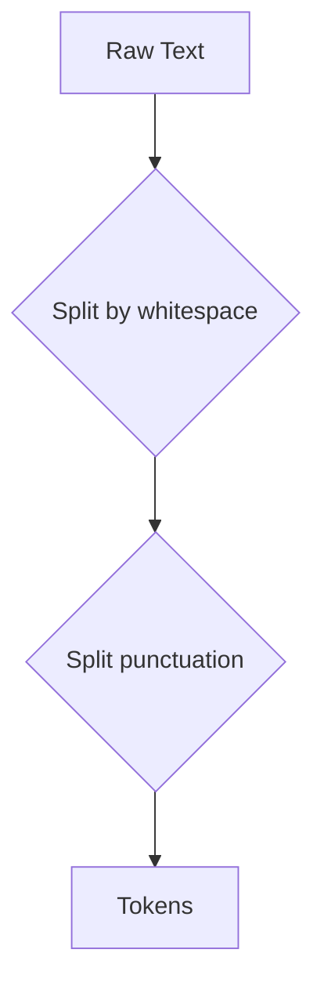

# 📜 Rule-Based Tokenization

| Previous Material |          Current          | Next Material |
| :---------------: | :-----------------------: | :-----------: |
| [◁](./README.md)  | "Rule-based Tokenization" | [▷](./bpe.md) |

Rule-based tokenization uses a set of predefined rules to split text into tokens. These rules are often based on punctuation and whitespace.

For example, a simple rule could be to split the text by spaces. Given the sentence "The quick brown fox jumps over the lazy dog.", this would result in the tokens: `["The", "quick", "brown", "fox", "jumps", "over", "the", "lazy", "dog." ]`.

However, this simple approach has a problem: "dog." includes the punctuation. A more sophisticated rule-based tokenizer would then, therefore, also split based on punctuation. This would give us: `["The", "quick", "brown", "fox", "jumps", "over", "the", "lazy", "dog", "."]`.

While easy to implement, this is where the "easy" part ends. As explained in the [preamble](./README.md), this approach is extremely brittle and fails on... well, most of real-world language.

## The "Edge Cases"

The "edge cases" here aren't really edge cases, they're just... language. The complexity of maintaining a rule-based system explodes immediately.

- **Contractions:** How do you split "don't"?

  - A naive split gives `["don", "'", "t"]`. This is semantically useless.
  - A "smart" rule needs an exception: split `don't` into `["do", "n't"]`.
  - Ok, now add rules for "I'm", "we're", "you'll", "she's", "it's" (but not "its"\!), "cannot", etc. Your exception list is now huge.

- **Abbreviations & Punctuation:** How do you split "Mr. Smith lives in the U.S."?

  - A naive split on `.` gives `["Mr", ".", "Smith", "lives", "in", "the", "U", ".", "S", "."]`.
  - This is _terrible_. It incorrectly splits "Mr.", "U.S.", and treats every period as a separate token, confusing them with the end-of-sentence marker.
  - You now need another exception list for all abbreviations: `Mr.`, `Mrs.`, `Dr.`, `e.g.`, `i.e.`, `U.S.`, `etc.`.

- **Hyphens & Compound Words:** What about "state-of-the-art"?

  - Is it one token: `["state-of-the-art"]`?
  - Or three: `["state", "of", "the", "art"]` (by removing hyphens)?
  - Or five: `["state", "-", "of", "-", "the", "-", "art"]`?
  - The "correct" answer depends entirely on your task, which means more rules.

- **URLs, Emails, and Numbers:** "Email me at user@example.com or call 1-800-555-1234."

  - A rule-based system will shred this into a meaningless pile of `["user", "@", "example", ".", "com"]` and `["1", "-", "800", "-", "555", "-", "1234"]`.

- **Other Languages:**

  - **German:** Has massive compound words like _Donaudampfschifffahrtsgesellschaftskapitän_ (Danube steamship company captain). A whitespace split gives... one token. That's useless.
  - **Japanese, Chinese, Thai:** These languages **do not use spaces** to separate words. A whitespace-based tokenizer fundamentally fails. You need an entirely different, language-specific (and complex) segmentation system.

## ⚠️ Rule-Based vs. Deep Learning

This brittleness creates two massive problems for modern deep learning models, as we've already explored in the preamble:

1.  **Exploding Vocabulary & OOV:** To handle all these cases, you'd have to treat every unique word and its variations ("run", "running", "ran") as separate tokens. This makes your vocabulary size ($V$) _massive_, leading to a giant, slow embedding matrix ($V \times d_{\text{model}}$). Even worse, if you see a word that's not in your exception list or training data (like a typo, "runnning", or a new word), it gets mapped to a single `<unk>` (unknown) token. This is the **Out-of-Vocabulary (OOV)** problem, and it means your model learns _nothing_ from that word.

2.  **Maintenance Nightmare:** Every new piece of slang, every new URL format, every new abbreviation requires a new _manual rule_. This is unscalable and why systems like NLTK or spaCy have tokenizer modules that are incredibly complex. [^1]

This brittleness and the OOV problem are the primary reasons why modern NLP has (almost, if not) entirely moved on to the data-driven subword tokenization methods like BPE, Wordpiece, and Unigram. These methods _learn_ the optimal way to split words from the data itself.

Anyway, next, you can go read the next material on [BPE](./bpe.md), _or_, you can check out the [Tokenization notebook](./tokenization.ipynb#Rule-Based-Tokenization) to see how to do this in code.

[^1]: The [spaCy tokenizer documentation](https://spacy.io/usage/linguistic-features#tokenization) gives a good overview of how complex a "good" rule-based system has to be, with special-case rules, exceptions, and language-specific logic.
