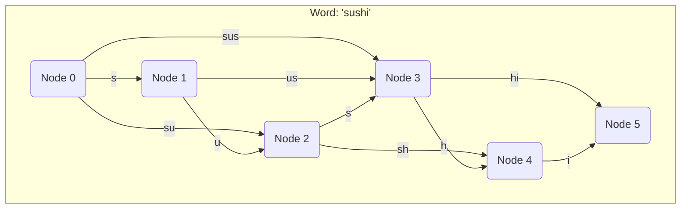
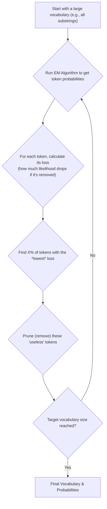

# ⚖️ Unigram

<div style="width: 50%; margin: 0 auto;">

| Previous Material |        Current         |    Next Material    |
| :---------------: | :--------------------: | :-----------------: |
|   [◁](./bpe.md)   | "Unigram Tokenization" | [▷](./wordpiece.md) |

</div>

Alright, as we've seen in [Byte-Pair Encoding (BPE)](./bpe.md), the way that it works is _greedy_. It finds the most frequent pair, merges it, and _never looks back_. It's fast, simple, and works really well, but it's not the only way to do things.

Unigram, which is the model used by _SentencePiece_ from the folks at Google [^1], takes a totally different... and way more "thoughtful" (ig?) approach. Instead of being a bottom-up greedy algorithm, Unigram is a **probabilistic model**.

It assumes that for any given string, there isn't just _one_ "correct" tokenization. Instead, it learns to assign a _probability_ to every possible segmentation. This is super useful for representing ambiguity. For example, 'unforgettable' could be:

- `["un", "forget", "table"]` (prob: 0.6)
- `["un", "forgettable"]` (prob: 0.3)
- `["unforget", "table"]` (prob: 0.1)

This ability to produce multiple segmentations with probabilities is used for **subword regularization** [^2], which is a fancy way of saying it "jitters" the tokenization during training (kinda like the data noise we talked about in [normalization](./README.md)!) to make the final model more robust.

## How it Works: Viterbi & EM

This is a two-part explainer.

1.  **Inference:** How do you find the _best_ tokenization for a word, assuming you _have_ the probabilities?
2.  **Training:** How do you _get_ those probabilities in the first place?

Let's start with inference.

---

## 1. Inference

Assume we _have_ a trained Unigram model. This model is just a big vocabulary $V$, where every single token $v_i$ has a probability $P(v_i)$ (or more accurately, a log-probability) assigned to it.

The model assumes all tokens are independent (that's the "unigram" part). So, the probability of a specific segmentation $x = (x_1, x_2, \dots, x_m)$ is just the product of the probabilities of its parts:

$$
P(x) = \prod_{i=1}^{m} P(x_i)
$$

For a word like "sushi", we can find all possible segmentations from our vocab:

- `s1 = ["su", "sh", "i"]` $\rightarrow P(s1) = P("su") \cdot P("sh") \cdot P("i")$
- `s2 = ["s", "u", "s", "h", "i"]` $\rightarrow P(s2) = P("s") \cdot P("u") \cdot P("s") \cdot P("h") \cdot P("i")$
- `s3 = ["sushi"]` $\rightarrow P(s3) = P("sushi")$

The "best" tokenization is simply the one with the highest probability: $\arg \max_{x \in S(\text{word})} P(x)$.

The problem is that this explodes. For "sushi", we have $2^{(5-1)} = 16$ possible segmentations:

```
["s", "u", "s", "h", "i"]
["su", "s", "h", "i"]
["s", "us", "h", "i"]
...
["sus", "hi"]
...
["sushi"]
```

We'd have to calculate the probability for all 16 paths and then find the max. for a 20-letter word, that's $2^{19} = 524,288$ paths, which is just— crayz.

To find this path efficiently, we use the **Viterbi algorithm**. This is a classic dynamic programming method that builds a lattice (or "trellis") of possibilities, finding the highest-probability path from the beginning of the word to the end.

With Viterbi, we work by building a "lattice" of nodes, where each node $k$ represents the boundary right after the $k$-th character. For "sushi" (length 5), our lattice has 6 nodes (0 to 5):

`[Node 0]` **s** `[Node 1]` **u** `[Node 2]` **s** `[Node 3]` **h** `[Node 4]` **i** `[Node 5]`

- **Node 0** is the "Start" position.
- **Node 5** is the "End" position.

The "edges" between these nodes are the tokens from our vocabulary.

- An edge from `Node 0` to `Node 1` is the token `"s"`.
- An edge from `Node 0` to `Node 2` is the token `"su"`.
- An edge from `Node 1` to `Node 3` is the token `"us"`.
- ...and so on.



The "score" of an edge is its log-probability (we use logs so we can add instead of multiply): $score(token) = \log(P(token))$.

Now, we create two arrays:

1.  **`best_scores[k]`:** Stores the score of the **best possible path** from `Node 0` to `Node k`.
2.  **`backpointers[k]`:** Stores the **token** (or "edge") that _got_ us that best score at `Node k`.

Let's trace it:

- **Step 0: Initialization**

  - `best_scores = [0, -inf, -inf, -inf, -inf, -inf]`
    - The score to get to the start (Node 0) is 0. All others are impossible for now.
  - `backpointers = [null, null, null, null, null, null]`

- **Step 1: Calculate for Node 1 (after 's')**

  - Only one way to get here: from `Node 0` with the token `"s"`.
  - `score = best_scores[0] + log(P("s")) = 0 + log(P("s"))`
  - `best_scores[1] = log(P("s"))`
  - `backpointers[1] = "s"`

- **Step 2: Calculate for Node 2 (after 'u')**

  - Two possible ways to get here:
    1.  From `Node 0` with token `"su"`.
        - $score_A = best\_scores[0] + \log(P("su")) = 0 + \log(P("su"))$
    2.  From `Node 1` with token `"u"`.
        - $score_B = best\_scores[1] + \log(P("u")) = (\log(P("s"))) + \log(P("u"))$
  - Then, we compare them: which is bigger, $score_A$ or $score_B$?
  - Let's say $score_A$ is bigger (i.e., $\log(P("su")) > \log(P("s")) + \log(P("u"))$).
  - `best_scores[2] = score_A`
  - `backpointers[2] = "su"`
  - (We now know the absolute best way to segment "su". We never have to think about `["s", "u"]` again.)

- **Step 3: Calculate for Node 3 (after 's')**

  - Three possible ways to get here:
    1.  From `Node 0` with token `"sus"`.
        - $score_A = best\_scores[0] + \log(P("sus"))$
    2.  From `Node 1` with token `"us"`.
        - $score_B = best\_scores[1] + \log(P("us"))$
    3.  From `Node 2` with token `"s"`.
        - $score_C = best\_scores[2] + \log(P("s"))$
  - We then find the $\max(score_A, score_B, score_C)$.
  - Let's say $score_C$ wins.
  - `best_scores[3] = score_C`
  - `backpointers[3] = "s"`

- ...we keep doing this all the way to `Node 5`.

- **Step 4: We have a winner!**

  - We've calculated `best_scores[5]`. This number is the log-probability of the _best possible segmentation_ for "sushi". The Viterbi algorithm's main loop is done.

- **Step 5: Backtracking**
  - Now, we just need to find out _what_ that path was. We use our `backpointers` array and work backward from the end.
  1.  Start at `Node 5`. What got us here? `backpointers[5]`
  2.  Let's assume the winning path continued from our trace. Let's say it was the token `"i"` (which started at `Node 4`). Add `"i"` to our path. Jump to `Node 4`.
  3.  What got us to `Node 4`? `backpointers[4]`. Let's say it was `"h"` (which started at `Node 3`). Add `"h"` to our path. We jump to `Node 3`.
  4.  What got us to `Node 3`? `backpointers[3]`. From our example trace, this was `"s"` (which started at `Node 2`). Add `"s"` to our path. We jump to `Node 2`.
  5.  What got us to `Node 2`? `backpointers[2]`. From our example trace, this was `"su"` (which started at `Node 0`). Add `"su"` to our path. We jump to `Node 0`.
  6.  We're at `Node 0` (the start). We're done.
  7.  Our path (in reverse) is `["i", "h", "s", "su"]`. Flip it, and we get the best segmentation: `["su", "s", "h", "i"]`.

That's it. By building the best-path-so-far from left to right, we guarantee we've found the single best path without getting lost in that exponential nightmare.

---

## 2. Training: Learning the Probabilities (EM & Pruning)

Okay, but where do the $P(v_i)$ values _come from_? This is a chicken-and-egg problem:

- To get the probabilities, you need the segmentations.
- To get the segmentations, you need the probabilities.

This is what we're trying to solve. We have a corpus $C$ and a (currently too large) vocabulary $V$. We want to find a probability $P(v)$ for every token $v$ in $V$ that makes our corpus $C$ **as likely as possible**.

This "total likelihood" $L$ is the product of probabilities of all sentences $s$ in the corpus. In log-space (which is easier), we want to maximize:

$$
L(\theta) = \sum_{s \in C} \log(P(s))
$$

(where $\theta$ is just the set of all our $P(v)$ probabilities)

Here's the problem: what is $P(s)$? For "sushi", it's not just one probability. It's the **sum of probabilities of _all possible segmentations_**:

$$
P(\text{"sushi"}) = P(["sushi"]) + P(["su", "shi"]) + P(["s", "ushi"]) + P(["su", "s", "hi"]) + \dots
$$

This sum $\sum$ inside the $\log$ is what makes this a "latent variable problem," and it's horrible to optimize directly. The "latent variable" is the "correct" segmentation, which we don't know. To get around this, instead of calculating that messy 'soft' sum of all paths, the Unigram model uses a simpler, faster version called 'Hard EM' or 'Viterbi EM'.

### The EM Algorithm

This is where **Expectation-Maximization (EM)** comes in. It's an iterative algorithm that solves this exact "chicken-and-egg" problem. Since we can't optimize for all paths at once, we just... alternate.

As explained above, the Unigram model uses a simpler, faster version of EM called "Hard EM" or "Viterbi EM". It's a two-step loop. It just finds the single best path (the $\arg \max$) and pretends that's the only one that matters. It's an approximation, but it's way faster. Let's assume we're at some step `t`,

#### **A. The E-Step (Expectation)**

In this step, we **freeze** our current probabilities $\theta^{(t)}$ (our set of all $P(v)$).

Then, for _every single word_ in our training corpus, we run Viterbi. This gives us a new "hypothetically correct" corpus, where _every_ word has been segmented into its single best path.

#### **B. The M-Step (Maximization)**

This step is fairly easy. It's just counting. We **freeze** the new tokenized corpus we just made in the E-Step and treat it as the "ground truth."

Now, we just iterate through this new corpus, count up how many times each token $v$ appears, and re-calculate all the probabilities.

1.  Initialize a new count dictionary, `counts = {}`.
2.  Iterate through our new "best" corpus (e.g., `[["su", "shi"], ["to", "ro"], ["su", "shi"]]...`).
3.  Tally the counts: `counts = {"su": 2, "shi": 2, "to": 1, "ro": 1}`.
4.  Get the total count: `total = 6`.

We then update our probabilities $\theta^{(t+1)}$ to these new, "maximized" values:

- $P("su") = 2 / 6 = 0.33$
- $P("shi") = 2 / 6 = 0.33$
- $P("to") = 1 / 6 = 0.16$
- $P("ro") = 1 / 6 = 0.16$

---

(~~damn~~) That's one full iteration.

We now take these _new_ probabilities (our $\theta^{(t+1)}$) and go right back to the **E-Step**.

Maybe this time, with $P("sushi")$ still at $0.001$ but $P("su")$ and $P("shi")$ now much higher, the Viterbi algorithm _still_ picks `["su", "shi"]`. But for another word, maybe "unforgettable", the probabilities have shifted just enough that Viterbi _changes its mind_ and picks a different best path.

This loop (E-step $\rightarrow$ M-step $\rightarrow$ E-step $\rightarrow$ M-step ...) continues. Each loop is guaranteed to increase (or at least not decrease) the total likelihood $L(\theta)$ of the corpus. We repeat this until the probabilities stop changing much (i.e., the model has _converged_).

### Pruning

Now you're left with a giant, unwieldy vocabulary (we started with _all_ substrings!). This is where the **pruning** part comes in. The goal is to shrink $V$ to a target size (e.g., 32,000).

After an EM-Step converges, the model calculates a "loss" for each token. This loss score is basically: "How much would the _total likelihood_ of the corpus _decrease_ if I completely removed this token $v_i$?"



- **Useless tokens** (e.g., "jet" when `["j", "et"]` is just as good and `j`/`et` are used elsewhere) will have a very **low loss**. Removing them doesn't hurt.
- **Crucial tokens** (e.g., common words like " the" or important subwords like "ing") will have a **high loss**. Removing them would be very bad.

The algorithm then finds the 10-20% of tokens with the **lowest loss** and deletes them. Then it **re-runs the EM algorithm** with this new, smaller vocabulary.

This EM $\rightarrow$ Calculate Loss $\rightarrow$ Prune $\rightarrow$ Retrain loop repeats until the vocabulary is whittled down to your target size.

This process is _way_ more computationally expensive than BPE's simple greedy counting, but it produces a mathematically-grounded vocabulary where each piece has "proven" its worth to the model's overall likelihood.

---

Next, you can check out either the next material on [Wordpiece](./wordpiece.md), or, as always, the [Tokenization notebook](./tokenization.ipynb#Unigram-Tokenization) to see how to do this in code.

[^1]: [Kudo, T., & Richardson, J. (2018). SentencePiece: A simple and language-independent subword tokenizer and detokenizer for Neural Network-based text processing. _Proceedings of the 2018 Conference on Empirical Methods in Natural Language Processing: System Demonstrations_.](https://aclanthology.org/D18-2012/)

[^2]: [Kudo, T. (2018). Subword Regularization: Improving Neural Network Translation Models with Multiple Subword Candidates. \_Proceedings of the 56th Annual Meeting of the Association for Computational Linguistics (Volume 1: Long Papers)\*.](https://aclanthology.org/P18-1007/)
