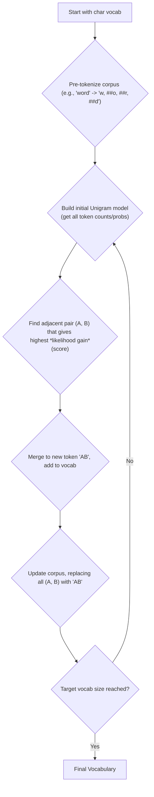

# 🧩 Wordpiece

| Previous Material |         Current          |      Next Material       |
| :---------------: | :----------------------: | :----------------------: |
| [◁](./unigram.md) | "Wordpiece Tokenization" | [▷](../../nlu/README.md) |

Mmmokay, so we've seen [BPE](./bpe.md) which is fast but kinda "dumb" (it's greedy, it just counts), and [Unigram](./unigram.md), which is super-smart and probabilistic but also _way_ more complex to train (that whole EM algorithm).

**Wordpiece** is another subword tokenization algorithm from Google (it was technically introduced in Schuster & Nakajima [^1], but the algorithm's official implementation itself has never been truly open-sourced), and it's most famous for being the tokenizer used by **BERT** (and consequently, a _ton_ of models that came after it, like Electra, BioBERT, etc.). [^2]

It's kinda like a middle ground. it's "bottom-up" like BPE (it starts with characters and merges them), but it uses a "smarter" rule for merging, which is where it feels a bit like Unigram's probabilistic approach.

The most recognizable thing about wordpiece is its output. It uses a `##` prefix to mark any token that is _not_ the start of a word.

For example, the word "unaffable" might be broken into: `["un", "##aff", "##able"]`.

- `"un"` is a token that can start a word.
- `"##aff"` and `"##able"` are tokens that are _inside_ a word.

This is a super important distinction. it lets the model learn the difference between `"aff"` at the start of a word (like in "affiliation") and `"##aff"` in the middle of a word (like in "unaffable").

In terms of logic, the key here is that we're doing _likelihood_, not just frequency. [BPE](./bpe.md) is "dumb" (in a fast, effective way), it just finds the most _frequent_ pair of tokens (e.g., `('e', 's')`) and merges them. It's a simple count.

Wordpiece is "smarter" in the sense that it doesn't just merge the most frequent pair. It merges the pair that _increases the likelihood of the training corpus the most_.

...which is a fancy way of saying it looks for pairs that are "surprisingly common" together, not just common in general. It basically asks: "if i merge `A` and `B` into `AB`, does this new `AB` token make my data 'make more sense' (probabilistically) than just keeping `A` and `B` separate?"

A simple way to model this is to calculate a "likelihood" score for every pair, and pick the highest-scoring one:

$$
\text{score} = \frac{\text{count}(A, B)}{\text{count}(A) \times \text{count}(B)}
$$

(This is related to _Pointwise Mutual Information_, or PMI. Where it's a measure of how likely two tokens are to occur _only_ next to each other.)

Here's how it's trained:

1.  **Step 1: Init & Pre-tokenize**

    - start with a vocabulary `V` containing all the base characters.
    - take your corpus (e.g., `{"low": 5, "lower": 2, ...}`).
    - pre-tokenize _all_ words by splitting them into characters and adding `##` to every piece except the first one.
    - `"low"` $\rightarrow$ `l, ##o, ##w`
    - `"lower"` $\rightarrow$ `l, ##o, ##w, ##e, ##r`
    - `"newest"` $\rightarrow$ `n, ##e, ##w, ##e, ##s, ##t`
    - this becomes our starting "corpus" of token sequences.

2.  **Step 2: Build Initial Model**

    - count all these initial tokens to get their probabilities (this is our starting unigram model).
    - `P(l) = count(l) / total_tokens`
    - `P(##o) = count(##o) / total_tokens`
    - ...and so on.

3.  **Step 3: The Iterative Merge Loop**

    - Now, you run a loop for a set number of merges (e.g., 30,000 times).
    - In each iteration, you find the **best pair** to merge.
    - **Find Best Pair:** look at all _adjacent_ token pairs in your current tokenized corpus (e.g., `(l, ##o)`, `(##o, ##w)`, `(n, ##e)`, `(##e, ##s)`, etc.).
    - **Calculate Score:** for _each_ pair `(A, B)`, you calculate its score, where score is what we saw above,
      - $\text{score} = \frac{\text{count}(A, B)}{\text{count}(A) \times \text{count}(B)}$
    - **Merge:** find the pair `(A_best, B_best)` that has the highest score.
    - **Update:**
      - create the new merged token (e.g., `l##o` or `##es`).
      - add this new token to your vocabulary `V`.
      - go back to your _entire_ tokenized corpus and replace every instance of `A_best, B_best` with the new token `AB`.
      - this updates your counts and probabilities for the next iteration.
    - **Repeat** until your vocab reaches its target size.

Let's see why this is different from BPE in practice, take two pairs, `('e', 's')` and `('t', 'ion')`,

- **Pair 1: `('e', 's')`**

  - `count('e')` is massive (e.g., 10,000,000).
  - `count('s')` is massive (e.g., 8,000,000).
  - `count('e', 's')` is also massive (e.g., 1,000,000).
  - **BPE** would look at `1,000,000` and go ahead and merges it.
  - **Wordpiece** would first calculate the score:
    `1,000,000 / (10,000,000 * 8,000,000)` = a _tiny_ number, like, `0.0000000125` tiny.
  - Wordpiece sees that `e` and `s` appear together, but they also appear with _everything else_ all the time. They don't often occur _only_ next to each other. Merging them doesn't add much new information.

- **Pair 2: `('t', 'ion')`**
  - `count('t')` is high (e.g., 5,000,000).
  - `count('ion')` is pretty high (e.g., 400,000).
  - `count('t', 'ion')` is also pretty high (e.g., 300,000).
  - **BPE** might see `300,000` and merge it, but only _after_ it merges `('e', 's')` and other more frequent pairs.
  - **Wordpiece** calculates the score:
    `300,000 / (5,000,000 * 400,000)` = a _larger_ number.
  - Wordpiece sees that "ion" almost _always_ follows a "t". it's often that they occur _only_ next to each other. Thus, merging them into `"tion"` is a great move because it captures a real, meaningful morphological unit.

So, Wordpiece would merge `('t', 'ion')` into `"tion"` long before it ever considered merging `('e', 's')`. This leads to a more morphologically-aware vocabulary.

Thus, the final algorithm looks like this:

## ...so... what's the difference again?

A lot of stuff, gets confusing, so here's the tl;dr as a recap:

| Method        | How it Trains           | Key Idea                                                                                                     |
| :------------ | :---------------------- | :----------------------------------------------------------------------------------------------------------- |
| **BPE**       | **Bottom-up** (merging) | **Greedy Frequency:** Merges the _most frequent_ adjacent pair. Simple, fast, "dumb".                        |
| **Wordpiece** | **Bottom-up** (merging) | **Likelihood:** Merges the pair that _helps the model's probability_ the most. "Smarter merge".              |
| **Unigram**   | **Top-down** (pruning)  | **Probabilistic:** Starts with all substrings and _prunes_ the ones that hurt the model's probability least. |

Wordpiece and BPE both _build_ a vocab from characters up. unigram _shrinks_ a vocab from substrings down.

Wordpiece's main advantage is that its likelihood-based merging creates a vocabulary that's often better at capturing meaningful subwords (like `##tion` or `##ing`) compared to BPE's "dumber" frequency-based approach. While its main _disadvantage_ is that it's more complex to implement than BPE.

---

Next, as this is the final one in this chapter, you can either move on to the next chapter, [NLU](../../nlu/README.md), _or_, check out the [Tokenization notebook](./tokenization.ipynb#WordPiece-Tokenization) to see how to do this in code.

[^1]: Mike Schuster, & Kaisuke Nakajima (2012). Japanese and Korean Voice Search. In International Conference on Acoustics, Speech and Signal Processing (pp. 5149–5152).

[^2]: [Devlin, J., Chang, M. W., Lee, K., & Toutanova, K. (2019). BERT: Pre-training of Deep Bidirectional Transformers for Language Understanding. _Proceedings of the 2019 Conference of the North American Chapter of the Association for Computational Linguistics: Human Language Technologies, Volume 1 (Long and Short Papers)_.](https://aclanthology.org/N19-1423/)
