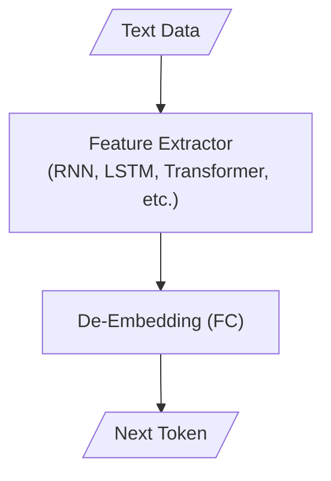
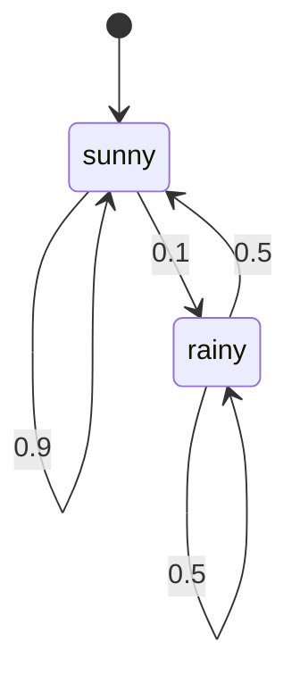
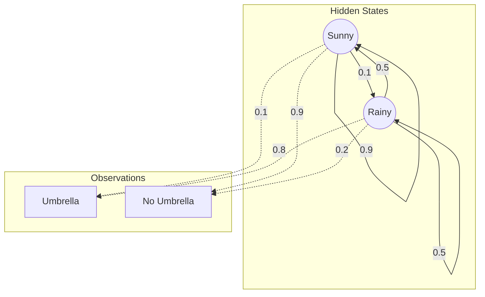

# ✍️ Natural Language Generation

|   Previous Material    | Current |   Next Material   |
| :--------------------: | :-----: | :---------------: |
| [◁](../nlu/cls/cls.md) |  "NLG"  | [▷](./agentic.md) |

Natural Language Generation (NLG) is a sub-branch of NLP which deals with the generation of novel data from the lexical distribution of a given textual corpus. Essentially, what you're trying to do is to form a causal chain of probability distributions, also known as Markov Chains.

> (...for the most part, it gets clunky, but you can arguably reduce it like that imho)

In this chapter, we'll talk about how to go from language generation to agentic patterns: how to go from simply generating text, into reasoning, tool-calling, agents, reasoning agents, tool-calling reasoning agents, how it relates to search algorithms, and how to implement your very own agentic buddy. :3

So, to start things off, what _is_ language generation? Well, recall back to the previous material. Language generation, in its essence, is pretty much just classification over your vocabulary space. What it is, is just slapping an FC head to predict the next token given your model's hidden state.

Now, obviously, there is some nuance to this: how one does classification for discriminative tasks differ from how one would do it for generative tasks. To see why, let's start from a perspective of markov chains.

## Markovian Generation

If you don't know what markov chains are, to derive a bit from its wikipedia page: A Markov process is a stochastic process that satisfies the Markov property, a process for which predictions can be made regarding future outcomes based solely on its present state and that such predictions are just as good as the ones that could be made knowing the process's full history.

$$P(X_{n+1}=x_{n+1} \mid X_n=x_n, \dots, X_0=x_0) = P(X_{n+1}=x_{n+1} \mid X_n=x_n)$$

Where a Markov chain is a type of this that has either a discrete state space or a discrete index set (often representing time). This then can form a graph of probabilities which determines the probability of transition from a state to another, which we can then view as a matrix called a transition matrix. For example, this markov chain

can be viewed this as the matrix

$$
P = \begin{pmatrix}
0.9 & 0.1 \\
0.5 & 0.5
\end{pmatrix}
$$

The reason why we see it as a markov chain is because autoregressive generation is inherently fulfilling of this nature (with some nuance, which we'll get to, eventually): the current state predicts the next state (called the "markovian" property).

This was, in fact, how the very first "actual" NLG systems worked during inference, given the current token, we predict the next.

In predicting the next state, we _have_ to be probabilistic. Otherwise, the sequence would turn into a loop. Take the sequence `the brown fox jumped over the lazy dog near the brown fox which is sleeping`, in this corpus, the highest probability for the follow-up to `the` is `brown`, and `fox` is to `brown`, if we (assuming unigram) greedy explore this, we'll get stuck in a loop of `the brown fox jumped over the brown fox jumped over the ... `.

This is why, during inference, for an NLG model (or any probabilistic sequence model really), we can _sample_ from the distribution of probabilities to prevent said looping issue.

## Deeper Networks

In deeply-learned language models, we _do_ have to adjust the intuition a slight bit, though. This is because deeply-learned models, unlike the markov chain, does the markov process within latent space. This form is called the hidden markov model (HMM). What HMM does is basically define the system as two parts: the emissions and the hidden process.

For example, the above chain can be modified to include the emissions `Umbrella` and `No Umbrella`

which has its own emission matrix, something like

$$
B = \begin{pmatrix}
0.1 & 0.9 \\
0.8 & 0.2
\end{pmatrix}
$$

What this means is that, for an observed state $Y_t$, it's conditionally-independent from all other states when given a hidden $X_t$.

$$P(Y_t \mid X_t, X_{t-1}, Y_{t-1}, \dots) = P(Y_t \mid X_t)$$

This decouples the dependency of the $Y_t$, so $P(Y_t \mid X_t, Y_{t-1}) = P(Y_t \mid X_t)$, which allows us to _not_ depend on the observable transition, and instead the _latent_ transition.

The reason why I brought this up is that in most deeply-learned models, what we do is actualy do _exactly_ (with some leeway for handwaving) this: take an RNN, the observable state, the tokens, are _decoupled_ from the hidden state latent transitions. The difference here is that, in an HMM, the latent state is discrete, whilst an RNN network works over a _continuous_ state vector.

Why the latent factor matters here is that it allows us to prevent the direct dependency of the observable states from one another by relying on the hidden states' "decay", let's try intuiting this.

In a standard Markov chain (assuming unigram), the state is strictly the observable token. If $Y_t = \text{"fox"}$, the distribution for $Y_{t+1}$ is fixed. It doesn't matter if this is the first time or the fiftieth time you've said "fox", the probability table $P(Y_{t+1} \mid Y_t)$ is static.

$$P(Y_{t+1} = \text{"jumped"} \mid Y_t = \text{"fox"}) \equiv \text{constant}$$

But in an Hidden Markov Model (HMM), the probability of the next emission depends on the hidden state $z_t$, not just the previous emission $y_t$.

$$P(y_{t+1} \mid z_{t+1}) \quad \text{where} \quad z_{t+1} \sim P(z_{t+1} \mid z_t)$$

This hidden state $z_t$ can be different even if the emission $y_t$ is the same. You might emit "fox" while in state $z_a$ (Subject-State) and later emit "fox" while in state $z_b$ (Object-State). Because $z_a \neq z_b$, the transition probabilities differ,

$$P(z_{t+1} \mid z_t = z_a) \neq P(z_{t+1} \mid z_t = z_b)$$

which allows us to "remember" context by encoding it into the specific index of the hidden state.

However, because the state of an HMM is discretized, we're still bound for repetition under the pigeonhole principle. Take $K$ states, where $z \in \{1, \dots, K\}$. If you generate a sequence of length $T > K$, you are mathematically guaranteed to revisit a hidden state because

$$\exists \ t, k \quad \text{such that} \quad z_t = z_{t+k}$$

Once $z_t = z_{t+k}$, the system has entered a true cycle. The transition distribution is identical, and if you are sampling greedily (or if the distribution is peaked enough), you will produce the exact same text loop: `the brown fox ... the brown fox ...`. This makes the "memory" of an HMM is hard-capped by $K$.

When we define the state $h$ as a vector in a continuous vector space, $h \in \mathbb{R}^d$, because $\mathbb{R}^d$ is uncountable, the probability of an deeply-learned model, say, an RNN, landing on the exact same hidden vector $h_t = h_{t+k}$ is theoretically zero, assuming the input sequence varies even slightly. This means an RNN can theoretically encode an infinite amount of history (or at least, a unique path) into $h_t$.

"But wait--" I hear you ask, "don't LLMs still repeat anyway? Pretty sure I've seen \<insert-your-favorite-LLM> do it!"

...and you'd be correct. They still do. Why is this? Well, recall that, even in RNNs, we strive for a specific property while training these deeply-learned models: gradient stability.

Deep networks (whether they be recurrent or layer-wise) with total length $T$ introduce a non-linear state transition function parametrized as $\theta$

$$h_{t} = f_\theta(h_{t-1}, x_t)$$

as we've discussed prior in [**Transformers**](../nlu/architectures/transformers.md), this transition is almost always done with a residual flow in mind,

$$h_{t} = h_{t-1} + g_\theta(h_{t-1}, x_t)$$

this is important because this allows us to look at the evolution of the state as integral of a differential field $g_\theta$. When we look at the jacobian of this transition map, we arrive at a familiar equation we've had prior

$$J_t = \frac{\partial h_t}{\partial h_{t-1}} = I + \frac{\partial g_\theta}{\partial h_{t-1}}$$

Ensuring that the network maintains long-term dependencies require that the transformation is dynamically isometric.

As we've explored before in [**Attention**](../nlu/architectures/attention.md) and [**Word2Vec**](../nlu/embedding/word2vec.md) while talking about capacity (near the introduction to JL lemma), a transformation is defined as isometric if it preserves the euclidean metric.

In seeing this, what we can do is see the spectral radius of the jacobian product

$$\mathcal{J}_{total} = \prod_{t=1}^{T} J_t = \prod_{t=1}^{T} \left( I + \frac{\partial g}{\partial h_{t-1}} \right)$$

which is basically just the largest eigenvalue of this matrix, denoted as $\rho(\mathcal{J}_{total})$.

If $\rho(\mathcal{J}_{total}) \gg 1$ this denotes exploding gradients, while $\rho(\mathcal{J}_{total}) \ll 1$ denotes the vanishing of gradients.

By having an $I$ there, we can bias the eigenvalue of matrix to be close to 1. If the network doesn't need to modify the input, simply have $W$ be small. It also ensures that we can never hit eigenvalue 0.

_However_, what's important is that we have to distinguish initialization from inference. While the initialization itself solves the propagation of signal, the resulting geometry from training is likely to result in a manifold which _breaks_ the isometry. We'll take a brief detour into dynamical systems.

As said before in the [**Cls**](../nlu/cls/cls.md) chapter, technically, generation is just classification over vocabulary space. As a result, we train for cross-entropy. A consequence of this is that the model _has_ to collapse all possible states into the valid state.

The result of this is that $f_\theta$ becomes a _contraction_ mapping

$$||f(u) - f(v)|| \le k ||u - v||$$

which makes the jacobian less than 1. In worst case, this can result in a state which becomes a fixed point

$$h^* = f(h^*)$$

In such a case, we can define a set which contains _all_ states $h_0$ resulting in $h^*$

$$\mathcal{B}(h^*) = \{ h_0 \in \mathbb{R}^d \mid \lim_{t \to \infty} f^{(t)}(h_0) = h^* \}$$

this is what we call a fixed-point attractor. All points within this "basin" returns back to $h^*$. Again, though, this is very unlikely, instead, what _is_ likely is that the training results in a periodic orbit (specifically, a limit cycle).

Let $\Gamma = \{h_1, h_2, \dots, h_k\}$ be a sequence of $k$ distinct states. This set $\Gamma$ is a stable limit cycle if $f(h_i) = h_{i+1}$ and $f(h_k) = h_1$. Effectively, what this means is $f^{(k)}(h) = h$. If you nudge $h_i$ slightly $h_i + \epsilon$, the dynamics pull it back to the orbit $\Gamma$.

This then forms a similar basin in the form of a cycle

$$\mathcal{B}(\Gamma) = \{ h_0 \in \mathbb{R}^d \mid \text{dist}(f^{(t)}(h_0), \Gamma) \to 0 \text{ as } t \to \infty \}$$

The jacobian in this cycle becomes contractive $\prod_{i=1}^k ||J_f(h_i)|| < 1$ and the state gets stuck in that cycle. This is why deep networks can result in these looping structures.

## Sampling for Quality

In fact, this is why we, again, need to sample from the distribution: even in a case where we sample from logit probabilities, if the "basin" is deep enough, the next state will almost definitely still stay within the cycle.

To prevent this, we _have_ to alter the logits. Assume $z \in \mathbb{R}^V$ at time $t$. The probability of selecting a token from $z_i$ can be seen as a softmax

$$P(x_i) = \frac{e^{z_i}}{\sum_{j=1}^V e^{z_j}}$$

Defining the "energy" of a token can be seen as its negative logit

$$E(x_i) = -z_i$$

where, for a higher logit, lower energy, and consequently a more stable state.

To prevent a loop, the simplest way to alter the logits is to increase _temperature_. The probability of selecting a token $x_i$ at temp $T$ is given as

$$P(x_i \mid T) = \frac{e^{-E(x_i)/T}}{Z(T)} = \frac{e^{z_i/T}}{\sum_{j=1}^V e^{z_j/T}}$$

Say we're stuck in a loop, denote $x_{loop}$ be the token that continues the loop. It has the highest logit $z_{loop}$ (lowest energy $E_{loop}$).

Then, denote $x_{esc}$ be the best alternative token that breaks the loop. it has logit $z_{esc}$ (energy $E_{esc}$).

The energy barrier (or the "height" of the basin "walls" we need to climb) is therefore defined as

$$\Delta E = E_{esc} - E_{loop} = z_{loop} - z_{esc} > 0$$

If we assume that the loop token dominates the distribution, $Z(T) \approx e^{z_{loop}/T}$, the probability of choosing $x_{esc}$ then becomes

$$P(\text{escape}) \approx \frac{e^{z_{esc}/T}}{e^{z_{loop}/T}} = \exp\left( - \frac{z_{loop} - z_{esc}}{T} \right) = \exp\left( - \frac{\Delta E}{T} \right)$$

this is similar to the arrhenius equation for reaction rates. When $\Delta E \gg T$, the probability decays exponentially, and conversely, when $T \to \infty$ the exponent approaches 0, $P \to 1$.

In modern LMs, we often also do what's called nucleus sampling, this is when the sampled set of tokens $S$ is fulfilling of $\sum_{x \in S} P(x) \ge p$.

The reason why one may want to do this is that with a flatter distribution of logits, all tokens end up being equally-likely and we lose the contraction mapping of the network. This essentially artificially induces that back in.

This state can actually exacerbate the problem we explored, assume that the probability of the $x_{loop}$ _just_ stops dominating the set

$$P(x_{loop}) = \frac{e^{z_{loop}/T}}{Z(T)} = p$$

assuming that the competition is between it and just the best $z_{esc}$, we can approximate the partition as

$$Z(T) \approx e^{z_{loop}/T} + e^{z_{esc}/T}$$

substituted back, solving for $T$

$$
\begin{aligned}
\frac{e^{z_{loop}/T}}{e^{z_{loop}/T} + e^{z_{esc}/T}} & = p \\
e^{z_{loop}/T} & = p \cdot (e^{z_{loop}/T} + e^{z_{esc}/T}) \\
e^{z_{loop}/T} & = p \cdot e^{z_{loop}/T} + p \cdot e^{z_{esc}/T} \\
e^{z_{loop}/T} - p \cdot e^{z_{loop}/T} & = p \cdot e^{z_{esc}/T} \\
e^{z_{loop}/T} (1 - p) & = p \cdot e^{z_{esc}/T} \\
\frac{e^{z_{loop}/T}}{e^{z_{esc}/T}} & = \frac{p}{1 - p} \\
e^{(z_{loop} - z_{esc})/T} & = \frac{p}{1 - p}
\end{aligned}
$$

since $\Delta E = z_{loop} - z_{esc}$, we can ln both sides,

$$\frac{\Delta E}{T} = \ln\left( \frac{p}{1 - p} \right)$$

This gets us a critical $T$ denoted as $T_c$, where if your $T < T_c$, the escape probability discontinuously drops to exactly 0

$$T_c = \frac{\Delta E}{\ln\left( \frac{p}{1 - p} \right)}$$

There are many other schemes to sampling which can significantly affect your generation quality, you can look into others on your own time, though we'll more briefly go into several which has become majorly-adopted schemes.

Let's start with Top-K.

Before nucleus sampling (top-p) became the de-facto standard, we relied heavily on top-k. While top-p truncates the distribution based on the cumulative density function (CDF), top-k truncates based on the cardinality of the support set.

Denoting $V$ as the vocabulary, we define a subset $V^{(k)} \subset V$ such that $|V^{(k)}| = K$, and the condition holds that:

$$\forall x \in V^{(k)}, \forall y \notin V^{(k)} : P(x) \ge P(y)$$

the probability mass is then renormalized over this truncated set

$$P'(x*i) = \begin{cases} \frac{P(x_i)}{\sum*{x_j \in V^{(k)}} P(x_j)} & \text{if } x_i \in V^{(k)} \\ 0 & \text{otherwise} \end{cases}$$

the issue with this, and why it is often dynamically unstable, relates back to the entropy of the distribution $H(P)$.

In a "flat" distribution (high entropy, model is unsure), $K$ might cut off valid options, forcing the model to choose from a technically high-probability but semantically nonsensical set if the correct answer lies in the tail. Conversely, in a peaked distribution (low entropy, model is sure), $K$ allows the inclusion of the tail, which would introduce noise.

Top-P solves this by making the size of the set $|V^{(p)}|$ dynamic relative to the shape of the distribution curve.

A more recent addition to the sampling family, and one that arguably handles the dynamic range better than min-p in certain temperature regimes, is min-p.

Instead of integrating the PDF until a threshold $p$ is met, min-p defines a relative truncation floor based on the confidence of the top token.

Let $P_{max} = \max_{x \in V} P(x)$. We define a threshold relative to this maximum

$$\tau = \alpha \cdot P_{max}$$

The valid set $V_{valid}$ then becomes $\{ x \in V \mid P(x) \ge \tau \}$.

This creates a self-regulating truncation. If the model is extremely confident ($P_{max} \to 1$), the threshold $\tau$ becomes very high, effectively forcing greedy decoding or very tight sampling (preventing hallucinations). If the model is uncertain ($P_{max} \to \frac{1}{|V|}$), the threshold drops, allowing for broader exploration without arbitrarily cutting off the tail as top-k does.

Finally, to directly address the fixed-point attractor problem we derived earlier, we can manually penalize the energy landscape. This is what repetition penalty does.

If a token $x_i$ has already appeared in the context window $C$ (the history), we want to artificially lower its logit $z_i$ (raise its energy $E(x_i)$) to "push" the state out of the basin.

The standard implementation (as seen in most inference engines) applies a penalty scalar $\theta$ to the logits. However, since logits can be positive or negative, we apply it piecewise to ensure the probability always decreases

$$
z'_i = \begin{cases}
\frac{z_i}{\theta} & \text{if } z_i > 0, i \in C \\ z_i \cdot \theta & \text{if } z_i < 0, i \in C \\ z_i & \text{otherwise}
\end{cases}
$$

where $\theta > 1$.

By suppressing the logits of previously seen tokens, we effectively deform the manifold of the transition function $f_\theta$. If the system is stuck in a limit cycle $\Gamma$, the repetition penalty increases the energy of the states $h \in \Gamma$ every time they are visited. Eventually, the energy of the loop becomes higher than the escape barrier.

## Other Ways to Frame Generation

Anyway, moving on from sampling, let's go a bit more fundamental: "Text generation is autoregressive."

Sounds simple, right. ...but is it? Well, the reality is a bit more complicated.

In the most practical terms, NLG is autoregressive insofar as there is no better way to formulate it w.r.t the way that linguistics is done, which is directional.

What does this imply then? The _model_ itself doesn't _have_ to be autoregressive. In fact, in recent years, there have been a few explorations on this front. To see why, we have to understand that while the way that we _write_ is autoregressive (that is, it's directional), the way that we _conceptualize_ language is **not**.

Linguistic inputs can technically be turned into a sparsely-connected graph where the connections are semantical relationships. Take `the brown fox jumped over the lazy dog near the brown fox which is sleeping`, instead of seeing it as $w_1 \to w_2 \to w_3$, we can map out the dependencies:

- the fox (1) is the subject of jumped;
- the fox (2) is the object of near;
- sleeping describes fox (2), not fox (1);
- etc.

When we look at it from this view, we see that the autoregression actually destroys an important property of language: contextual symmetry. In the graph, "jumped" is just as connected to "dog" (the thing it jumped over) as it is to "fox" (the thing that did the jumping). An autoregressive model would only consider the fox when it has already generated the verb.

To break this bottleneck, what we can do instead is to generate for the entire sequence _at once_. This is where diffusion language models come in.

Technically speaking, you _can_ formulate generation over a sequence window as whatever other process. However, the problem with text is that: a.) it's discretized; b.) it's sequence length increases w.r.t time.

Let's give you a brief primer on diffusion models. Diffusion models basically model the progressive corruption of input space $q$, called the forward diffusion process,

$$
q(\mathbf{x}_t \vert \mathbf{x}_{t-1}) = \mathcal{N}(\mathbf{x}_t; \sqrt{1 - \beta_t} \mathbf{x}_{t-1}, \beta_t\mathbf{I}) \quad
q(\mathbf{x}_{1:T} \vert \mathbf{x}_0) = \prod^T_{t=1} q(\mathbf{x}_t \vert \mathbf{x}_{t-1})
$$

you can see a more intuitive visual of this in the following figure

commonly, the corruption modelled here is a gaussian noise schedule. To invert $q$, the reverse process here is intractable because we need the entire dataset to estimate it (or, _technically_ if you condition on $x_0$ it becomes a closed form). So, we parametrize the process as $p_\theta$,

$$
p_\theta(\mathbf{x}_{0:T}) = p(\mathbf{x}_T) \prod^T_{t=1} p_\theta(\mathbf{x}_{t-1} \vert \mathbf{x}_t) \quad
p_\theta(\mathbf{x}_{t-1} \vert \mathbf{x}_t) = \mathcal{N}(\mathbf{x}_{t-1}; \boldsymbol{\mu}_\theta(\mathbf{x}_t, t), \boldsymbol{\Sigma}_\theta(\mathbf{x}_t, t))
$$

recovering the input from the noise.

The problem with this, is that text, unlike images, is fundamentally discretized. You cannot inherently add $\epsilon \sim \mathcal{N}(0, I)$ to a token ID `4521` (e.g., "apple") and get `4521.03` ("slightly apple?").

To bridge this, we can utilize embedding space diffusion. We define a lookup table (embedding matrix) $E \in \mathbb{R}^{V \times d}$ that maps the discrete one-hot token $w$ to a continuous vector $x_0$:

$$\mathbf{x}_0 = E w$$

Since $\mathbf{x}_0 \in \mathbb{R}^d$, we can now apply the standard Gaussian forward process $q(\mathbf{x}_t \vert \mathbf{x}_{t-1})$. The model is then trained to denoise the embedding vectors rather than the tokens themselves.

However, a new issue arises during inference: rounding.

When the model reconstructs the predicted "clean" embedding $\hat{\mathbf{x}}_0$ from the noise, this vector will not perfectly match any row in our embedding matrix $E$. It will land somewhere in the void between valid words. To recover the text, we must perform a nearest-neighbor search or a softmax projection to find the most likely discrete token:

$$p(w \vert \hat{\mathbf{x}}_0) = \text{softmax}\left( \frac{\hat{\mathbf{x}}_0 \cdot E^\top}{\tau} \right)$$

This allows us to treat language generation not as a "next-token" prediction task, but as a "denoising" task where the entire sentence is generated simultaneously from pure noise, refining the semantic meaning of all words in parallel.

Another alternative that you _can_ do is instead frame the diffusion process over the sequence.

In the continuous world, corruption means adding Gaussian noise: $x_t = x_{t-1} + \epsilon$.

In the discrete world, corruption means state transition.

What we can do is define the forward process $q$ not as a Gaussian, but as a Markov transition matrix $Q_t$. If $x_{t-1}$ is a one-hot vector representing a token, the next state $x_t$ is sampled from a categorical distribution determined by multiplying the state with this matrix

$$q(x_t \mid x_{t-1}) = \text{Cat}(x_t; x_{t-1} \mathbf{Q}_t)$$

Here, $\mathbf{Q}_t \in [0, 1]^{V \times V}$ is a stochastic matrix where $[Q_t]_{ij} = q(x_t=j \mid x_{t-1}=i)$.

Because matrix multiplication is associative, we can jump directly from the clean data $x_0$ to any timestep $t$, just like in the Gaussian case, by pre-computing the cumulative product of the matrices $\bar{\mathbf{Q}}_t = \mathbf{Q}_1 \mathbf{Q}_2 \dots \mathbf{Q}_t$:

$$q(x_t \mid x_0) = \text{Cat}(x_t; x_0 \bar{\mathbf{Q}}_t)$$

Now, the "flavor" of diffusion depends entirely on how we construct this noise matrix $\mathbf{Q}_t$. There are generally two main strategies used in text:

1.  **Uniform Diffusion:** The token has a small probability $\beta_t$ of randomly flipping to _any_ other token in the vocabulary.

    $$
    \mathbf{Q}_t = (1 - \beta_t) \mathbf{I} + \frac{\beta_t}{V} \mathbf{1}\mathbf{1}^\top
    $$

    This is chaotic. A sentence like "The cat sat" might corrupt into "The [apple] sat" $\to$ "The [apple] [car]".

2.  **Absorbing State Diffusion (Masking):** The token has a probability $\beta_t$ of flipping to a special `[MASK]` token, but once it is masked, it stays masked (absorbing).

$$
    q(x_t \mid x_{t-1}) = \begin{cases}
    \beta_t & \text{transition to [MASK]} \\
    1 - \beta_t & \text{keep original token}
    \end{cases}
$$

This essentially turns generation into an iterative unmasking process, very similar to how BERT works, but done sequentially rather than all at once.

The reverse process $p_\theta(x_{t-1} \mid x_t)$ then becomes a classifier. Given the corrupted (or masked) sequence $x_t$, the network predicts the logits of the original token $x_0$ (or the previous step $x_{t-1}$).

$$p_\theta(x_{t-1} \mid x_t) \propto \sum_{\tilde{x}_0} q(x_{t-1} \mid x_t, \tilde{x}_0) p_\theta(\tilde{x}_0 \mid x_t)$$

This allows us to generate text non-autoregressively. Instead of generating left-to-right, the model refines the _entire_ sequence from a state of pure entropy (all masks or random tokens) into a coherent sentence, filling in the global context simultaneously.

"Oookay, well, you said two problems, what about the sequence length?" You may ask. Well, there are a few ways you can handle this.

One way is to "stitch" together states, say the model has a context of 1024 tokens, the process goes something like

1. Generate 0-1024: We get our first block.
2. Shift & Mask: We keep the last 512 tokens (tokens 512-1024) and treat them as "ground truth" (observed data).
3. Diffuse 512-1536: We then initialize a noise vector for the new 512 tokens, but for the old 512 tokens (the overlap), we fix them to the values from step 1.
4. During the reverse diffusion process, the model tries to denoise the new part conditional on the overlap part.

this is akin to "outpainting" an image.

Another way that you can do this is to simply frame the generation process as a semi-autoregressive mechanism. For some target length, we generate a fixed size window of text. Remember, the limit is on the output, not the input (assuming you're still within training context length).

Thus concludes the NLG sub-chapter, for the next material, we'll go over [**Agentic**](./agentic.md) systems.
