# 🕵️‍♀️ Agentics

| Previous Material |  Current   | Next Material |
| :---------------: | :--------: | :-----------: |
| [◁](./README.md)  | "Agentics" |       ▷       |

Ah, the last chapter ~~finally 🙃~~. So, agentic systems.

What are agentics? Well, to be honest, the current definition of it feels quite charged with buzzword-iness that it's almost like "anything" can be an "agent", so to dispel a bit of that and try to consolidate our frame of reference here, let's define agents as:

> "An LLM becomes an agent when it runs in a loop (possibly with tools) to achieve a goal."

Now, obviously, this isn't the most rigorous definition, but it'll do in order to restrict down our scope of study.

The simplest agentic system that one can do is essentially what we've just defined up there. This pattern is one of the most commonly-used agentic formalizations, the ReAct pattern.

Let's say that we have a file in a directory we want an agent to find, 'astolfo.jpg'. We define a tool, say `listDirectory`, to list a directory's contents. The flow then becomes

An observation that can be made here is that this is suboptimal: the agent could've called tree first to see the entire directory _structure_. This calls for the optimization of your toolset, say we define another tool, `treeDirectory`, to call `tree` on a directory. The loop then becomes

```mermaid
graph LR
   A["Where's the file 'astolfo.jpg'?"]-->B[Agent]
   B-- "First call: Get current directory's structure" -->C["treeDirectory('./')"]
   C-- ".<br>├── a<br>├── b<br>├── c<br>├── d<br>│ └── astolfo.jpg<br>└── e<br><br>5 directories, 1 file" -->B
   B-->A
```

See how this significantly reduces the search complexity? Your toolset's compatibility with the usecase domain can significantly affect the agent's effectiveness.

Now, read that again: search.

Agentic systems, especially when put in a loop, can be seen as search algorithms. From this pov, what we can do is, in a way, "translate" the ideas we already have in search algorithm research.

Let's define the search problem tuple
$\langle \mathcal{S}, \mathcal{A}, p_\theta, \mathcal{R} \rangle$:

- State ($s_t \in \mathcal{S}$): the sequence of thoughts generated so far.
- Action ($a_t \in \mathcal{A}$): the next thought/step the model generates.
- Transition/Policy ($p_\theta(a_t | s_t)$): the llm’s probability distribution over the next thought.
- Reward/Value ($\mathcal{R}$): correctness of the final answer (usually binary $1/0$) or a heuristic score.

When we follow one path, this becomes a "chain", at each step $t$,the agent selects $a_t = \text{argmax}_{a} p_\theta(a | s_t)$. It generates a single trajectory $\tau = (s_0, a_0, s_1, a_1, \dots, s_T)$, which is a depth-first search where the branching factor is exactly 1 with no backtracking. This is what we can refer to as a chain-of-thoughts (CoT) decoding scheme.

A CoT scheme like that can be prone to a scenario where it chooses the "wrong" thought. This would then cascade down because the search cannot backtrack.

To amend this, what one can do before moving from $s_t$ to $s_{t+1}$ is the agent samples multiple candidate actions $\{a^{(1)}, \dots, a^{(k)}\}$, _then_ using a value function $V(s_{t} + a^{(i)})$, we determine which branch to expand.

$$a_t = \text{argmax}_{a \in \{a^{(i)}\}} V(s_t, a)$$

This is what we call Tree-of-Thoughts.

In this scenario, one can turn this into a BFS _or_ a DFS search. For a DFS, you focus on one state $s_t$, generate its children, pick the best one, and immediately dive to $t+1$. Only looking at siblings when you backtrack, where

$$s_{t+1} = \text{argmax}_{s' \in \text{generate}(s_t)} V(s')$$

(or just sample one where $V(s') > \tau$)

Again, the decision is local. You pick the best child of the current node and move on, not caring if a node in a completely different branch is theoretically better right now.

For a BFS exploration, generate the next step for all current candidates, score them, and prune the weak ones before moving to depth $t+1$.

To keep a set of $b$ promising states, we choose by

$$\mathcal{S}_{t+1} = \text{top}_b \left( \{ s' \mid s' \in \text{generate}(s), \forall s \in \mathcal{S}_t \} \right)$$

$$\text{ordered by } V(s')$$

The decision here is global across the current depth layer, you need to see all siblings to know which ones to keep.

A cost of this is that you need to compute $V(s)$ for the states, which, depending on how you implement it, could be prohibitive in its compute requirement. An alternative that you could do is, instead of using the value function as a guide, do CoT multiple times and then at the end aggregate.

This is self-consistency.

Sample some $k$ independent trajectories $\{\tau_1, \tau_2, \dots, \tau_k\}$ from the policy $p_\theta$ (usually with temperature > 0). Then, apply a majority vote function to the final leaves

$$\hat{y} = \text{argmax}_y \sum_{i=1}^k \mathbb{1}(y_i = y)$$

This makes it a randomized path sampling which assumes that while individual reasoning paths might be noisy (stochastic), the correct answer is the "attractor" in the state space that most valid paths converge to.

There are other ways you can formalize the search mechanism here, e.g., there's graph-of-thoughts, chain-of-preference-optimization, algorithm-of-thoughts, and so on; you can look into these other systems in your own time.

The reason why this matters is that when designing an agentic system, you're trying to balance compute requirement with the output quality, so it's important that the way you "roll out" the loop is designed well.

Interestingly, the "tool" which an agent could use doesn't have to be a static kind of tool: in fact, it can in and of itself, be an agent: Recursive Language Models (RLMs).

If we view the agent's context window as a constraint on the state space $\mathcal{S}$, standard agents struggle when the input $x$ is massive (e.g., a whole book or a codebase). Instead of stuffing $x$ into the model's context, we treat the input $x$ as an external variable in the environment.

We can formalize an RLM as a search process operating within a Read-Eval-Print Loop (REPL) environment.

Let our tuple be $\langle \mathcal{E}, \mathcal{S}, \mathcal{A}, p_\theta \rangle$:

- Environment ($\mathcal{E}$): A REPL where the long prompt $P$ is stored as a variable (e.g., prompt_str) rather than being passed to the model's attention mechanism directly.
- State ($s_t$): The history of code executions and observations within the REPL.
- Action ($a_t$): A snippet of Python code generated by the policy. Crucially, the action space $\mathcal{A}$ includes a special operator `llm_query(sub_prompt)`.

When the agent executes an action $a_t$, the transition is it can either run regex or string manipulation on variable $P$ to inspect it (filtering/chunking), or it can call `llm_query(p')` where $p' \subset P$. This invokes a new instance of the policy $p_\theta$ (or a smaller model) on a sub-problem.

$$a_t \in \mathcal{A}_{\text{code}} \cup \{ \text{recurse}(p_\theta, s') \}$$

This effectively transforms the linear chain of thought into a dynamic recursion tree.

Another important part in amanging the context of an agent is when perhaps the context is _memory_ which needs to be recalled. Technically, this can either be implemented as a tool call, _or_, for every query, what one can do is retrieve a relevant document from some store.

This is what we call Retrieval Augmented Generation (RAG). The query then becomes

Usually, the way you implement this is via the use of a vector database. Though you _can_ theoretically, use any other database/store: graph databases, or even SQL databases can work. However, using those mechanisms mean that you need to conform to their expression language and that means adding an agent specifically to format queries, which may not be what you want depending on your use-case. It's important to note that they do, however, offer a higher scale of granularity to their retrieval.

So, vector databases are essentially databases which can store dense embeddings from an embedding model: it allows you to associate and search for a relevant document to a query based on its similarity.

The reason why you'd want to do this is because scaling the search for dense embeddings is _hard_. Say you want to look for $k$ closest points among $N$ samples. First, calculate the distance (like euclidean or cosine) between the query and every single point in the dataset, this costs $O(D)$ per point, $O(N \cdot D)$. Then, to get top-k, it's $O(N \log k)$ using a heap.

So overall, we're looking at $O(N \cdot D + N \log k)$. Say, you're storing 768-dimensional embeddings, you have 200 documents in the store, for a query of 2 relevant docs, you're looking at $768\times200=153,600$ operations _just_ to get two documents relevant to the current prompt.

This is why we do _approximate_ nearest neighbor (ANN) search, implemented in these databases. I'm not going to go into the details in how they're done for brevity, however the usual indexes (the stores) used for this are these three: FAISS, HNSW, and Annoy. However, there have, recently, been a few more additions to this list, some to name are LightMem, LEANN, and mem0, though this list keeps growing pretty rapidly as the field and industry develops.

There are many ways we can formulate an agentic system, this is mostly because the way you standardize the access layer for these tools can vary depending on your usecase and needs.

These days, the frameworks that are commonly associated and/or used to create agentic systems are the likes of `autogen`, `langchain`/`langgraph`, or `smolagents`.

Though, really, personally, I usually do think that there's a lot to be gained from the granularity of trying to implement an agentic system from scratch. There's a reason why this sub-chapter was mostly conceptual: the implementation of these systems can really be designed fairly loosely and conformant to your own personal preferences.

So, to that end, for this chapter, your exercise will be to create your own agentic Discord bot which can think, retrieve, tool-call, and remember, guidance of which you can go ahead and check out [here](./agentic.ipynb).
