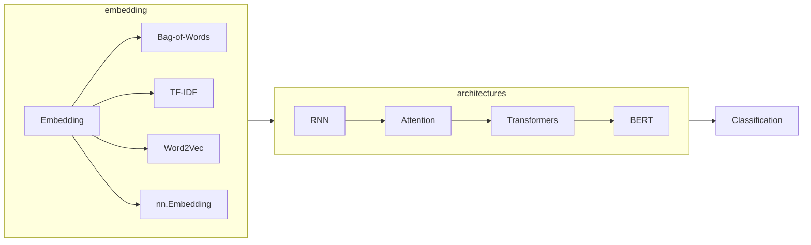

# 📃 Preface (NLU)

|               Previous Material                |    Current    |       Next Material        |
| :--------------------------------------------: | :-----------: | :------------------------: |
| [◁](../fundamentals/tokenization/wordpiece.md) | "NLU Preface" | [▷](./embedding/README.md) |

Natural language understanding (NLU) is a sub-branch of NLP that deals with the interpretation of linguistics and inference with regard to semantics. Basically, this is the branch that deals with processing those words you pre-processed and inferring new information/insights off them. _Technically_, most of NLU is just, "classification" and "regression" (and even "classification" is technically just a discretized/binarized "regression", but I digress).

In this chapter, we'll learn how to turn what you got from the tokenization process from before, into high-dimensional representation which can be learned, then the architectures that are often used in Deep Learning (DL) NLP and how they work, and _finally_ apply both traditional ML and DL for an NLU task: Classification.

Next, go to [**[Embedding]**](./embedding/README.md) to learn about your first material in this chapter.
