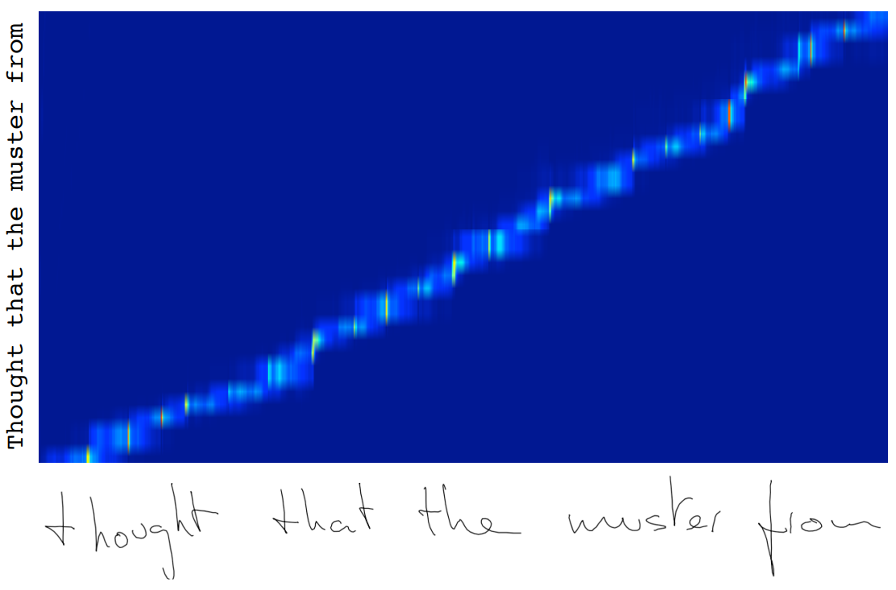
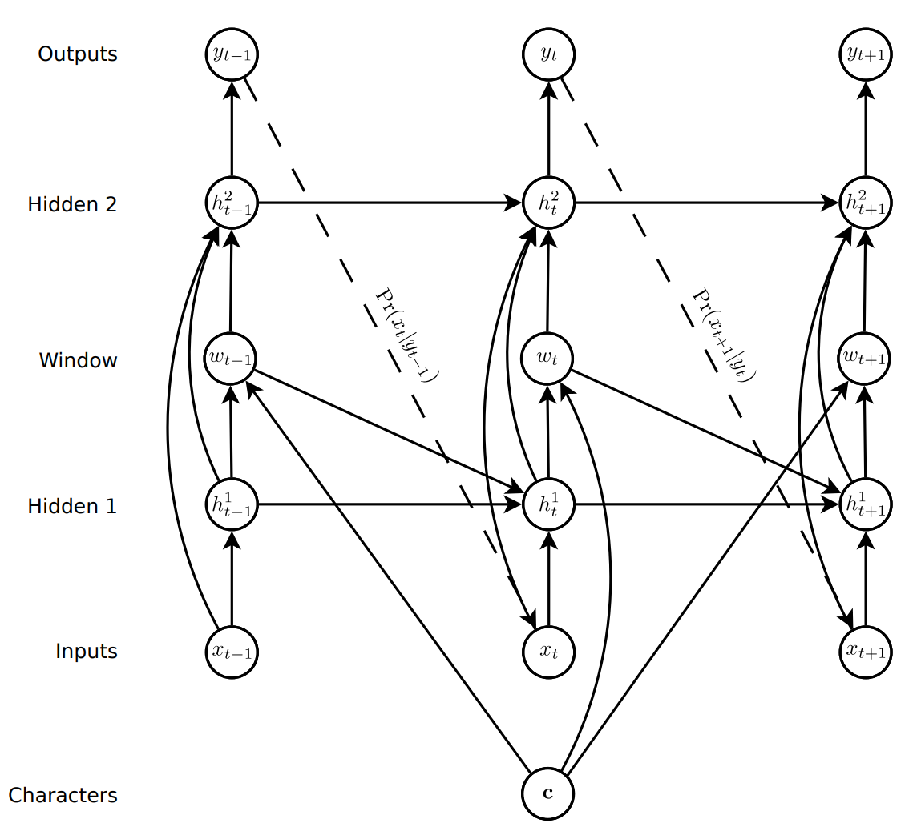
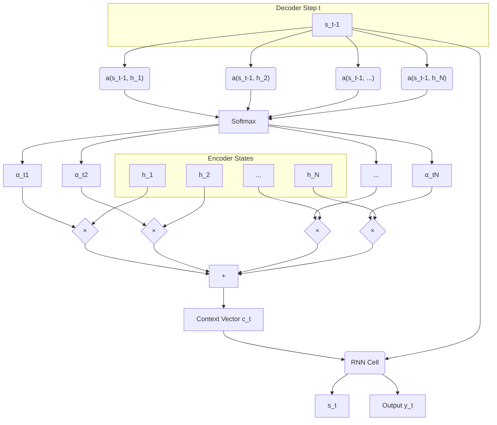
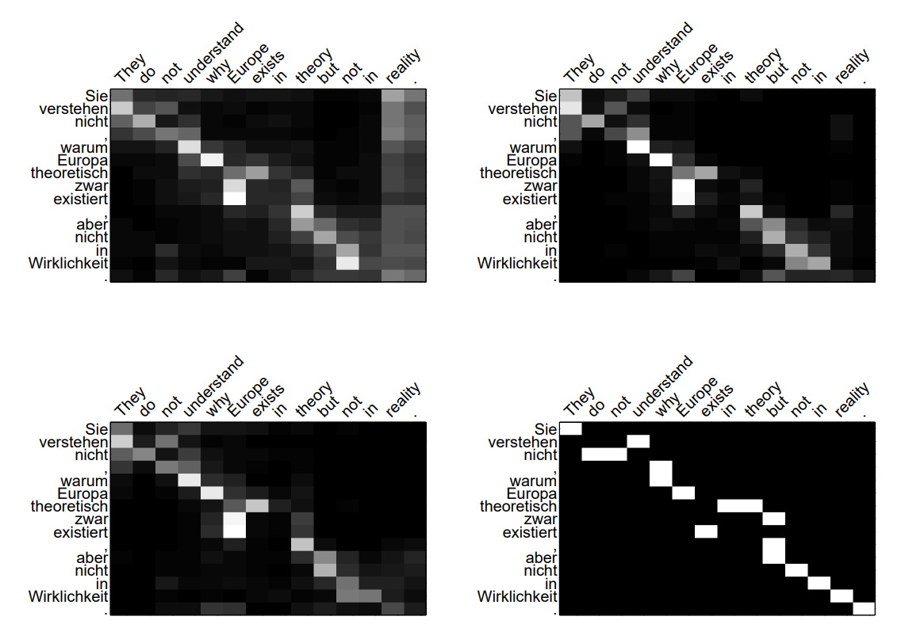
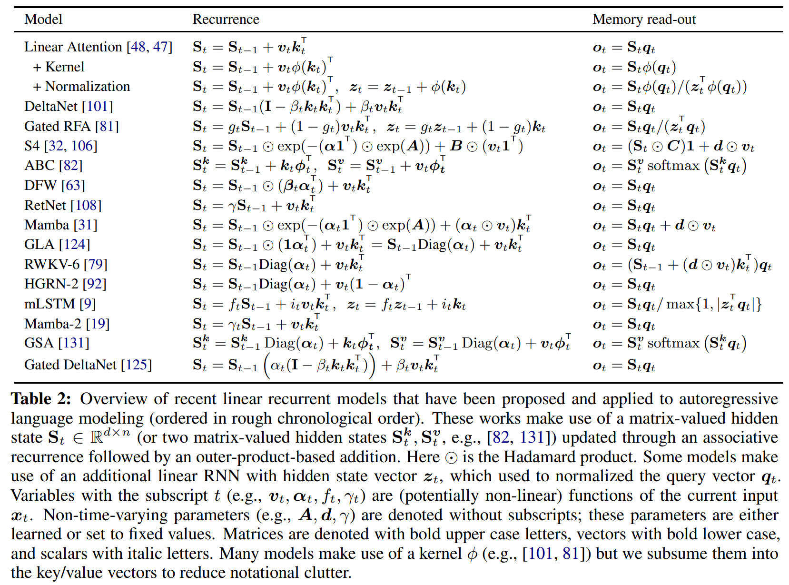

# 👀 Attention

|   Previous Material  |           Current            |          Next Material             |
| :------------------: | :--------------------------: | :--------------------------------: |
|    [◁](./rnn.md)     |   "Attention"                |    [▷](../attention.md)            |

Attention is a technique that allows a neural network to focus on specific parts of an input sequence when performing a task. In NLP, it was originally developed for machine translation, especially as models often struggled with long sequences.

To understand how and (probably more importantly,) _why_ they work, we have to pull back and recall from [RNNs](./rnn.md). RNNs work when you can guarantee, with the utmost certainty, that the flow of information follows [bptt](https://en.wikipedia.org/wiki/Backpropagation_through_time). That is, it goes one way, and one way only.

However, many linguistic tasks, namely those which rely on varying "rules" of information flow, e.g. translation, don't... do this. This is because the "modality" in which the information is conveyed, itself, changes. Especially in translation, the language changes, ergo, the mechanism in which information is conveyed, also changes. Thus, assuming that the next state (which determines next token) can solely depend on the previous state, is inherently flawed, there is no function with one-to-one correspondence wrt each individual input token, which means that you can't just "map" each of the input's units to output's deterministically.

In order to mitigate this, what one can do naively, is to "decouple" the generation process from the "encoding" process in order to allow for variability of output wrt input. This is what a (assuming most vanilla, baseline, RNN) seq2seq [^1] model does: it uses two structures, an "encoder", which takes in the input and outputs a latent state, this latent state is then put into a "decoder" which does the generation based on that latent state as its initial $h_0$.

**_However,_** (and this is a pretty big caveat) a big issue with this approach is the fact that due to a finite $d$-dimensional information bottleneck, we run into the upper-bound of information that can even be stored within the state vector's $d$. Let's take a math detour to prove this, we have three approaches we can take: 1.) a pure information-theoretic; 2. semantic geometrical; 3.) and associative limitation approach. We'll go into this a bit more as well in the linear attn section at the bottom, but you can [skip all of this](#solving-the-dimensionality-issue-attention) if you want.

## Dimensionality Limitations

From a information-theoretic approach, this is what's a bit more intuitive to understand (imo), we can take [Shannon's coding theorem](https://en.wikipedia.org/wiki/Shannon%27s_source_coding_theorem). This is simply an inherent limitation in how we're representing information for a given state size $d$. For any state $d$-sized at some bit precision, our capacity for information (assuming best-case) is given as $d \cdot b$, where $b$ is the precision of each of our state's digits. Why? The theorem states that

> $N$ i.i.d. random variables each with entropy $H(X)$ can be compressed into more than $N$ $H(X)$ bits with negligible risk of information loss, as $N \rightarrow \infty$; but conversely, if they are compressed into fewer than $N$ $H(X)$ bits it is virtually certain that information will be lost.

In other words, for some $C(X)$ where $C$ is a coding function, the entropy of encoded $C(X)$ has to be $\geq$ $H(X)$ (entropy of $X$). In bits, entropy is defined as the number of binary positions to "determine" to perfectly "guess" the target sequence.

Let's work on an example, say we had some $d_{hidden}=256$ at precision $b=32$ (i.e., fp32), this can correspond to some grid where for each of the $d_{{hidden}_i}$ we have $b$ bits to convey information with, thus

$$(2^{32}) \times (2^{32}) \times \dots \times (2^{32}) \quad \text{($d$ times)}$$
$$= (2^{32})^d = 2^{32d}$$

Thus, this "container" can only hold up to $256 \times 32 = \text{8,192 bits of entropy}$. If, say our vocabulary size is $\text{32,768}$ tokens, $\log_2(\text{32,768}) = 15$, thus 15 bits per word. Say our input sequence is $\text{1,000}$ words long, $\text{1,000 words} \times \text{15 bits/word} = \text{15,000 bits of entropy}$. (Obviously some caveats on the entropy of language, but for the most part, this asymptotically holds up.) Since $\text{8,192 state bits of entropy} \lt \text{15,000 input bits of entropy}$, there has to be loss in information.

Formalizing this, to losslessly encode and compress information from the history, what we have is therefore

$$\underbrace{d \cdot b}_{\text{State Capacity}} \ge \underbrace{L \cdot \log_2|V|}_{\text{Sequence Entropy}}$$

rearranging, we get

$$L_{max} \le \frac{d \cdot b}{\log_2|V|}$$

This means that it is _guaranteed_ that some information-theoretic loss _will_ be incurred once this inequality is broken.

From a geometrical point-of-view, let's start with a simple intuition: to store some number of "different" vectors in a vector space, we need to ensure that our space can store them orthogonally (i.e., perpendicular).

If, say, vector A is the memory for "Apple" and vector B is "Banana", then the ideal scenario is that $A \cdot B = 0$ where this means they're $90\degree$ apart, completely distinct from one another. When they are $A \cdot B \neq 0$, this is an overlap. This is what's called "crosstalk", or "interference" in signal processing: changing one changes the other too. Thus, for the ideal case, from some set of $X$ of $N$ points in $\R^d$, we need a projection $f:\R^d \rightarrow \R^n$, where for every $x_i$ and $x_j$ it's $||f(x_i)-f(x_j)||^2=||x_i-x_j||^2$. This makes $f$ [isometrical](https://en.wikipedia.org/wiki/Isometric_projection), each $x_i$ is represented as a single dimension. In this intuition, the sequence length $L$ _cannot_ exceed $d$, as each element has to be represented.

$$L\leq d$$

Obviously, this isn't ideal. Thus, assuming some acceptable distortion of $\epsilon$, we can work from the Johnson-Lindenstrauss (JL) lemma (recall from the word2vec chapter?): For some $0 \lt \epsilon \lt 1$, there exists an integer $k \gtrapprox \frac{8\ln(N)}{\epsilon^2}$ such that the linear map $f : \R^d\rightarrow \R^k$ where

$$ (1+\epsilon)^{-1}\|f(x_i)-f(x_j)\|^{2} \leq\|x_i-x_j\|^{2} \leq(1-\epsilon)^{-1}\|f(x_i)-f(x_j)\|^{2} $$

This implies that _theoretically_, one can store an _exponential_ number of memories $N\approx e^d$ (with the assumption of slight correlation within the stretch factor).

However, the problem with this intuition is that it assumes distinct points to store. In RNNs, we store a sum, where

$$S = v_1 + v_2 + v_3 + \dots + v_L$$

to understand what this implies, assume we want to see how well it retrieves some memory $v_1$ (e.g. "Apple"), we can get the dot prod of $v_1 \cdot S$, getting us

$$v_1 \cdot S = v_1 \cdot (v_1 + v_2 + \dots + v_L) = \underbrace{(v_1 \cdot v_1)}_{\text{Signal}} + \underbrace{(v_1 \cdot v_2) + (v_1 \cdot v_3) + \dots}_{\text{Noise (Crosstalk)}}$$

What ends up occurring is that, even if the distortion for every $v_1 \cdot v_i$ (where $i\neq1$) is small, this is accumulated over $L$. Thus the signal-to-noise ratio (SNR) becomes

$$\text{SNR} \propto \frac{1}{\sqrt{L}}$$

Where the noise strength is $\sqrt L$. This means that as $L$ grows, the noise "floor" rises. Eventually, this is bigger than the signal, where $L\approx d$.

The last approach we could take is analysis of the associative capacity. This takes from a bit of neuroscience theories. To model it under this schema, we can derive from an RNN model: the Hopfield Network. This intuition comes from the fact that the $S$ in RNNs are updated additively, thus

$$h_{new} = h_{old} + \text{(New Pattern)}$$

this is what's called Hebbian learning, you might have heard of the phrase that's usually used to describe it: "Neurons that fire together, wire together."

Assume that we wanna store some $P$ distinct memories $\{\xi^1, \xi^2, \dots, \xi^P\}$ where each is a vector of size $d$ (let's say binary $\{-1, +1\}$ for easier math, but this holds for floats too), we store the "memory" in the $W$ of the RNN. To do so, we can use the Hebbian Rule (which is just the sum of outer products)

$$W = \frac{1}{d} \sum_{\mu=1}^P \xi^\mu (\xi^\mu)^T$$

what this matrix implies is that if some neuron $i$ and $j$ were active together in the past, the connection should be strong between them.

Assuming the activation here is a sign function,

$$h_{new} = \text{sign}\left( \sum_{j=1}^d W_{ij} h_{old} \right)$$

Ideally, the update rule is that for any $\xi^\mu$, it is a stable fixed point. So, ideally $\text{sign}(\sum W_{ij} \xi_j^\mu) = \xi_i^\mu$.

Let's look at this in practice, say we're trying to memorize $\xi_1$, the update rule becomes

$$h_{new} = \text{sign}(W \xi^1)$$

expanding,

$$h_{new} = \text{sign}\left( \left( \frac{1}{d} \sum_{\mu=1}^P \xi^\mu (\xi^\mu)^T \right) \xi^1 \right)$$

If we expand for target ($\mu=1$) w.r.t. all other memories ($\mu\neq 1$), we get

$$h_{new} = \text{sgn}\left( \underbrace{\frac{1}{d} \xi^1 (\xi^1)^T \xi^1}_{\text{Signal}} + \underbrace{\frac{1}{d} \sum_{\mu=2}^P \xi^\mu (\xi^\mu)^T \xi^1}_{\text{Noise (Crosstalk)}} \right)$$

simplifying the signal term (since $(\xi^1)^T \xi^1 = d$), we get

$$h_{new} = \text{sgn}\left( \mathbf{\xi^1} + \mathbf{\text{Noise}} \right)$$

looking at that Noise term, assuming all memories are random,

$$C_i = \frac{1}{d} \sum_{\mu=2}^P \sum_{j=1}^d \xi_i^\mu \xi_j^\mu \xi_j^1$$

this behaves similarly to a random walk. By Central Limit Theorem (CLT), we see that the variance of this scales w.r.t. $P$

$$\sigma^2_{noise} \approx \frac{P}{d}$$

In order to ensure that a bit stays correct then, therefore, we need to ensure that the signal is significantly larger than the standard deviation of Noise ($\sqrt \frac{P}{D}$).

$$1>C\cdot \sqrt \frac{P}{d}$$

Squaring both sides,

$$1 > C^2 \cdot \frac{P}{d}$$
$$\frac{P}{d} < \frac{1}{C^2}$$

this was solved in Amit et al. (1985) as a thermodynamics problem, where $\alpha = \frac{P}{d}$, when it exceeds a critical value of $\alpha\approx 0.138$, it undergoes a phase transition. Below $0.14d$, it flows to the correct states. Above that, it turns into a "Spin Glass" phase, where the landscape becomes chaotic and it gets stuck in random states.

Thus, due to the noise, what this effectively proves, is that, for some state at $d$, one can only store $\approx d\times 0.14$ distinct memories in the state.

## Solving the dimensionality issue: Attention.

The core idea of attention is to therefore: **rid the bottleneck**.

Instead of forcing the model to rely on one single vector $c$, we let the decoder "look back" at the _entire_ input sequence at _every single step_ it takes. It's like allowing the decoder to fully do the decoding "open book". At each step, it can pay "attention" to the specific input words that are most relevant for generating the _next_ output word.

### Graves' "Soft Window"

One of the first attempts at this was for handwriting generation. [^2] Alex Graves' model needed to turn a short string (e.g., "hello") into a long sequence of ($x,y$) coordinates for a pen. It has to know _when_ to start "e" after "h".

In order to do this, he did a "soft window" approach. The decoder would predict the parameters of a set of 1D gaussians ($\mu_i, \sigma_i$) and the importance of each ($\phi_i$) (read: [Mixture of Gaussians (MoG)](https://en.wikipedia.org/wiki/Mixture_model#Gaussian_mixture_model)) given the input and the previous hidden state, which then would be overlaid over the input text to determine how much weight should be put on the input at a given moment. By doing this, the model would learn to shift a "window" of focus along the input text (e.g., "hello") as it was drawing in order to know how much of the input to still take into consideration for the next output.

The model's "decoder" then used a Mixture Density Network (MDN) for this, which, is a bit out-of-scope if I had to go over its definitions and all, so just a brief understanding: the MDN, similar to the MoG, predicts parameters ($\mu, \sigma$ both scalars) for some distributions, of which it also (similar to MoG) predicts _which_ of these distributions to use ($\pi$ a vector).

The problem with this approach was that it was _"monotonic"_, meaning the window only ever moved forward. this makes sense for handwriting, but not for language translation (where word order gets messy).

### Bahdanau's "Additive" Attention

This is possibly the biggest leap the NLP attention field will take for a _while_ and became the sort of "meta" for a while bit: the Bahdanau et al. (2014)'s "Neural Machine Translation by Jointly Learning to Align and Translate". [^3]

Their approach threw away the "monotonic" constraint and made the mechanism content-based. At each step, it takes in the current hidden state, and determines which of the input hidden state sequence is most relevant to it.

In practice, it looks something like:

1.  We have our current decoder hidden state $s_{t-1}$.
2.  We have _all_ the encoder hidden states $h_1, h_2, \dots, h_N$.
3.  We calculate an "alignment score" $e_{tu}$ for _each_ encoder state $h_u$:
    $$e_{tu} = v_a^T \tanh(W_a s_{t-1} + U_a h_u)$$
    this is just a small feed-forward network that learns to output a high score if $s_{t-1}$ and $h_u$ are a good match.
4.  We run all those scores through a softmax to get the final weights $\alpha_{tu}$ (which all add up to 1):
    $$\alpha_{tu} = \frac{\exp(e_{tu})}{\sum_j \exp(e_{tj})}$$
5.  From that, create a context vector $c_t$ by taking a weighted sum of _all_ the encoder states:
    $$c_t = \sum_u \alpha_{tu} h_u$$
6.  Finally, feed this new $c_t$ (along with $s_{t-1}$) into the decoder RNN to generate the next word and the new state $s_t$.

The model learns the weights $W_a$, $U_a$, and $v_a$ all via backprop, resulting in it learning to align.

<small>This is a more intuitive example from the paper, you can see how the alignment from french to english is largely monotonic, _but_ there are cases where there's non-monotonicity, seen in the "European Economic Area" being translated into "zone économique européenne" (see how it's reversed in order?) or how "was" is translated into "a été".</small>

---

## Luong "Multiplicative" Attention

One year later, Luong et al. in "Effective Approaches to Attention-based Neural Machine Translation" [^4] improved on Bahdanau et al.'s approach. [^3]

Within their paper, they also explored other attention styles and tweaks, but the main idea was that they proposed multiplicative formulations in order to simplify and generalize Bahdanau et al.'s formulation. Another tweak they did was that they used the _current_ decoder state $s_t$ (not the previous $s_{t-1}$) to simplify the computational graph from $h_{t-1} \rightarrow a_t \rightarrow c_t \rightarrow \tilde{h}$ which reduces into just $h \rightarrow a_t \rightarrow c_t \rightarrow \tilde{h}$ (although this doesn't necessarily, strictly, mean that this is easier to implement, we'll go over this later in the colab). They evaluated the following formulations:

- **`dot`**: $e_{tu} = s_t^T h_u$
- **`general`**: $e_{tu} = s_t^T W_a h_u$ (this is bilinear)
- **`concat`**: $e_{tu} = v_a^T \tanh(W_a[s_t; h_u])$ (this is basically bahdanau's formulation)

where $h_u$ is all hidden states of the decoder. Afterwards, it's put into a softmax, such,

$$
\begin{aligned}
  a_{tu} & = & \text{align}(s_t, \bar{h}_u) \\
         & = & \frac{\exp(e_{tu})}{\sum_j \exp(e_{tj})}
\end{aligned}
$$

where $e$ is as defined above. Both `dot` and `general` both result in performance improvements because they allow us to parallelize the score calculation over the states as matmuls. Why is this? Let's step back and see the formulation again,

<!-- prettier-ignore -->
$$ e_{tu} = v_a^T \tanh(\underbrace{W_a s_{t-1}}_A + \underbrace{U_a h_u}_B) $$

<!-- prettier-ignore -->
The key problem with this is that, we have to do multiple operations which have different tensor sizes, so when you do $A$, then $B$, to do $A + B$, you have to broadcast $A$ over $B$ so they're the same size (i.e., basically, pad the tensors). This is also exacerbated by the fact that we have a $tanh$ operation to get the actual scores applied over $v$. This $tanh$ operation is non-linear, which makes it non-associative, preventing the precomputation of that scoring behaviour.

By simplifying the maths into a dot product, we can effectively reduce the operations down from 5 operations (mult, mult, broadcast + add, tanh, mult) down to 2 matmuls or even just 1 matmul.

In the paper, they also went over a variant of the attention calculation called "local attention", which does something like graves' where they predict the "window" in which one should do the attention computation (in fact, the paper actually took inspiration off a paper Graves co-authored, that took from his previous publications).

In order to do this, we obtain a $p_t$ which denotes position alignment between source and target (i.e., where source is at time $t$ and $p_t$ is its positional alignment to the target word). If we took from Graves' approach, we can denote this as $p_t=t$, as we assume that the alignment is monotonic and thus have a one-to-one correspondence with one another.

However, as we've already established, especially in tasks in which the input may not have the same ordering rule as the output like translation, it would be better to do this as a predicted operator.

In their paper, they denoted this as

$$p_t = S \cdot \text{sigmoid}(v_p^T \tanh(W_p s_t))$$

where both $W_p$ and $v_p$ are both learned, and $S$ is the source sentence length. By doing this, what you get is a $p_t$ thats $\in [0, S]$. This $p_t$ is then applied over the sequence as:

<!-- prettier-ignore -->
$$ a_{tu} = \text{align}(s_t, \bar{h}_u) \exp(-\frac{(u-p_t)^2}{2\sigma^2}) $$

<!-- prettier-ignore -->
where $\sigma = \frac{D}{2}$, and $D$ is a predefined hyperparam. This approach is similar to how Graves did it, by modelling it as a gaussian distribution, where its center is positioned at roughly $p_t$, but this formulation allows for a more flexible, non-monotonic alignment.

<small>To intuit this better, let's look at this figure. Top-left is global, top-right is local monotonic, bottom left is local learned, and bottom right is the ground truth alignment (provided by the RWTH). By allowing the model to only attend to a smaller window of words, we allow for less information decay as there's less to try to "fit" in the next state.</small>

Let's quickly prove that this scheme allows for more information within the state compared to the global mechanism. Let's assume that the attention is trying to obtain some target $h_{u^*} \in H$ where $H = \{h_1, h_2, \dots h_N\}$.

In the global mechanism, the context vec $c_t$ is defined as the weighted sum of the entire source sequence of length $L$.

$$c_{global} = \sum_u^L \alpha_{tu} h_u$$

Even if the softmax ended up making the distribution "sharp", the function is never a perfect delta func. There's always a non-zero probability mass assigned to irrelevant states.

$$c_{global} = \underbrace{\alpha_{t u^*} h_{u^*}}_{\text{Signal}} + \underbrace{\sum_{u \neq u^*}^L \alpha_{tu} h_u}_{\text{Crosstalk (Noise)}}$$

If we treat these irrelevant states as noise (i.e., random vectors, non-orthogonal), the noise variance would accumulate over length $L$,

$$||\text{Noise}|| \propto \sqrt{L}$$

similar to what we saw in RNNs up there, getting us

$$\text{Noise}_{global} \propto \sqrt{L}$$

In contrast, doing local attention clamps the summation down to $D$ (where, presumably/asymptotically, $D\ll L$)

$$c_{local} = \underbrace{\alpha_{t u^*} h_{u^*}}_{\text{Signal}} + \underbrace{\sum_{u \neq u^*}^D \alpha_{tu} h_u}_{\text{Crosstalk (Noise)}}$$

thus, the noise variance only accumulates over D

$$\text{Noise}_{local} \propto \sqrt{D}$$

As such, since $D \ll L$ (presumably, asymptotically),

$$ \frac{1}{\sqrt{D}} \gg \frac{1}{\sqrt{L}}$$
$$\therefore \text{SNR}_{local} \gg \text{SNR}_{global} $$

Effectively, what this implies is that, the window method allows for us to lower the entropy of the retrieval, thus the noise from far-away tokens are geometrically guaranteed to be irrelevant.

## "if all you have is a hammer, everything looks like a nail": Self-attention

...I don't think I need to brief you up on _what_ this is, I'm fairly certain one way or another you've heard of "Attention Is All You Need" from Vaswani et al. [^5], but for those who _haven't_ (somehow), we'll go into it briefly.

Before we get started though, I would like to make a brief note: we'll go over Vaswani et al.'s formulation in [^5], but there were obviously prior attempts at implementing the idea. [^6] [^7] [^8] to name a few, but I do think that the main "advantage" of self-attention does not become immediately obvious if we don't observe it primarily through the lens of transformers' approach.

To get here, we can start off from Luong et al.'s [^4] formulation for their dot-product attention, where

$$
  a_{tu} = \frac{\exp(s_t^T h_u)}{\sum_j \exp(s_t^T h_j)}
$$

If we looked at the above, what may not be immediately obvious to one, is the existence of the bottleneck still. Where? The $h$. $h$ here denotes the state output from the encoder. What you have to understand is that for each $h_u$ here, it is a compressed representation of information from the encoder as it passes through the entire sequence.

As we've established above, we _cannot_ assume that all information contained within these vectors are fully orthogonal w.r.t one another. As such, the noise floor _will_ increase, and information dilution _will_ occur (unless one assumes fixed window $D$, but we're speaking worst-case).

Relying on encoder states as the input means that for any token $x_i$ in the sequence, one cannot compare said token _directly_ against $x_j$.

Why is this a problem? Assume that we would like to obtain interpretation of the semantic information from token $x_u$ against the current state of the decoder $s_t$, $h_u$ here can be seen as (roughly),

$$h_u = \underbrace{\text{feature}(x_u)}_{\text{Signal}} + \underbrace{\phi(h_{u-1})}_{\text{Noise}}$$

Thus, when the attention tries to calculate $s_t^T h_u$, it is essentially trying to fight against $\phi(h_{u-1})$, attempting to obtain the relationship of $s_t$ with $x_u$ is practically impossible as $h_u$ is a cumulation of all the crosstalk _and_ $x_u$.

Let's, again, detour, to explain this. (As usual, [you can skip this if you want btw](#solutionthing))

As we've explored up [there](#dimensionality-limitations), for any token $x_u$, the ideal vector of $k_u$ should ideally be a function which is _solely_ of $x_u$, such that

$$\frac{\partial k_u}{\partial x_j} = 0 \quad \forall j \neq u$$

This is essentially a restatement of the geometrical argument we've explored. "Apple" at $x_1$ should not alter the representation of "Banana" at $x_2$.

Take the RNN update rule (omitting bias for brevity),

$$h_u=\tanh(W_x x_u + W_h h_{u-1})$$

linearizing,

$$h_u \approx W_x x_u + W_h h_{u-1}$$

unrolling the recursion, we see

$$h_u \approx W_x x_u + W_h (W_x x_{u-1} + W_h h_{u-2})$$

thus, if we continued unrolling, it becomes

$$h_u \approx \underbrace{W_x x_u}_{\text{Signal}} + \underbrace{\sum_{k=1}^{u-1} W_h^{u-k} W_x x_k}_{\text{History (Noise)}}$$

When we apply the dot-product attention, we see that

$$e_{tu} = s_t^T h_u$$
$$e_{tu} = s_t^T \left( W_x x_u + \sum_{k=1}^{u-1} W_h^{u-k} W_x x_k \right)$$
$$e_{tu} = \underbrace{s_t^T W_x x_u}_{\text{Target Match}} + \underbrace{\sum_{k=1}^{u-1} s_t^T W_h^{u-k} W_x x_k}_{\text{Interference}}$$

For the target match to be perfectly applied here, we need to ensure that

$$s_t \perp W_h^{u-k} W_x x_k \quad \forall k < u$$

where $s_t$ has to be orthogonal w.r.t _all_ input vectors. This is probabilistically impossible (refer back to the JL lemma). Thus,

$$\left\| \frac{\partial h_u}{\partial x_k} \right\| > 0$$

$h_u$ _has_ to have some form of decayed version of $x_{u-1}, x_{u-2}, \dots$ within it.

How do we solve this? Well, you may be surprised to hear this: get rid of the bottleneck (...again 💀).

Don't use encoder states, just use the embeddings directly, project $X$ into a learned space ($K$), compare with another $X$ ($Q$). This ensures that

$$K_u = W_K x_u$$
$$\frac{\partial K_u}{\partial x_k} = 0 \quad \forall k \neq u$$

for any $x_{k\neq u}$, it will be orthogonal to $x_u$.

This is the most basic building blocks of transformers: self-attention.

Cleaning up, the formulation is essentially just all of these projection matrices on the sequence,

$$Q_u = W_Q x_u$$
$$K_u = W_K x_u$$
$$V_u = W_V x_u$$

we get the familiar equation you've probably seen,

$$\text{Attention}(Q, K, V) = \text{softmax}\left(\frac{QK^T}{\sqrt{d_k}}\right)V$$

You may be wondering how we suddenly got $V$ in there, $V$ actually comes from $h_u$ in the original formulation.

You see, $h_u$ is used in two places,
$$c_t = \sum_u \alpha_{tu} \underbrace{h_u}_{\text{Purpose 1}}$$
$$e_{tu} = s_t^T \underbrace{h_u}_{\text{Purpose 2}}$$

it's trying to serve two purposes,

1. It contains the semantic information which you'd like to derive from the input sequence.
2. It's also trying to be used for _matching_ **_where_** the current decoder state _is_ in the input sequence.

This double-purpose simply exacerbates the amount of information dilution, because you're essentially trying to _already_ find something, ...within itself, in a way, but through a... weirdly muddy lens.

The purpose of self-attention is to _decouple_ these two and establish much clearer separation of concerns, as such we denote (1) as $V$, and (2) as $K$.

How this is better (and especially in transformers' approach) can actually be argued with a rank/subspace argument.

Assume $x$ an input token $x \in \R^d$, which has two types of features:

1. $r$: routing feature, which contains syntactical information.
2. $c$: content feature, which contains semantical information.

Define $x = r + c$, where $r \perp c$ (i.e., orthogonal, $r^T c=0$).

Ideally, say we had a query $q$ which is looking for a verb (where $r$ is verb), we should obtain $c$ which contains semantical information of said verb.

Thus, the attention, ideally, should be
$$a(q, x) \propto q^T r$$
where
$$y=c$$

However, when we compute the attention with the same vector $x$ for both purposes, the attention becomes

$$\text{score} = q^T x = q^T (r + c) = \underbrace{q^T r}_{\text{Signal}} + \underbrace{q^T c}_{\text{Noise}}$$

$c$ isn't needed here, but r and c _has_ to be _perfectly_ orthogonal for there to be no noise, which, as we've established, is probabilistically impossible.

Another issue, is during output. Output is calculated by multiplying the attention score with each $x$,

$$y = \sum_i \alpha_i x_i$$

assume that we had an ideal case where the target $x^*$ is all we attend to,

$$y \approx 1 \cdot x^*$$

when substituting for $x$, we get

$$y \approx r^* + c^*$$

so even under ideal circumstances, the ideal
$$y=c^*$$
is not possible.

Compare that to a decoupled definition. Say we had an ideal $W_V$, the output then becomes

$$y = \sum_i \alpha_i (W_V x_i)$$

assuming perfect attention,

$$y \approx 1 \cdot (W_V x^*)$$

substituting,

$$y \approx W_V(r^* + c^*)$$

if the network learned well, what could be done here, is to nullify the $r$.

$$W_V r^* \approx 0$$
$$W_V c^* \approx c^*$$

thus,

$$y \approx c^*$$

we obtain the ideal case. :>

Now, obviously transformers did more than this, especially w.r.t parallelization, but we'll go over them in the next chapter instead.

## uh, everyone... _else_: Linear Attention

There's a reason why I quoted "if all you have is a hammer, everything looks like a nail" there, self-attention, especially transformers' approach, essentially has become the meta until this very moment.

It's not hard to see why, you've removed the information bottleneck, you allowed for high levels of parallelization, why not?

However, what one has to understand is that, with the higher fidelity information passing through the network, it came with a trade-off: higher compute requirement.

I think some of us have heard of this term of $O(N^2)$ being thrown around when talking about transformers. Why is that? Well, an important observation that one has to make when seeing how the computation is performed in a transformer network is that

$$\text{Attention}(Q, K, V) = \text{softmax}\left(\frac{QK^\top}{\sqrt{d_k}}\right)V$$

implies three matrix multiplications, $Q$, $K$, $V$. Each of these were obtained via projections into embedding $d$ space via a linear head, getting an $N\times d$ matrix w.r.t $N$ as sequence length. Tracing this operation, the first matrix $N\times d$ matches with the transpose $d\times N$, getting us $N\times N$, AKA., $O(N^2)$. The reasoning why this has to happen is because we're utilizing the $\text{softmax}(\dots)$ operation for the activation, which requires processing _all_ of the input $\mathbf{z}$ to allow for the $\sum$

$$\text{softmax} (\mathbf{z} )_{i}={\frac {e^{z_{i}}}{\sum _{j=1}^{K}e^{z_{j}}}}\$$

Obviously, an $O(N^2)$ grows really, _really_, quickly. As such, an alternative to "linearize" the approach has been explored in recent times.

When we look at its most basic form, the self-attention simply needs to compute a $(QK^\top)V$ operation. This is because the softmax here, can simply be stated as a feature map $\psi$, resulting in $\psi(Q)\psi(K)^\top V$, redefining $Q \leftarrow \psi(Q)$ and $K \leftarrow \psi(K)$, and we get

$$Y = (QK^\top )V $$

This is sometimes called the kernel attention in literature.

Looking at the aforementioned formulation, it is tempting to simply "move" the multiplication around a bit. Working out the matrix associativity, $Q(K^\top V)$, where instead of $(N,d)\times(d,N)$, we do $(d,N)\times(N,d)$, getting $d\times d$ and making the operation "linear". In practice, however, this is likely not possible.

The reason why this "folklore"-ish approach to making it linear doesn't as easily apply, is because often in modelling, we _cannot_ assume that _all_ the inputs are avilable during generation.

> (Some caveats still apply though, because _technically_ it could work assuming the masking still allows gradient flow like in an MLM, but I digress)

Assume a causal task, there's a mask matrix $L$ to prevent the model from seeing the future, where

$$L = \begin{bmatrix} 1 \\ \vdots & \ddots \\ 1 & \dots & 1 \end{bmatrix}$$

As such, the formulation becomes $Y = (L\circ QK^\top)V$, which breaks the associativity. Solving this, what we can do is we can view the matrix as a cumsum.

If we write out the $i$-th row of this,

$$y_i = \sum_{j=1}^{N} (L_{ij} \cdot \underbrace{q_i k_j^\top}_{\text{attention score}}) v_j$$

because $L$ is causal (0 if $j > i$), the sum just gets cut off at $i$

$$y_i = \sum_{j=1}^{i} (q_i k_j^\top) v_j$$

via associativity, we can just move the parentheses over

$$y_i = \sum_{j=1}^{i} q_i (k_j^\top v_j)$$

Since $q_i$ depends on $i$ but not $j$ (it's constant for the summation), we can factor it completely out of the sum

$$y_i = q_i \left( \sum_{j=1}^{i} k_j^\top v_j \right)$$

the $\sum_{j=1}^{i} k_j^\top v_j$ here means that we can treat it like a stream $M_j = k_j^\top v_j$ such that the term becomes $\text{cumsum}(M)_i$.

So the equation (assuming $K^\top V$ implies the sequence of outer products at each timestep) simplifies to

$$Y = Q\cdot \text{cumsum}(K^\top V)$$

which stays linear _and_ is equivalent to the $(L\circ QK^\top)V$ formulation. This was the approach that Katharopoulos, et al. (2020) [^10]'s Linear Attention took, and is often _the_ bedrock foundational work which further approaches built on.

> (For brevity, this is just to show the intuition. There's one in Gu & Dao (2024)'s blog post [^9] if you'd like to see a tensor contraction proof of it.)

Looking back however, notice how, to obtain up to $y_i$, we can compute it as a _sequence_ of outer products at each timestep. This means that defining a state matrix $\mathbf{S}_t = \sum_{j=1}^t\mathbf{v}_j\mathbf{k}_j^\top$, the attention effectively becomes an RNN with state $S$ which accumulates the KV outer products.

This approach of viewing linear attention variants generalizes for basically all networks succeeding [^10]'s formulation, as seen in DeltaNet's (arguably glorious) [^11] attempt at stating them all in this notation:

So, _why_ these further explorations? Well, other than practical optimizations (theory and hardware often needs _more_ than just the asymptotic lower bound, hardware-aware implementation must also be considered to ensure that the theory can be put to practice), as we've established earlier, there's a loss in the associative capacity of the state vector. To amend for this, we can look back on [LSTMs and GRUs](./rnn.md) and see that, the solution here is: better selection of the memories that are kept. That's essentially what these forms are doing.

In practice, this mechanism is still bleeding-edge. Certain mechanisms like Mamba (see [Nemotron](https://developer.nvidia.com/nemotron#section-nvidia-nemotron-models)) and RWKV are starting to become adopted in the industry, but overall, we haven't seen much of these yet, mostly because sparsity seems to have become a better "crutch" at amending the bottleneck from the transformer architecture. I think it's worth mentioning however, that this may change very soon due to major players needing to utilize their compute more efficiently.

Speaking of which, next up, let's talk about [**[transformers]**](./transformers.md) a bit more in-depth.

[^1]: Sutskever, I., Vinyals, O., & Le, Q. V. (2014). [Sequence to Sequence Learning with Neural Networks.](https://proceedings.neurips.cc/paper_files/paper/2014/file/5a18e133cbf9f257297f410bb7eca942-Paper.pdf)

[^2]: Graves, A. (2013). [Generating Sequences With Recurrent Neural Networks](https://arxiv.org/abs/1308.0850).

[^3]: Bahdanau, D., Cho, K., & Bengio, Y. (2014). [Neural Machine Translation by Jointly Learning to Align and Translate](https://arxiv.org/abs/1409.0473).

[^4]: Luong, M. T., Pham, H., & Manning, C. D. (2015). [Effective Approaches to Attention-based Neural Machine Translation](https://arxiv.org/abs/1508.04025).

[^5]: Vaswani, A., et al. (2017). [Attention Is All You Need](https://arxiv.org/abs/1706.03762).

[^6]: Cheng, J., Dong, L., & Lapata, M. (2016) [Long Short-Term Memory-Networks for Machine Reading](https://arxiv.org/abs/1601.06733)

[^7]: Parikh., A., et al. (2016) [A Decomposable Attention Model for Natural Language Inference.](https://arxiv.org/abs/1606.01933)

[^8]: Lin, Z., et al. (2017) [A Structured Self-attentive Sentence Embedding](https://arxiv.org/abs/1703.03130)

[^9]: Gu, A. & Dao, T. (2024) [State Space Duality (Mamba-2) Part II - The Theory](https://goombalab.github.io/blog/2024/mamba2-part2-theory)

[^10]: Katharopoulos, A., Vyas, A., Pappas, N. & Fleuret, F. (2020) [Transformers are RNNs: Fast Autoregressive Transformers with Linear Attention](https://arxiv.org/abs/2006.16236)

[^11]: Yang, S., Wang, B., Zhang, Y., Shen, Y., & Kim, Y. (2024) [Parallelizing Linear Transformers with the Delta Rule over Sequence Length](https://arxiv.org/abs/2406.06484)
