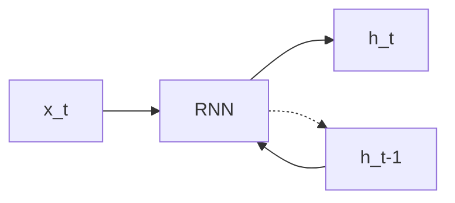
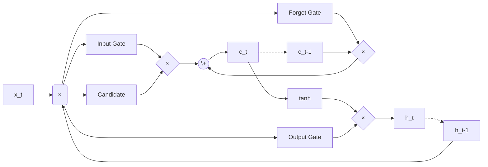
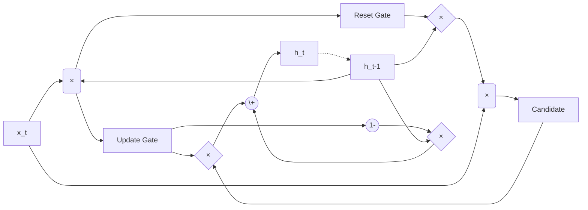

# Recurrent Neural Networks (RNN)

Recurrent Neural Networks (RNNs) are a type of neural network that is designed to work with sequential data. Unlike traditional feedforward nets, RNNs have a 'memory' that allows them to persist information from previous inputs in the sequence. [^1]

The way that this 'memory' is done, is by wrapping it as a hidden state $h$ at timestep $t$ as another input to the model (where $h_0$ could either just be a vector with zeros, or a learned parameter, or some other thing, essentially, it's a vector). Inputting $x_t$ and $h_t-1$ into the RNN, a function parametrized under $f_\theta$, it transforms the inputs into a new hidden state $h_t$.

<!-- prettier-ignore -->
This $h_t$ is later decoded into the output via an activation under $g_\theta$, resulting in $y_t$. 
Thus,
$$ h_t = f_\theta(h_{t-1}, x_t) $$

<!-- prettier-ignore -->
$$ y_t = g_\theta(h_t) $$

unwrapping, we see that this becomes a network that allows memory to flow via the chain of dependencies on all previous hidden states.

$$h_t = f_\theta(h_{t-1}, x_t)$$
$$h_t = f_\theta(f_\theta(h_{t-2}, x_{t-1}), x_t)$$
$$\dots$$
$$h_t = f_\theta(f_\theta(\dots f_\theta(h_0, x_1), \dots, x_{t-1}), x_t)$$

This unrolled dependency on _all_ previous inputs ($x_1, \dots, x_t$) is how the network maintains its "memory." The current state $h_t$ (and thus the output $y_t$) is influenced not just by $x_t$, but by the entire sequence that came before it.

## Vanishing gradients.

While this works for short-to-medium length sequences, simple RNNs can struggle with long sequences due to the gradient instabilities. This problem occurs because the same jacobian matrix gets applied over and over again, and when the gradient isn't stable (i.e., too high, too low), this accumulates over time as we're doing backprop thru time (BPTT).

Let's try understanding this by tracking how the gradient from a loss at a _late_ timestep (say, $t=T$) flows back to an _early_ timestep (say, $t=k$). Assume that $f_\theta$ has two weight matrices: $W_{xh}$ (for input) and $W_{hh}$ (for the recurrent state).

$$h_t = \tanh(W_{hh} h_{t-1} + W_{xh} x_t + b_h)$$
$$y_t = g_\theta(h_t)$$

Say we have a sequence of length $T$, we get an output $y_T$ and calculate a loss $L_T$. Then, we want to update our weights, like $W_{hh}$.

Gradient of the loss w.r.t. $W_{hh}$ ($\frac{\partial L_T}{\partial W_{hh}}$) requires us to sum up its influence at _every_ timestep, but let's just look at one path: the path from the loss $L_T$ all the way back to the hidden state $h_k$ (where $k$ is much smaller than $T$). To get the gradient from $L_T$ back to $h_k$, we use the chain rule.

$$\frac{\partial L_T}{\partial h_k} = \frac{\partial L_T}{\partial y_T} \frac{\partial y_T}{\partial h_T} \frac{\partial h_T}{\partial h_k}$$

The first two parts, $\frac{\partial L_T}{\partial y_T} \frac{\partial y_T}{\partial h_T}$, are just standard backprop from the loss to the final hidden state. _However_, that last term: $\frac{\partial h_T}{\partial h_k}$... How does $h_T$ depend on $h_k$? Well, $h_T$ depends on $h_{T-1}$, which depends on $h_{T-2}$, and so on, all the way back to $h_k$. We have to apply the chain rule _again_ to this single term:

$$\frac{\partial h_T}{\partial h_k} = \frac{\partial h_T}{\partial h_{T-1}} \cdot \frac{\partial h_{T-1}}{\partial h_{T-2}} \cdot \dots \cdot \frac{\partial h_{k+2}}{\partial h_{k+1}} \cdot \frac{\partial h_{k+1}}{\partial h_k}$$

this can be written as a big product:

$$\frac{\partial h_T}{\partial h_k} = \prod_{i=k+1}^{T} \frac{\partial h_i}{\partial h_{i-1}}$$

Now, let's look at what's _inside_ that product. What is $\frac{\partial h_i}{\partial h_{i-1}}$? Take the derivative of our RNN equation $h_i = \tanh(W_{hh} h_{i-1} + \dots)$ with respect to $h_{i-1}$:

$$\frac{\partial h_i}{\partial h_{i-1}} = \underbrace{\text{diag}(\tanh'(z_i))}_{\text{activation deriv.}} \cdot \underbrace{W_{hh}^T}_{\text{weights}}$$
(where $z_i$ is the stuff inside the tanh).

This is the Jacobian. let's analyze its two parts:

1.  **The Activation Derivative:** The derivative of $\tanh(x)$ is $1 - \tanh^2(x)$. This value is _always_ between 0 and 1. at its peak (when $x=0$), the derivative is 1. but for most values, especially if the neuron is "saturated" (outputting ~1 or ~-1), the derivative is very close to **0**.
2.  **The Recurrent Weights:** This is our weight matrix $W_{hh}$.

so, to get the gradient $\frac{\partial L_T}{\partial h_k}$, we have to multiply this jacobian matrix $\frac{\partial h_i}{\partial h_{i-1}}$ by itself many, _many_ times ($T-k$ times).

What happens when you multiply a bunch of numbers that are $\le 1$ together?

$$0.9 \times 0.9 \times 0.9 \times \dots \times 0.9$$

if you do that 100 times ($0.9^{100}$), you get $\approx 0.000026$. It _vanishes_.

The same thing happens with our matrices, the long product $\prod_{i=k+1}^{T} \frac{\partial h_i}{\partial h_{i-1}}$ will shrink exponentially fast.

- even if the $\tanh$ derivatives are all 1 (which they aren't), just having the weights $W_{hh}$ be "small" (technically, eigenvalues < 1) is enough to make the product vanish.
- the $\tanh$ derivatives being $< 1$ (and often near 0) makes it _so much worse_.

by the time the gradient signal from $L_T$ travels all the way back to $h_k$, it's basically zero.

$$\frac{\partial L_T}{\partial h_k} \approx 0$$

This means the model gets _no information_ about how the hidden state at step $k$ should change to help the loss at step $T$. it literally _cannot_ learn dependencies between things that are far apart in the sequence.

## Exploding gradients.

An opposite phenomenon could also occur, where,for

$$\frac{\partial h_i}{\partial h_{i-1}} = \underbrace{\text{diag}(\tanh'(z_i))}_{\text{activation deriv.}} \cdot \underbrace{W_{hh}^T}_{\text{weights}}$$

1.  **The Recurrent Weights:** This is the main culprit. if your recurrent weight matrix $W_{hh}$ is initialized in a way that it's "large" (its largest eigenvalue is > 1), it _amplifies_ vectors that are passed through it.
2.  **The Activation Derivative:** The $\tanh'$ derivative is still $\le 1$, so it actually _fights_ the explosion. but if $W_{hh}$ is large enough, its explosive tendency will easily overpower the $\tanh'$ term.

What happens when you multiply a bunch of numbers that are $> 1$ together?

$$1.1 \times 1.1 \times 1.1 \times \dots \times 1.1$$

if you do that 100 times ($1.1^{100}$), you get $\approx 13780$. it _explodes_.

What happens then?

- The gradient values become astronomically large (e.g., `1e30` or `inf`).
- When the optimizer tries to take a step ($\text{new\_weights} = \text{old\_weights} - \text{learning\_rate} \times \text{gradient}$), the update is so massive that it completely "yeets" the weights into a nonsensical part of the parameter space.
- Your loss will instantly spike to `NaN`, and your model just... breaks.

For the problem, exploding gradients, they have a super simple, brute-force fix that's often used even in other architectures: gradient clipping.

So all you need to do is, before you update the weights, you check the "size" (the norm) of your total gradient vector, and if it's too big, just... scale it down to an upper-bound thresh.

## LSTMs, GRU.

Resolving this problem, we need to allow for gradients to flow thru in long windows without accumulating the gradient. Here, the solution isn't to just _clip_ the gradient (which only solves the _exploding_ part), but to fundamentally change the architecture so that the gradient _doesn't vanish_ in the first place.

This is solved by _Long Short-Term Memory (LSTM)_ networks, and its simpler variant, the _Gated Recurrent Unit (GRU)_. The core idea in these is to, instead of _multiplying_ the hidden state by a weight matrix at every step, use an _additive_ update, which is much more stable for gradients.

### Long Short-Term Memory (LSTM)

An LSTM introduces a new, crucial component, the cell state ($c_t$). [^2] This is what's going to let information flow through many timesteps and stay largely unchanged. The $h_t$ we had before (the "hidden state") still exists, but it's more of a "working memory" or the output for the current step.

(where the "x" in a rounded box thing denotes concat, and the one in a diamond shape denoting mult)

The LSTM controls what information is _added to_ or _removed from_ this cell state using three "gates":

1.  **Forget Gate ($f_t$):** Decides what to throw away from the _old_ cell state ($c_{t-1}$).
2.  **Input Gate ($i_t$):** Decides which _new_ information to store in the cell state.
3.  **Output Gate ($o_t$):** Decides what to output from the cell state to the _new_ hidden state ($h_t$).

These gates are just sigmoid functions, which output a value between 0 (close the gate) and 1 (open the gate).

In order to _forget_, the network looks at the old hidden state $h_{t-1}$ and the new input $x_t$ and decides what to forget from the old cell state $c_{t-1}$.
$$f_t = \sigma(W_f \cdot [h_{t-1}, x_t] + b_f)$$

Then, to decide what new information to _add_, it does a two-step process:

- The _input gate_ $i_t$ decides _which_ values to update.
- A "candidate" state $\tilde{c}_t$ (using $\tanh$) creates a vector of _new_ values that _could_ be added.
  $$i_t = \sigma(W_i \cdot [h_{t-1}, x_t] + b_i)$$
  $$\tilde{c}_t = \tanh(W_C \cdot [h_{t-1}, x_t] + b_C)$$

Then, and this is the most important equation, we update the cell state $c_t$ by taking the old state $c_{t-1}$ and multiplying it by the forget gate $f_t$, then taking the new candidate state $\tilde{c}_t$ and multiplying it by the input gate $i_t$ finally _adding_ them together.

$$c_t = f_t \odot c_{t-1} + i_t \odot \tilde{c}_t$$
_(where $\odot$ is element-wise multiplication)_

Finally, we create the new hidden state $h_t$ (the "working memory") by taking the (now updated) cell state $c_t$, squashing it with $\tanh$, and filtering it with the **output gate** $o_t$.
$$o_t = \sigma(W_o \cdot [h_{t-1}, x_t] + b_o)$$
$$h_t = o_t \odot \tanh(c_t)$$

How does this solve the vanishing grads? Let's look at that update equation again: $c_t = f_t \odot c_{t-1} + i_t \odot \tilde{c}_t$.

Now, think about the gradient $\frac{\partial L}{\partial c_{t-1}}$ during backpropagation. Because of the addition in the update rule, the gradient from $c_t$ back to $c_{t-1}$ is (using the chain rule):

$$\frac{\partial c_t}{\partial c_{t-1}} = f_t + \text{(other terms...)}$$

Let's just focus on that first term. The gradient path from a late timestep $T$ back to an early timestep $k$ looks like:

$$\frac{\partial c_T}{\partial c_k} = \prod_{i=k+1}^{T} \frac{\partial c_i}{\partial c_{i-1}} = \prod_{i=k+1}^{T} f_i$$

This is _still_ a product, just like the RNN! But there is one _massive_ difference:

- In the simple RNN, the $\tanh'$ and $W_{hh}$ terms were _uncontrollable_ and almost always pushed the product towards zero.
- In the LSTM, the $f_i$ (the forget gate) is a **learned parameter**.

If the network learns that the information in $c_k$ is super important for the loss at $T$, it can learn to set the forget gates $f_i \approx 1$ for all the steps from $k$ to $T$.

If $f_i = 1$, the gradient is $\prod 1 = 1$. It just flows.

The additive update $c_t = c_{t-1} + \dots$ creates an "uninterrupted" path where the gradient can pass through _unchanged_, as long as the forget gate allows it. The network _learns_ when to open and close this, giving it the power to connect dependencies across thousands of timesteps.

### Gated Recurrent Unit (GRU)

GRU is a (somewhat, calling it "new" would be crayz tho) newer and simpler alternative that often performs just as well as an LSTM. [^3] It merges the **cell state $c_t$** and the **hidden state $h_t$** into a _single_ state, $h_t$.

(where the "x" in a rounded box thing denotes concat, and the one in a diamond shape denoting mult)

It only has two gates:

1.  **Update Gate ($z_t$):** This gate does the job of _both_ the forget and input gates. It decides how much of the _old_ state $h_{t-1}$ to keep, and how much of the _new_ candidate state $\tilde{h}_t$ to add.
2.  **Reset Gate ($r_t$):** This gate decides how much of the _old_ state $h_{t-1}$ to "show" to the candidate state calculation.

The key update equation is:

$$h_t = (1 - z_t) \odot h_{t-1} + z_t \odot \tilde{h}_t$$

Look familiar? This is just another additive update.

- $z_t$ acts as the "input" gate.
- $(1 - z_t)$ acts as the "forget" gate.

Just like the LSTM, this additive structure allows the GRU to learn to "copy" $h_{t-1}$ to $h_t$ by setting $z_t \approx 0$, which lets gradients flow backward without vanishing.

Both architectures solve the vanishing gradient problem by creating a path where the gradient is _added_ or _gated_, not just _multiplied_ by a fixed matrix and activation at every step.

Next, you can check out the [RNN notebook](./rnn.ipynb) to see how to do this in code. This is especially because these "sequentially linear" (what we'll later end up developing as "linear attn" models) often tend to require some initialization tricks if we wanna get good convergence (i.e., hyperparam tuning, my favorite~ ).

[^1]: Elman, J.L. (1990), Finding Structure in Time. Cognitive Science, 14: 179-211. https://doi.org/10.1207/s15516709cog1402_1

[^2]: Sepp Hochreiter and Jürgen Schmidhuber. 1997. Long Short-Term Memory. Neural Comput. 9, 8 (November 15, 1997), 1735–1780. https://doi.org/10.1162/neco.1997.9.8.1735

[^3]: [On the Properties of Neural Machine Translation: Encoder–Decoder Approaches](https://aclanthology.org/W14-4012/) (Cho et al., SSST 2014)
