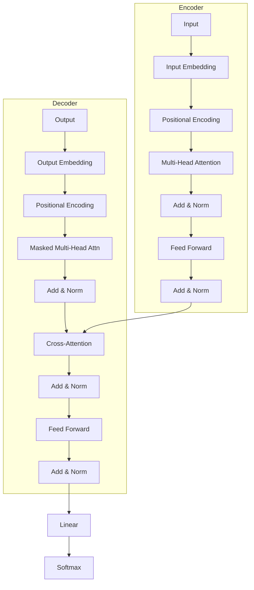
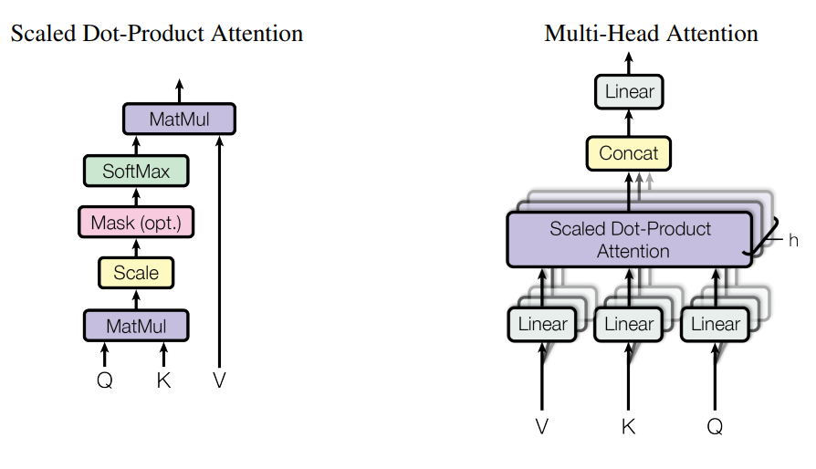
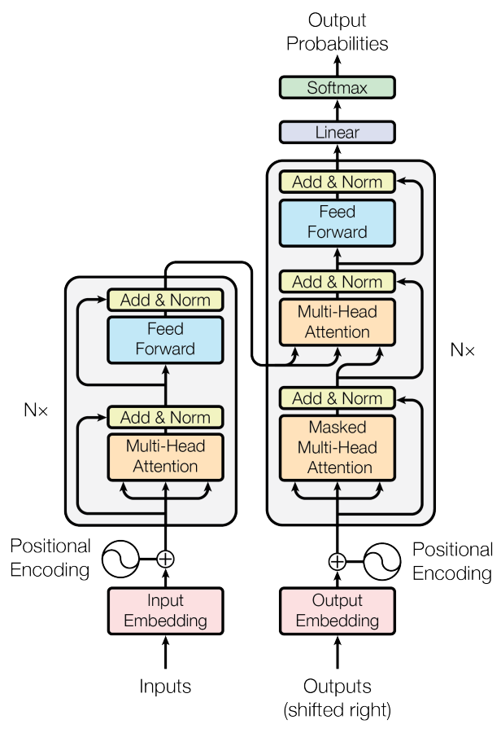
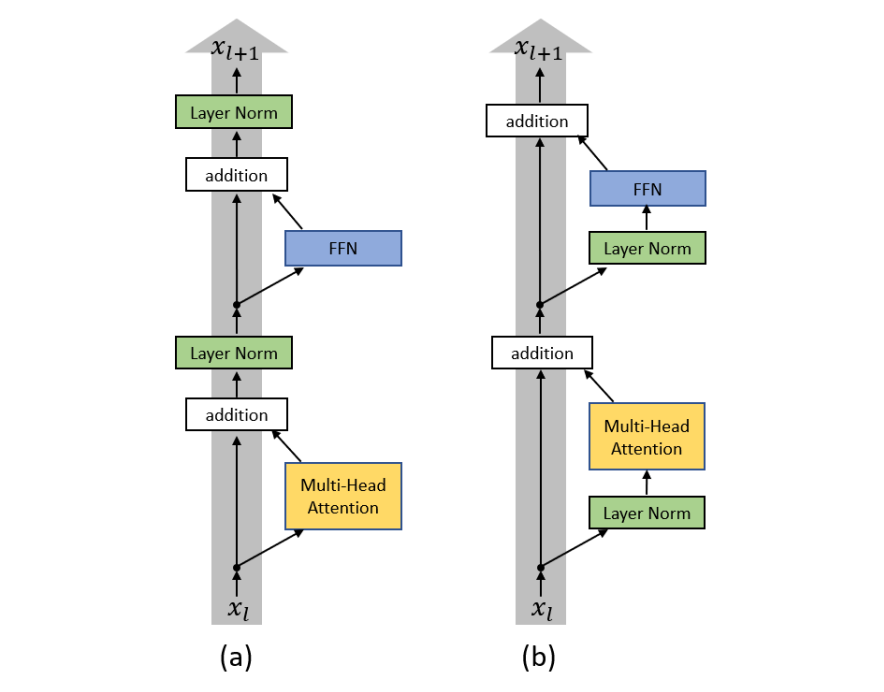
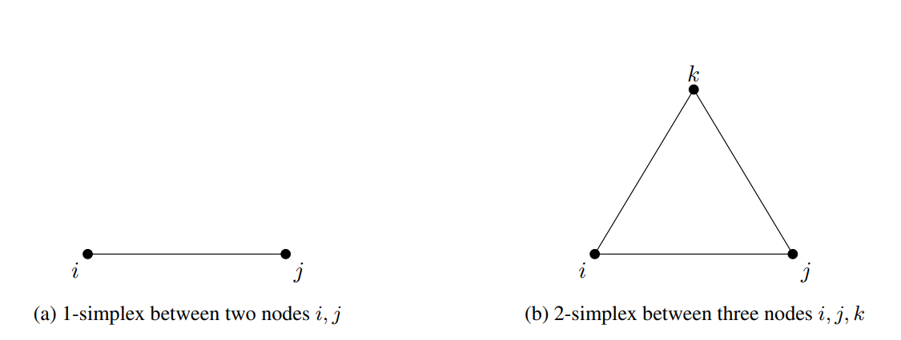
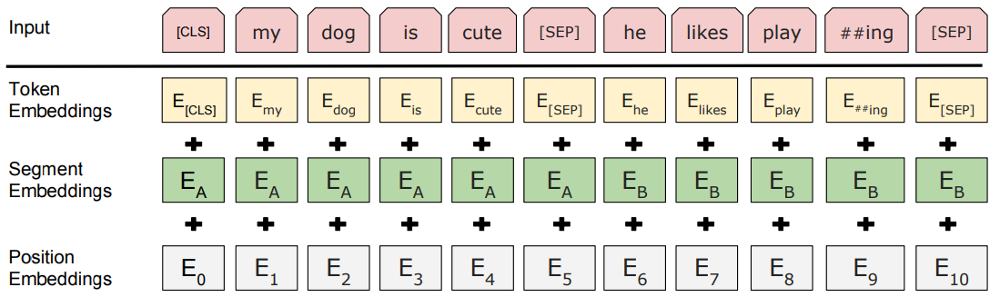

# 🤖 Transformers

|   Previous Material  |           Current            |         Next Material            |
| :------------------: | :--------------------------: | :------------------------------: |
| [◁](./attention.md)  | "Transformers"               |    [▷](../cls/cls.md)            |

So, we've finally arrived. The big one.

If you recall from the [previous chapter](./attention.md), we ended on the note that **Self-Attention** allows us to decouple the "routing" of information from the "content" of information, solving the orthogonality issues inherent in compressing sequences into a single hidden state.

In transformers, Vaswani et al. (2017) [^1]'s innovation was that they proposed an architecture that relies _entirely_ on it, discarding recurrence and convolutions completely. Hence, "Attention Is All You Need".

But why is this such a big deal?

In RNNs, processing is sequential: $h_t$ depends on $h_{t-1}$. This precludes parallelization within training examples. If your sequence length is $N$, you need $O(N)$ sequential operations.

Since the attention mechanism in transformers looks at the whole sequence at once, the sequential operations drop to $O(1)$. You can feed the entire sequence into the GPU and compute the self-attention for every token in parallel.

> (Well, technically the decoder is still autoregressive during inference, but during training we use "Teacher Forcing" with masking, so we can still blast the whole thing through at once. We'll get to that.)

Since we've already covered self-attention in the [attention](../architectures/attention.md) sub-chapter, in this sub-chapter we'll instead pivot and focus more on what transformers did _on top_ of self-attention.

## The Architecture

The formulation for a transformer follows an Encoder-Decoder structure, similar to the seq2seq models we discussed before, but the internals are vastly different.

It looks a bit daunting, but it's actually composed of just a few identical blocks stacked on top of each other.

## Positional Encoding

Here's a problem: Self-attention is **permutation invariant**.

Because we got rid of the encoder network, which has the recurrent constraint of having $h_t$ depend on $h_{t-1}$, if you shuffle the words in your sentence, the self-attention score for "cat" attending to "mat" is exactly the same, regardless of whether "mat" is at index 5 or index 500.

$$ \text{Attention}(\text{shuffle}(X)) = \text{shuffle}(\text{Attention}(X)) $$

This is _bad_. "The cat ate the mouse" means something very different from "The mouse ate the cat". We need to inject the notion of _order_ back into the system.

Since we don't have recurrence to implicitly track position, we can explicitly add a vector to each input embedding, a Positional Encoding (PE).

$$ x_i = \text{Embedding}(x_i) + PE_i $$

To construct this vector, there are a few ways. Mainly, what you're trying to ensure that this encoding stays consistent w.r.t sequence length and can scale up into indices which may go _beyond_ the sequence length of your training data (e.g., something like a integer-based scheme would _not_ work here because the embedding representation would change for longer sequences).

There's a nice write-up by Fleetwood in 2024 [^2] if you want to read up further on the intuition, but here we'll go over _some_ of the modern approaches that's been taken and the motivation behind them.

In the original transformers [^1] paper, they implemented a sinusoidal scheme for the positional encoding, where for any given position $pos$, the PE is given as

$$
\begin{aligned}
PE_{(pos, 2i)} & = & sin(\frac{pos}{\theta^{2i/d}}) \\
PE_{(pos, 2i+1)} & = & cos(\frac{pos}{\theta^{2i/d}})
\end{aligned}
$$

with $i$ denoting a component index within $d$ which denotes the model dimension. $\theta$ denotes the base wavelength which can be stretched or compressed as a function of the component index, set at $10,000$ if we follow [^1]'s formulation. This approach properly generalizes because the sin-cos pair will always exist for a number and at a standardized bound (assuming real).

_Howeever_, the problem with this approach is that, as we've discussed numerous times before, when we're modelling a sequence and trying to "memorize" it, the problem becomes:

> "The enemy of memory isn't time; it's other memories"  
> -- David Eagleman  
> (Thx to Songlin for this ref :d)

It's the interference of other semantic information which prevents "perfect" memorization of information. When we add positional "information" into the sequence, it directly "dilutes" the semantic information contained within the words and especially because for longer distances, _absolute_ positioning no longer matters, relative does. The words surrounding the current word provide more semantically-significant information compared to further away tokens.

To "amend" this, a simple approach is therefore to simply... _learn_ the embedding. This was the approach that several prior works like BERT and GPT-3 took, but it pretty much relies on the fact that you implemented it right w.r.t any optimizations you later on do on to your codebase: sequence packing, for example, can break this by packing short sentences and phrases together in a single context and breaking up sentences across contexts within certain implementations.

Thus, an alternative is to therefore: **Do relative encodings**.

To do this, what we can do is first understand that what the vanilla PE effectively does is a [Rotation Matrix](https://en.wikipedia.org/wiki/Rotation_matrix) transformation. This is because in order for

$$
M.\begin{bmatrix}
	    \sin(\omega_i . p) \\
	    \cos(\omega_i . p)
	\end{bmatrix} = \begin{bmatrix}
	    \sin(\omega_i . (p + k)) \\
	    \cos(\omega_i . (p + k))
	\end{bmatrix}
$$

to hold, where
$$\omega_i=\frac{1}{10000^{2i/d}}$$
and $p$ denoting their respective positions, the linear transformation $M$ must be independent of $p$. Solving for it, we obtain

$$
M_{k} = \begin{bmatrix}
        \cos(\omega_i . k) & \sin(\omega_i . k) \\
        - \sin(\omega_i . k) & \cos(\omega_i . k)
    \end{bmatrix}
$$

As a result, what we're effectively doing is "rotating" on the position within high dimensional space, then adding it into the embedding. Again, it doesn't have any information from the words themselves, and thus simply uses up the semantic "bandwidth" that could have been allocated to the actual sequence itself (i.e., by adding a vector on to another vector, you modify its norm).

Thus, enter RoPE, which was later on introduced by RoFormer [^3] to "fix" this by embedding the positions through _multiplication_. Understand that the dot-product of two vectors are calculated through

$$\vec{a} \cdot \vec{b} = |\vec{a}| |\vec{b}| \cos\theta$$

see how there's already a $\theta$ parameter there? What we can do here is simply "modulate" the result of the dotprod via this parameter. So, instead of adding a new vector into each vector in the input matrix, we can cut the chase and simply multiply each pair with the rotation matrix.

Let $q$ or $k$ be the input vector at position $p$. We create a block diagonal matrix where $M_i$ is the rotation for that pair,

$$
R(q,p) = \begin{pmatrix}
M_1 & & & \\
  & M_2 & &\\
  & & \ddots &  \\
  & & & M_{d/2}
\end{pmatrix}
\begin{pmatrix}
q_1\\
q_2 \\
\vdots \\
q_d
\end{pmatrix}
$$

where $M_i$ is

$$
M_i = \begin{bmatrix}
        \cos(\omega_i .p) & \sin(\omega_i . p) \\
        - \sin(\omega_i . p) & \cos(\omega_i . p)
    \end{bmatrix}
$$

In practice, we can just leverage the way we do the computation and work out

$$
R_{\Theta,p}^d = \begin{pmatrix} q_1 \\ q_2 \\ q_3 \\ q_4 \\ \vdots \\ q_{d-1} \\ q_d \end{pmatrix} \odot \begin{pmatrix} \cos p\theta_1 \\ \cos p\theta_1 \\ \cos p\theta_2 \\ \cos p\theta_2 \\ \vdots \\ \cos p\theta_{d/2} \\ \cos p\theta_{d/2} \end{pmatrix} + \begin{pmatrix} -q_2 \\ q_1 \\ -q_4 \\ q_3 \\ \vdots \\ -q_d \\ q_{d-1} \end{pmatrix} \odot \begin{pmatrix} \sin p\theta_1 \\ \sin p\theta_1 \\ \sin p\theta_2 \\ \sin p\theta_2 \\ \vdots \\ \sin p\theta_{d/2} \\ \sin p\theta_{d/2} \end{pmatrix}
$$

By doing this, we get conclusively better results because there's less "bandwidth" allocated to the positional encoding.

Another nice property of this formulation is that because the $\theta$ doesn't get _added on_ to the embeddings, what one can do to extend context length is change the base frequency and a model could simply "adapt" to the new base frequency (obv some caveats, but this is grounded), it's just "faster" or "slower" from its point of view (so when it's on a higher frequency, it literally does "disappear" to it).

Because of its reliability, this method has effectively become the current meta in how we make modern transformer models. However, it is important to not e that this formula is still not _perfect_.

There's still a lot of exploration in this space, especially because PE specifically would help us to scale the context window of LLMs: your choice of PE mechanism could dictate how far your model can see.

> ~~(a- assuming you don't have giga-amounts of compute to train on crazy ctx len, but atp ur some mega-lab anw, might as well just cycle the money around dawg 🥀)~~

Some I will mention for now, mostly because I think they may be worth your read: ALiBi [^4], PaTH-Attention [^5], Stick-breaking Attention [^6], and finally, GRAPE [^7]. Give these a read when you have the time for further readings, because they may help give you more of an understanding on how the current ~2026-ish landscape looks like for this. Nothing is off the table, give it a shot :d

## Multi-Head Attention (MHA)

The vanilla attention formulation has one linear $d_{model}$ projection for each Q, K, and V. However, this may not be the most efficient way to do this.

Look at the formulation here,

$$\text{Attention}(Q, K, V) = \text{softmax}\left(\frac{QK^T}{\sqrt{d_k}}\right)V$$

the $\frac{1}{\sqrt{d_k}}$ here was introduced because at higher $d_k$ they found that the additive attention scheme works better than the dot-product scheme because the softmax ends up obtaining small gradients for those values.

However, because the scaling of $\frac{1}{\sqrt{d_k}}$ averages out the information from each representation subspaces (i.e., basically, "regions" of the embedding space), we obtain a much more reduced expressivity from the attention mechanism. To counteract this, they introduced MHA, which is basically just $h$ number of $d_{model}/h$ projections, then running it by self-attn, and finally running it by a $W^O$ layer.

## Masking & Cross-Attention

Notice how between the encoder and the decoder there is a layer connecting them, that is the cross-attention.

Cross-attention is basically the same as self-attention, but the $K$ and $V$ comes from the encoder, and the $Q$ is from the decoder.

Speaking of decoder: The decoder is essentially what we've talked about, but it applies a **_masked_** self-attention scheme. This is what we've talked about before in [linear attention](./attention.md), this is the causal masking bit. To ensure that the model, when generating, _cannot_ see the future, we _mask_ out the attention layer to prevent it from attending the future tokens.

This is done by adding an $M$ matrix

$$\text{Attention}(Q, K, V) = \text{softmax}\left(\frac{QK^T}{\sqrt{d_k}} + M \right)V$$

where

$$
M_{ij} =
\begin{cases}
0 & \text{if } i \geq j \\
-\infty & \text{if } i < j
\end{cases}
$$

ensuring that future tokens are not attended to by the self-attn on the decoder.

## ...the rest of the things: "not so new stuff?"

In the architecture, we see a lot of these arrows "wrapping" around into these "Add & Norm" blocks. What these are, are _residual connections_: $x_{l+1} = x_l + f(x_l)$, assuming $x_l$ is current input and $f$ is the current layer.

Essentially, what they are is a way for the model to preserve information from before the transformation done by the attention. It inherently prevents vanishing gradients, especially in deeper networks. The reason for this is that we can simply see deeper networks as "unwrapping" a recurrence.

Assume some layer $l$,

$$h_{l+1} = f(h_l, \theta_l)$$

if we view this as "unrolling" a recurrence (like an RNN), we are effectively imposing a constraint where the weights are shared across time (depth):

$$h_{t+1} = f(h_t, \theta)$$

when the layer is a residual block

$$h_{t+1} = h_t + f(h_t, \theta_t)$$

we can rewrite this to look like Euler's method for numerical integration, introducing some step size $\tau$ (which is implicitly $1$ in standard residual)

$$h_{t+1} = h_t + \tau f(h_t, \theta_t)$$

rearranging this gives us the finite difference approximation of a derivative

$$\frac{h_{t+1} - h_t}{\tau} = f(h_t, \theta_t)$$

When $\tau \to 0$ and the number of layers approach infinity, the discrete sequence of layers becomes a continuous trajectory $h(t)$. This then becomes an ODE

$$\frac{dh(t)}{dt} = f(h(t), t, \theta)$$

which makes the output the solution to the initial value problem at some time $T$

$$h(T) = h(0) + \int_{0}^{T} f(h(t), t, \theta) dt$$

making forward propagation an integration.

Why is this a desired property? For a system to be continuous (like a smooth curve), the state at time $t$ and time $t + \epsilon$ must be super close to each other.

$$h_{t+1} \approx h_t$$

in a standard net $h_{t+1} = \sigma(W h_t)$, there is no guarantee that the output is anywhere near the input.

With a residual,

$$h_{t+1} = h_t + f(h_t)$$

if we initialize the weights of $f$ to be small, then $f(h_t) \approx 0$, which means $h_{t+1} \approx h_t$. This forces the network to learn gradual transformations rather than wild jumps. This "gradual-ness" is exactly what allows us to treat it as a continuous flow (an ODE).

From an ODE POV, the gradient calculation is effectively solving an adjoint ODE backwards in time. Because the forward path is a smooth flow (thanks to the residuals), the backward path is also a smooth flow.

In a standard deep net without residuals, gradients have to multiply through many matrices $W$. If those $W$ are small, gradients vanish; if large, they explode. With residuals, the gradient signal can flow through the identity ($+1$ term in the derivative) unchanged.

$$\frac{\partial h_{t+1}}{\partial h_t} = I + \frac{\partial f}{\partial h_t}$$

that $I$ ensures that even if $f$ messes up, the gradient can still flow straight back to the start.

Afterwards, this is shoved into a LayerNorm layer which normalizes values across the feature dims.

## The Variants et al.

Now, this "plain" formulation of ours can be termed several different labels these days, something along the lines of "Post-LN Encoder-Decoder MHA 1-simplicial Softmax Transformer with a Fixed Sinusoidal APE and ReLU activation," (😂 we can go more pedantic fwiw) where Post-LN refers to the configuration which places the LayerNorm layer _after_ the residual, Encoder-Decoder being the components used, Fixed Sinusoidal APE simply means that we're using a fixed sinusoidal absolute PE scheme, MHA being the Multi-Head Attention mechanism, Softmax indicating that this is the "quadratic" formulation of it, and the ReLU here refers to the activation in the FFN at the end of the two things.

Let's go over some of these, the alternative of the "Post-LN" scheme is to do it, well, "Pre-LN". This places the LayerNorm _before_ the residual,

this formulation would end up more stable because

$$x_{l+1} = x_l + F(\text{LayerNorm}(x_l))$$

keeps the identity clean as opposed to

$$x_{l+1} = \text{LayerNorm}(x_l + F(x_l))$$

To see why, let's compact the notation a bit,

$$x_{l+1} = \text{LN}(x_l + F_l(x_l))$$

the jacobian becomes

$$J_l = S \cdot (I + \frac{\partial F}{\partial x_l})$$

where $S$ denotes a scaling factor from the LayerNorm. When we trace the gradient from $L$ to $l$, we get this product

$$\text{Total Gradient} = \prod_{i=l}^{L-1} S_i \cdot (I + \delta_i)$$

this makes the loss gradient

$$\frac{\partial \mathcal{L}}{\partial x_l} = \frac{\partial \mathcal{L}}{\partial x_L} \cdot \prod_{i=l}^{L-1} \underbrace{S_i \left( I + \frac{\partial F_i(x_i)}{\partial x_i} \right)}_{J_i}$$

recall back to what we talked about in RNNs, when we have a product like this, which repeatedly multiplies the same term, this opens up the possibility of vanishing or exploding gradients.

In contrast,

$$x_{l+1} = x_l + F_l(\text{LN}(x_l))$$

the jacobian here becomes

$$J_l = \frac{\partial x_{l+1}}{\partial x_l} = I + \frac{\partial F}{\partial x_l}$$

because the LayerNorm is now _inside_ the second term, the total gradient can instead be stated as

$$\text{Total Gradient} = \prod_{i=l}^{L-1} (I + \frac{\partial F_i}{\partial x_i})$$

while this _is_ still a product, it's a better product because there's no longer that $S$ term, ensuring that your gradients stay stable w.r.t depth.

Funnily enough, ByteDance, literally like, a few days ago as this was written (~30 Oct 2026, it was on 27th) released a paper proposing for KEEL [^8], which is Post-LN, but they tack on an LN to the input too plus scaling on the normalized residual.

$$
x_{l+1} = \alpha LN_{l-1}(x_l) + F_l(LN_l(LN_{l-1}(x_l)))
$$

_Obviously_ their argument is that this is supposedly better, but whether this better in practice is... still... "arguable", but I guess we'll have to see what the industry thinks! 🗿

Another variation is, formulating the self-attention, there has actually been some explorations into how one can alternatively formulate it as opposed to the MHA. Personally, I liked the visuals on George Novack's blog, so you can check out their figures for a more intuitive further understanding of the topic. [^9]

Mainly, the motivating factor from these is that, K and V can be cached: when _generating_ (i.e., in a decoder), to compute the attention score for some $Q_i$, all we need to do is multiply it to the K and (then) V matrices, which _don't change_, prior projections for $K_{j<i}$ doesn't need to be recomputed, thus we can cache the projections and _only_ have to compute for the new $Q_i$.

The problem, however, is that, with MHA, since each head is attending to different subspaces, this is multiplied by the number of heads across layers. This is... _bad_, it becomes

$$l\times b\times n \times h \times s\times2$$

where $l$ denotes layers, $b$ batch size, $n$ heads, $h$ head dimension, and $s$ the sequence length, $\times 2$ because this is for both K and V.

The very first of these explorations is Multi-Query Attention (MQA) from Shazeer (2019) [^10] What they did was that they only had _one_ head instead for K and V projection, this effectively reduces the computation down to

$$l\times b\times h \times s\times2$$

with a tradeoff for expressivity because now the KV can't do the joint learning for the subspaces.

Group-Query Attention (GQA) from Ainslie, J., et al. (2023) [^11] generalizes this formulation by allowing for some number $G$ of unique KVs, where the Q heads, say denoted as $H$, are then split into $G$ groups. MHA is essentially when $G=H$ and MQA is when $G=1$.

Obviously, even with this, there's still that tradeoff that you're not able to fully leverage the joint subspace understanding from the multiple heads.

Deepseek in 2024 introduced Multi-head Latent Attention (MLA) [^12] which tries to amend this by allowing for _all_ the heads, _but_ doing it within low rank instead. Similar to what we did back in [ALBERT's nn.Embedding](../../nlu/embedding/nnembedding.md), we can reduce the number of elements by doing a low-rank decomposition of the KV matrices. The low-rank latent decomposition is then the thing being cached, which then decompresses back into full-size matrices.

Whether this particular way of doing it is _great_ is... once again, still... "debatable". 🗿 This variant is comparatively very underexplored. Eryk Banatt did some experiments to test this out, [^13] and as far as _I_ can tell, there's still some level of expressivity loss reflected in the evals, but it definitely seemed better than the loss incurred by MQA, still, very debatable.

Activation on the FFN can also restrict the expressivity of the network. For example, instead of a ReLU activation, we can apply a GELU or a Swish activation, and this can improve the convergence.

Take the base formulation, ReLU, it has the classical problem of the "dying ReLU": when a neuron falls into the negatives, the gradient becomes zero, this could then lead to unstable gradients for deep models because it can cascade down the chain.

Stabilizing this, what we can do is we can apply a differentiable anywhere activation like a GELU,

$$f(x) =  x \cdot \Phi(x)$$

where $\Phi$ denotes the CDF of a normal distribution. Most older networks like GPT-2 and BERT utilized this function, however

Another way is that we can do a sigmoid $\sigma$

$$f(x) = x \cdot \sigma(x)$$

or a Swish

$$f(x) = x \cdot \sigma(\beta x)$$

where $\beta$ denotes a learnable parameter. Having this as a learnable parameter then would allow the network to dynamically adjust the activation's shape.

This can then transition into a Gated Linear Unit, where the formulation becomes

$$f(x) = (Wx+b)\cdot\sigma(Vx+c)$$

from there, the current meta is to transform it into a SwiGLU (Swish + GLU) [^14]

$$f(x) = (Wx+b)\cdot f_{swish}(Vx+c)$$

This was most prominently featured by Llama [^15], and though this ended up giving us one of my most beloved quotes in ML papers to date,

> We offer no explanation as to why these architectures seem to work; we attribute their success, as all else, to divine benevolence.

(in my opinion) the simple rationale here is due to the advantage of flexibility derived from the parametrization.

The standard formulation of the transformer self-attn is pairwise: For any token, it attends to every other token. However, it doesn't have to be this way.

Looking at it from a perspective of geometry, what we have for each relationship within self-attention is described as a 1-simplex (or edge) between two nodes $i,j$: basically, it's a line. However, there's no reason that one cannot model the relationships under different formulations, for example, what one can do is extend it as a 2-simplex operation between three nodes instead, $i,j,k$

What happens here is that now we have five matrices, $Q$, $K^{(1)}$, $V^{(1)}$, $K^{(2)}$, and $V^{(2)}$.

the attention then effectively becomes (assuming a causal mask $M$)

$$\text{Attention}(q, k^{(1)}, k^{(2)}, v^{(1)}, v^{(2)}) = \text{Softmax}\left(\frac{1}{\sqrt{d}} \langle q, k^{(1)}, k^{(2)} \rangle + M\right) ( v^{(1)} \circ v^{(2)} )$$

This was first already introduced back in Clift, J. et al. (2019) [^16], but it was later on brought up in Roy, A. et al (2025) [^17] for a more efficient implementation under Triton. The reason why it may be worthwhile to explore this is that it seems like 2-simplicial result in a more token efficient, requiring less for better performance. _However_, because we now have effectively _3_ matmuls, the complexity becomes an $O(N^3)$, which, so far, has proven to be prohibitive.

## OK-- but what to use?

Mmmmso, a lot of things, but I do believe that it's worth to backtrack a little bit.

What you have to _always_ understand is this: it depends a lot on your task requirements.

In the next chapter, we'll be looking into Classification next, so let's talk about the choice of the components. Because, believe it or not, you _don't_ **_need_** both the Encoder and Decoder to make a transformer model.

For classification, or any kind of representation learning really, we _don't_ need to generate novel data, we need to learn a way to represent the sequence accurately.

The nice thing with the encoder of a transformer network is that it sees _everything_, there's no causal masking for the self-attention. This is why in BERT, they only used an encoder for the transformer model.

In BERT, for a given token, its input representation is constructed by summing the corresponding token, segment, and position embeddings.

This is then pretrained on two schemes: a Masked Language Modelling (MLM) model and a Next Sentence Prediction (NSP) model.

For the MLM task, they "mask" out some number of tokens as a `[MASK]` token. This is different from causal language masking, because the gradient _does_ flow to these masked tokens. Then, the final hidden vec $T_i$ is used to predict the original token under cross entropy. For NSP, this is done by doing a binary classification for predicting if the second sentence after `[SEP]` is a sentence that follows the previous sentence. This helps BERT understand tasks which have causality like Question-Answering.

However, a core trade-off when using this scheme is that encoders inherently has that $O(N^2)$ bottleneck, simply because the self-attention within it is not masked out. This is why, when we talk about generative language modelling, what you may notice is that, they're all (mostly, excluding diffusion, BERT-has-a-mouth schemes, yadda yadda, I digress) they're _Decoder-only_.

Decoders, as we've explored before in [Linear Attention](./attention.md) due to their causal masking, effectively _halves_ the number of operations that it does: the mask is an upper triangle matrix. In generative LMs, what we usually have is essentially a decoder network, then at the end, we tack on a linear head which assigns the probabilities back into vocab space, $d_{model} \rightarrow d_{vocab}$.

Well, the Encoder-Decoder scheme here would total to a worst-case $3\times O(N^2)$ w/ all the self-attentions, are Encoder-Decoder schemes over? Not... necessarily. The reason why Encoder-Decoders fell out of fashion is simply that for the tasks that we are handling, that $3$ coefficient is simply too prohibitive for at-scale inference. Not to mention, the inductive logic of the tasks which we are handling now often do not align with the assumption of such a scheme. For a translation task, for example, such a scheme _could_ still work, an encoder provides higher amounts of expressivity due to its less restrictive inductive bias (i.e., non-autoregressive), with a Decoder-only scheme, we risk the semantics getting diluted as the autoregressive process goes on.

As such, at the end of the day, the choice of how you design your transformer model boils down to _your_ task requirements. Next, let's talk about [Classification](../cls/cls.md).

[^1]: Vaswani, A. et al. (2017). [Attention Is All You Need](https://arxiv.org/abs/1706.03762).

[^2]: Fleetwood, C. (2024) [You could have designed state of the art Positional Encoding](https://fleetwood.dev/posts/you-could-have-designed-SOTA-positional-encoding)

[^3]: Su, J. et al. (2023) [RoFormer: Enhanced Transformer with Rotary Position Embedding](https://arxiv.org/abs/2104.09864)

[^4]: Press, O. et al. (2021) [Train Short, Test Long: Attention with Linear Biases Enables Input Length Extrapolation](https://arxiv.org/abs/2108.12409)

[^5]: Yang, S. et al. (2025) [PaTH Attention: Position Encoding via Accumulating Householder Transformations](https://arxiv.org/abs/2505.16381)

[^6]: Tan, S. et al. (2025) [Scaling Stick-Breaking Attention: An Efficient Implementation and In-depth Study](https://arxiv.org/abs/2410.17980)

[^7]: Zhang, Y. et al. (2025) [Group Representational Position Encoding](https://arxiv.org/abs/2512.07805)

[^8]: Chen, C. & Wei, L. (2026) [Post-LayerNorm Is Back: Stable, ExpressivE, and Deep](https://arxiv.org/abs/2601.19895)

[^9]: Novack, G. (2023) [Multi-Query & Grouped-Query Attention](https://tinkerd.net/blog/machine-learning/multi-query-attention/)

[^10]: Shazeer, N. (2019) [Fast Transformer Decoding: One Write-Head is All You Need](https://arxiv.org/abs/1911.02150)

[^11]: Ainslie, J. et al. (2023) [GQA: Training Generalized Multi-Query Transformer Models from Multi-Head Checkpoints.](https://arxiv.org/abs/2305.13245)

[^12]: DeepSeek-AI, et al. (2024) [DeepSeek-V2: A Strong, Economical, and Efficient Mixture-of-Experts Language Model](https://arxiv.org/abs/2405.04434)

[^13]: Banatt, E. [Understanding Multi-Head Latent Attention](https://planetbanatt.net/articles/mla.html)

[^14]: Shazeer, N. (2020) [GLU Variants Improve Transformer](https://arxiv.org/abs/2002.05202)

[^15]: Touvron, H. et al. (2023) [LLaMA: Open and Efficient Foundation Language Models](https://arxiv.org/abs/2302.13971)

[^16]: Clift, J. et al. (2019) [Logic and the 2-Simplicial Transformer](https://arxiv.org/abs/1909.00668)

[^17]: Roy, A. et al. (2025) [Fast and Simplex: 2-Simplicial Attention in Triton](https://arxiv.org/abs/2507.02754)

[^18]: Devlin, J. et al. (2019) [BERT: Pre-training of Deep Bidirectional Transformers for Language Understanding](https://arxiv.org/abs/1810.04805)
