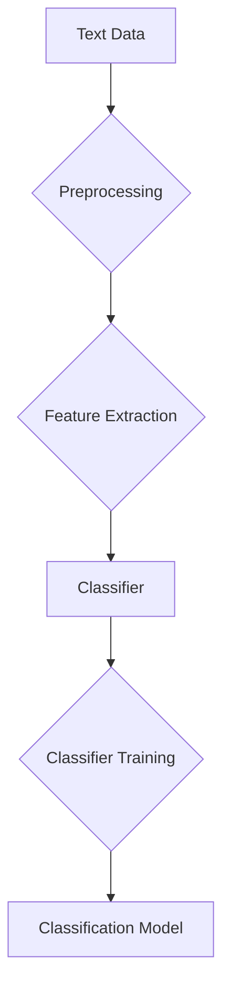

# 💾 Classification

Since this is going to be the last sub-chapter of NLU, we'll keep it short and to the point mostly, not much theoreticals ~~(and _mostly_ also because there's really not much to talk about here ahsdvsjh)~~.

Text classification is the task of assigning a predefined category to a piece of text. It is a fundamental task in NLU with a wide range of applications, including sentiment analysis, spam detection, and topic categorization.

## Flowchart

Various machine learning models can be used for text classification, from simple models like Naive Bayes to more complex models like Transformers.

Typically, in the current modern era of language modelling, the way we perform feature extraction is through the implementation of some deeply-learned language model, "fusing" the extraction into the classifier itself.

The reasoning for this is simple, as we've covered before in [Tokenization](../../fundamentals/tokenization/): Syntax–semantics is too complex to entirely model through hand-made rules.

In this sub-chapter, since the concept itself is fairly straightforward, I'll go over some ways one can more intuitively understand classification in modern NLP contexts.

First things first, to understand what I meant by "straightforward", what _is_ a classifier? Well, the simplest way that one can form a classifier is to tack on a fully-connected layer at the end of their language model.

What makes the FC layer a classifier is then simply that you are training for some form of categorical loss. Usually, _traditionally_, this is cross entropy (CE) or binary cross entropy (BCE). However, depending on the nature of your data, you can also use focal loss, dice loss, or whatever else kind of loss you want to use: as long as it's categorical, it's a classification task.

"Wait a minute, but don't generative tasks use CE?" Exactly. Classification actually generalizes to a lot of different tasks, it's basically just regression but discretized. At the end of a generative transformer network, for example, the FC is something like

$$\text{softmax}(W_{vocab} \cdot h + b)$$

this is effectively just multinomial logistic regression.

When designing a text classifier, what's important here is often the way you _extract_ information from the text, the feature extractor. More concretely, what you have to fully understand is the *why*s behind each architectural choices, the inductive biases of the networks.

Here, let's take a quick step back to what I had before in the [nn.Embedding](../embedding/nnembedding.md) sub-chapter: the CNN semantic classifier model. Neural networks have what we call a "Receptive Field", that is, what the model can effectively process at any given moment given the input.

Look at the demo we have at [this link](https://gemini.google.com/share/24824e92d69f) I had generated w/ Gemini, try hovering over the output to see what the network can see at any given moment. One can determine which architecture to use for feature extraction simply by understanding whether their task inherently requires the inductive bias of the respective architectures.

For example, by restricting the receptive field into neighboring tokens, a CNN-based model can have an edge over others in tasks in which the locality bias is already strong: in my case, it was that n-grams _could_ already effectively capture the semantics of the sequence. _If_, say, I had implemented the model for a generative task, there would be concerns w.r.t _how_ the model would even remember long-term information.

Further, what could affect your decision in architectural design is the practicality of the implementation,

1. Your dataset size:  
   if you don't have as much data, it is important to understand that ;
2. Your inference platform:  
   For example, a CNN is much more easily parallelizable and _lighter_ compared to an RNN or a Transformer network;
3. And... your... "budget":  
   _Obviously_, pretraining a language model is _not_ cheap, at least, for a Transformer-based one it's not. The asymptotic complexity would quickly prove prohibitive if you wanna train on-a-budget.

After choosing your preferred architecture for classification (and kinda because I still wanna have this have something new for you to take home lol), interestingly, there _is_ another way to model classification. You see, by determining which class an input belongs _to_, in theory, what we _can_ do is the opposite: which class belongs to this input?

This is what we call _generative_ classification, where our previous one can now be labelled as _discriminative_ classifiers. For some input $x$, we learn $\text{argmax}_y p_\theta (x|y)p(y)$. What this means is that, for a generative process, conditioned for $y$, the probability of $x$ must be high.

This is somewhat of an old paradigm to be fair, like, 1936-ish old (?), but it mostly fell out of fashion because the modelling back then could not be as complex as it is now, as such was recently re-explored, especially in Li, A. et al (2025) [^1].

In particular, the reason why I wanted to highlight this was that their findings showed that generative models tend to _not_ look for "shortcut" solutions, when you train a generative classifier, the decision boundary is determined by the data distribution itself, it cannot cheat.

(Ik ik, i said not much theory, but I swear this is interesting! 😭)

Assume we have a binary classification task $y \in \{-1, +1\}$.

The input $x$ is made of three parts

$$x = (x_{\text{core}}, x_{\text{spu}}, x_{\text{noise}})$$

these features are generated conditioned on the label $y$:

1. Core feature ($x_{\text{core}}$): this is the "real" signal. it's reliable but has some variance.$$x_{\text{core}} | y \sim \mathcal{N}(y, \sigma^2)$$

2. Spurious feature ($x_{\text{spu}}$): this is a shortcut. it looks like a strong signal (scaled by a large constant $\mathcal{B}$), but it sometimes flips (it's only correlated with probability $\rho$).

$$
x_{\text{spu}} | y =
\begin{cases}
    y\mathcal{B} & \text{with prob } \rho \\
    -y\mathcal{B} & \text{with prob } 1-\rho
\end{cases}
$$

3. Noise ($x_{\text{noise}}$): just random gaussian noise.$$x_{\text{noise}} | y \sim \mathcal{N}(0, \sigma_{\text{noise}}^2)$$

With a discriminative approach (logistic regression), the discriminative model tries to maximize $p(y|x)$.

In this linear setting, it tends to learn the max-margin solution. Because the spurious feature $x_{\text{spu}}$ has a large scale $\mathcal{B}$, using it allows the model to separate the "majority" classes with a massive margin very easily. It gets "lazy" and puts a huge weight ($w_{\text{spu}}$) on the shortcut because it minimizes the training loss fastest.

In contrast, doing it as a generative approach (e.g. here is a linear discriminant analysis, or LDA) assumes the data comes from gaussians. It learns the class means $\mu_{+1}, \mu_{-1}$ and a shared covariance matrix $\Sigma$.

The decision boundary is determined by the weights:

$$w_{\text{LDA}} = \Sigma^{-1}(\mu_{+1} - \mu_{-1})$$

because LDA is trying to model the density of the features ($p(x|y)$) rather than just pushing a decision boundary, it is much more sensitive to the consistency (variance) of the feature.

The core feature $x_{\text{core}}$ is consistently gaussian with variance $\sigma^2$. The spurious feature $x_{\text{spu}}$ is consistent most of the time, but the generative model penalizes features that don't fit the estimated density as cleanly or consistently as the core feature.

So _why_ not do this? Well, simply put: it's too expensive. 🗿 For all the classes, to classify, you have to do a forward pass (or multiple, depending on the generation scheme), which scales your compute linearly w.r.t the number of classes, which is... inefficient.

So really, while it does have its merits, perhaps modelling your next classification model under a discriminative approach may prove to be more beneficial. (Though, who knows? Only one way to find out: empirical evidence~ :3)

Next, you can check out the [Classification notebook](./cls.ipynb) to see how to do this in code, or, move on to the [nlg](../../nlg/) chapter for how to do natural languag generation.

[^1]: Li, A. et al (2025) [Generative Classifiers Avoid Shortcut Solutions](https://arxiv.org/abs/2512.25034v1)
