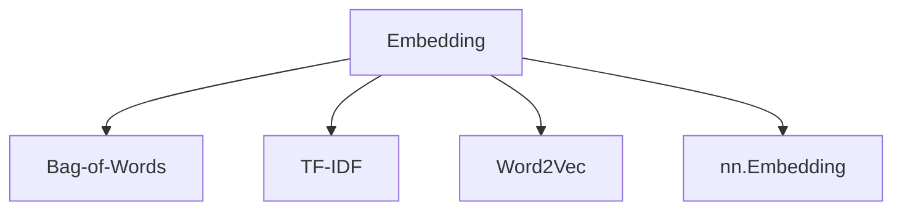

# 💬 Embedding

| Previous Material |           Current           |        Next Material         |
| :---------------: | :-------------------------: | :--------------------------: |
| [◁](../README.md) |    "Embedding Preamble"     |        [▷](./bow.md)         |

Embedding is a technique in NLP where words or phrases from a vocabulary are mapped to vectors of real numbers. This is a fundamental step because machine learning models, especially Neural Networks, because don't understand "text"— they understand numbers.

## The Problem: Sparse Representations (One-Hot)

A common starting point for representing categorical data (like words) is **One-Hot Encoding (OHE)**. In this approach, if our vocabulary has $|V|$ unique words, we represent each word as a $|V|$-dimensional vector that is all zeros, except for a single '1' at the index corresponding to that word.

- vocabulary: `["king", "queen", "apple", "orange"]` ($|V|=4$)
- `"king"` $\rightarrow [1, 0, 0, 0]$
- `"queen"` $\rightarrow [0, 1, 0, 0]$
- `"apple"` $\rightarrow [0, 0, 1, 0]$

This is a _sparse representation_ (i.e., where most of the vector is zeros), and it has two critical problems:

1.  _Computational Inefficiency:_ vocabularies are _huge_. A model like GPT-2 has $|V| \approx 50,000$. This means that for _every, single, word_ in the vocab, we have a 50,000-dimensional vector, which is incredibly wasteful.
2.  _No Semantic Meaning:_ this is the real issue. these vectors are _orthogonal_. Taking the dot product between any pair of these, you get 0.

<!-- prettier-ignore -->
$$ e_{\text{"king"}} \cdot e_{\text{"queen"}} = 0 $$

<!-- prettier-ignore -->
$$ e_{\text{"king"}} \cdot e_{\text{"apple"}} = 0 $$

this tells the model that the word "king" is _exactly_ as related to "queen" as it is to "apple" (i.e., not at all). This is semantically wrong and forces the model to learn all linguistic relationships from scratch, with no help from the input representation.

## The Solution: Dense Representations

Instead of a sparse $|V|$-dimensional vector, we _embed_ each word into a much smaller, **dense** vector in $\mathbb{R}^d$, where $d$ is a hyperparameter (e.g., $d=300$) and $d \ll |V|$.

$$ f : W \rightarrow \mathbb{R}^d $$

Where $W$ is our vocabulary and $f$ is our embedding function. This function $f$ is typically implemented as a simple **lookup table** (in pytorch, this is `nn.Embedding`). this table is just a big matrix of size $(|V|, d)$, where row $i$ is the $d$-dimensional vector for the $i$-th word in the vocab.

These vectors are _learned_. The values (or "weights") in this embedding matrix are initialized randomly and then updated via backpropagation just like any other parameter in the network.

The goal is for the model then to learn vectors such that the _geometry_ of this new $d$-dimensional "embedding space" captures semantic meaning.

- semantically similar words should be _close_ to each other.
- $\cos(e_{\text{"king"}}, e_{\text{"queen"}}) \approx 1$
- $\cos(e_{\text{"apple"}}, e_{\text{"orange"}}) \approx 1$
- $\cos(e_{\text{"king"}}, e_{\text{"apple"}}) \approx 0$

this structure even allows for capturing complex analogies, famously $e_{\text{"king"}} - e_{\text{"man"}} + e_{\text{"woman"}} \approx e_{\text{"queen"}}$, meaning the vector from "man" to "king" is similar to the vector from "woman" to "queen".

## Why Higher Dimensions?

Why does this projection into a higher-dimensional space work? Let's take a brief detour to **Cover's theorem**. [^1] Assume a function of $C(N, d)$ which gives the number of linearly separable sets of $N$ points in dimension $d$,

$${\displaystyle C(N,d)=2\sum _{k=0}^{d-1}{\binom {N-1}{k}}}$$

when $N\leq d+1$, the function is exponential in $N$. What that essentially means is that, _any_ set of points that is not bigger than $d+1$, would be linearly separable.

When $\displaystyle N>d+1$, the function starts growing less than exponential, so for any sample size $N$, in larger dimensionality $d$, it's more probable that a random set is linearly separable. Conversely, when $d$ is fixed but larger $N$, the probability of linear separability will decrease with $N$.

In simple terms: by adding more dimensions, we "untangle" the data and allowing for more probability of linear separability, making it easier to separate with a simple boundary (like a line or a plane).

Let's prove this with an example.

### The Problem in 1D

The the 1D integer ID idea from before, but with a jumbled vocabulary:

- `"king"` $\rightarrow 1$ (Class: Royalty)
- `"apple"` $\rightarrow 2$ (Class: Fruit)
- `"queen"` $\rightarrow 3$ (Class: Royalty)
- `"orange"` $\rightarrow 4$ (Class: Fruit)

if we plot this on a number line, we get:
`R` (at 1) --- `F` (at 2) --- `R` (at 3) --- `F` (at 4)

this data is **not linearly separable**. You cannot pick a single _point_ (a 0d hyperplane in $\mathbb{R}^1$) that cleanly separates all `R` from all `F`. You would need at least two cuts.

### The Solution: Projecting to 2D

Now, let's give our model the power to project this 1d data into 2d. we create an embedding layer $f_\theta : \mathbb{R}^1 \rightarrow \mathbb{R}^2$. Where, let's assume that this is just a lookup table with 4 rows and 2 columns.

Initially, the points are random:

- `"king"` $\rightarrow (0.5, -0.2)$
- `"apple"` $\rightarrow (-0.1, 0.9)$
- `"queen"` $\rightarrow (0.3, 0.1)$
- `"orange"` $\rightarrow (0.8, -0.7)$

as the model trains (e.g., on a task to _classify_ words as royalty or fruit), backpropagation will update these vectors. the loss will be high until the model "learns" to group similar classes together.

After training, the embedding space might look like this:

- `"king"` $\rightarrow (0.9, 0.8)$
- `"queen"` $\rightarrow (0.8, 0.9)$
- `"apple"` $\rightarrow (0.1, 0.2)$
- `"orange"` $\rightarrow (0.2, 0.1)$

Now, the data is **linearly separable**. it's trivial to find a _line_ (a 1d hyperplane in $\mathbb{R}^2$) to divide them.

This separating hyperplane is defined by a normal vector $\mathbf{w} \in \mathbb{R}^d$ and a bias $b \in \mathbb{R}$:

$$ \mathbf{w} \cdot \mathbf{x} + b = 0 $$

For our 2d example, a line like $x_1 + x_2 - 1 = 0$ (so $\mathbf{w} = [1, 1]$ and $b = -1$) would work perfectly. for any word embedding $e_i$:

- **Fruit Cluster:** $e_{\text{apple}} = (0.1, 0.2) \rightarrow (1 \cdot 0.1 + 1 \cdot 0.2) - 1 = -0.7 < 0$
- **Royalty Cluster:** $e_{\text{king}} = (0.9, 0.8) \rightarrow (1 \cdot 0.9 + 1 \cdot 0.8) - 1 = 0.7 > 0$

By projecting from 1d (where the data was tangled) to 2d (or $d=300$), we give the model the "space" it needs to pull the classes apart. This ability to find separating hyperplanes is what allows deep learning models to actually make classifications and understand linguistic structure.

The way that you _get_ these vectors can be "handcrafted" (count-based/algorithmic) or learned (prediction-based/data-driven). both have their advantages. data-driven learned algorithms tend to capture higher-level semantic information, while algorithmic ones tend to only capture statistical co-occurrence.

There are several methods, but in this chapter we'll go over:

Next, you can check out the [**[BoW]**](./bow.md) for the next material.

[^1]: [Cover, Thomas M.. “Geometrical and Statistical Properties of Systems of Linear Inequalities with Applications in Pattern Recognition.” IEEE Trans. Electron. Comput. 14 (1965): 326-334.](https://www.semanticscholar.org/paper/Geometrical-and-Statistical-Properties-of-Systems-Cover/445ad69010658097fc317f7b83f1198179eebae8?p2df)
