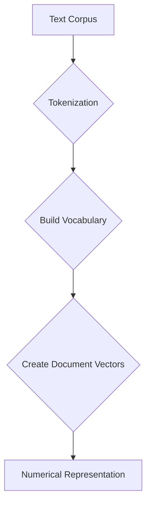

# 👜 Bag-of-Words (BoW)

| Previous Material  |        Current         |     Next Material     |
| :----------------: | :--------------------: | :-------------------: |
| [◁](./README.md)   | "Bag-of-Words (BoW)"   |   [▷](./tfidf.md)     |

So, **Bag-of-Words (BoW)**. This is probably the first and simplest ways you can turn text into numbers for a model to understand. It's a **count-based** method, which is a bit different from the learned embeddings we'll see later.

The name is pretty literal: it imagines you're just... throwing all the words from a document into a "bag." The bag doesn't care about the order you threw them in, it just knows _what's_ in it and _how many_ of each thing.

## The Flow

The whole process is just a few steps: get your text, count your words, and make your vectors.

Let's trace this with a real example.

### How it Works: An Example

Let's say we have a tiny corpus with 3 documents:

- **Doc 1:** "the quick brown fox"
- **Doc 2:** "the lazy dog"
- **Doc 3:** "the quick brown dog"

#### 1. Tokenization

First, we'd [normalize](../../fundamentals/normalization/README.md) (like lowercasing) and [tokenize](../../fundamentals/tokenization/README.md) each document.

- **Doc 1:** `["the", "quick", "brown", "fox"]`
- **Doc 2:** `["the", "lazy", "dog"]`
- **Doc 3:** `["the", "quick", "brown", "dog"]`

#### 2. Build Vocabulary

Next, we build our **vocabulary** ($V$) by finding every _unique_ word across the _entire_ corpus.

- $V = \{$ `"the"`, `"quick"`, `"brown"`, `"fox"`, `"lazy"`, `"dog"` $\}$

The size of our vocabulary is $|V| = 6$. This vocabulary is now our "feature space," and we'll give each word a fixed index:

- `"the"`: 0
- `"quick"`: 1
- `"brown"`: 2
- `"fox"`: 3
- `"lazy"`: 4
- `"dog"`: 5

#### 3. Create Document Vectors

Now, create a vector for _each_ document. Each vector will have a length of $|V|$ (so, 6 dimensions).

To fill the vector, we just go through the document and count the frequency of each word from our vocabulary.

- **Doc 1: `["the", "quick", "brown", "fox"]`**

  - "the": 1, "quick": 1, "brown": 1, "fox": 1, "lazy": 0, "dog": 0
  - **Vector:** `[1, 1, 1, 1, 0, 0]`

- **Doc 2: `["the", "lazy", "dog"]`**

  - "the": 1, "quick": 0, "brown": 0, "fox": 0, "lazy": 1, "dog": 1
  - **Vector:** `[1, 0, 0, 0, 1, 1]`

- **Doc 3: `["the", "quick", "brown", "dog"]`**

  - "the": 1, "quick": 1, "brown": 1, "fox": 0, "lazy": 0, "dog": 1
  - **Vector:** `[1, 1, 1, 0, 0, 1]`

#### 4. Final Representation

...That's it. We've turned our text into numbers. This is usually stored as a **Document-Term Matrix (DTM)**, where rows are documents and columns are words from the vocabulary. So something like:

| Document  | "the" | "quick" | "brown" | "fox" | "lazy" | "dog" |
| :-------- | :---: | :-----: | :-----: | :---: | :----: | :---: |
| Doc 1     |   1   |    1    |    1    |   1   |   0    |   0   |
| Doc 2     |   1   |    0    |    0    |   0   |   1    |   1   |
| Doc 3     |   1   |    1    |    1    |   0   |   0    |   1   |

---

## ⚠️ The Downsides

This model is simple, but that simplicity is also its biggest weakness.

1.  **Sparsity:** as we saw in the [Embedding preamble](./README.md), this is a **sparse representation**. our vocab was tiny ($|V|=6$), but a real vocab can have 50,000+ words. this means almost every document vector will be _mostly zeros_. This is super inefficient to store and process.

2.  **No Word Order:** the "bag" has no idea about grammar or syntax.

    - "dog bites man" $\rightarrow$ `[1, 1, 1]`
    - "man bites dog" $\rightarrow$ `[1, 1, 1]`
    - "the quick brown fox" $\rightarrow$ `[1, 1, 1, 1, 0, 0]`
    - "fox brown quick the" $\rightarrow$ `[1, 1, 1, 1, 0, 0]`

    to a BoW model, these pairs of sentences are _identical_, even though their meanings are totally different.

3.  **No Semantic Meaning:** the model doesn't know _what_ the words mean. it doesn't know that "fox" and "dog" are both animals, or that "quick" and "lazy" are related (opposites). As far as the model is concerned, all words are just independent features.

4.  **The Stopword Problem:** very common words (like "the", "a", "is", "in") will appear in almost _every_ document, giving them high counts. this "biases" the vectors, making documents seem more similar just because they share common filler words, not because their _topics_ are similar.

This last problem is a big one, and it's what the next technique, **TF-IDF**, was specifically designed to solve.

Anyway, you can check out [**[TF-IDF]**](./tfidf.md) for the next material.
