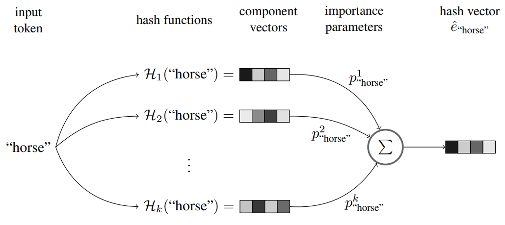

# 🏗️ nn.Embedding

|   Previous Material    |            Current             |            Next Material              |
| :--------------------: | :----------------------------: | :-----------------------------------: |
| [◁](./word2vec.md)     | "nn.Embedding"                 |   [▷](../architectures/README.md)     |

As we've established in the previous sub-chapter on Word2Vec, `nn.Embedding` is essentially a generalization of the concept we've learned: a "learned" embedding layer is simply a dense/linear layer which gets its weights from backprop as part of the first layer to a deep NN. More specifically, an `nn.Embedding` in pytorch (obv this generalizes into other frameworks too, but here we take torch's) simplifies the implementation to take in an array index instead of an OHE vector.

In this sub-chapter, since the concept itself is pretty simple, we'll actually try to dive into more on how the implementation of your embedding layer could affect the convergence, rate and stability, of your model. Maybe even on its inference efficiency.

## Sub-word Embeddings?

Let's take a quick glance back at the SGNS mechanism's objective function,

<!--prettier-ignore-->
$$ J(\theta) = \log \sigma({v'_w}^\top v_c) + \sum_{i=1}^{k}\log \sigma(-{v'_{w_i}}^\top v_c) $$

a problem with this is that, because we use a distinct vectorized representation of _each_ word, a problem that will arise when we use this mechanism in modern LLMs is that this won't be applicable. Recall to the [tokenization](../../fundamentals/tokenization/) chapter: most modern tokenization schemes apply a sub-word tokenization scheme. When we apply the above onto a modern tokenization scheme, each token would be treated as its own separate "word", which... well, breaks the representation, lol.

A way we can try to fix this is to approach it through an extension proposed by Bojanowski et al. (2017) [^1]. The modification is actually pretty simple, replace the scoring function ${v'_w}^\top v_c$ with an n-gram operation.

Given a word $w$, denote $\mathcal{G}_w \sub \{1, \dots, G\}$ the set of n-grams appearing in $w$, we assign each n-gram $g$ a vector representation $z_g$. Each word now can be represented as a summation of its n-grams' vectors, obtaining the scoring function

<!-- prettier-ignore -->
$$ \sum_{g \in\mathcal{G}_w}z_g^\top v_c $$

a problem with this approach, though, is that when you try to represent for _all_ possible n-grams up to $G$, the vocabulary _explodes_, for a 6-char lowercase word, that's already $26^6\approx300\text{ million}$. Bounding this, what you can do is apply a hashing function on the n-gram, so that the number of possible "vocab" can only go up to some number. For example, [^1] does this in FastText to ensure that it can _actually_ be practically implementable. Obviously, when we talk about modern approaches, since the sub-word tokenization also already caps the number of vocabulary, we really don't need to hash to make it "practical".

_However_, even by "capping" the number of possible vocabs, the number of parameters required for such a mapping gets incredibly big fast. Let's take Llama 3 for example, its tokenizer is capped at $\gtrapprox128\text{k}$ words, with its internal embedding dimensions set to $4096$, we see a parameter count of $128\text{k}\times4096\approx524,288,000$, half a billion _just_ for the embedding layer, a billion when we consider the de-embedding layer too (though some nuance whenw e consider weight tying and all, but I digress). As these are effectively parameters in your model, though not really requiring much compute (since these are effectively lookup tables) this becomes pretty much just a VRAM hog with not that much gain for the actual model performance.

## Hashed Embeddings

An approach to "fixing" this is to go back on that hashing idea. A problem with the hashing idea is that, by capping the number of possible values an input can hash to, we risk the possiblity of collision. If collision occurs on inputs which only rarely appears in the data, that's fine, but we can't assume this because we can't (easily) optimize for a hashing function via gradient-based methods: they have a discretized codomain.

An approach that was explored in Svenstrup et al. (2017) [^2] is to do what's called hash embedding.

Here, what we can do is we learn a matrix $E$ of $B$ vectors at dimension $d$, then with $k$ (fixed/unlearned) hashing functions (which each return an index), obtain $k$ vectors from $E$. From there, we can learn an importance matrix $P$ of vocab size $K$ where each row with length $k$ gives importance parameters $p_w$ for each word $w$. We then apply each $p_w$ to each of the $k$ hashes for a weighted aggregation scheme. In the diagram above this is done as a weighted sum.

This approach actually helped convergence and showed conclusively better performance in their paper, _and_ reduced parameter counts several orders of magnitude down. In recent research, Deepseek actually revisited this optimization in their Engram MoE scheme [^3].

## Embeddings Factorization

Another approach you could take in embedding is to factorize the matrix. Used previously in ALBERT. [^4] Instead of learning for $V\times D$ where $V$ is vocab size and $D$ is embedding dimension, we can factorize it down into some hidden $H$, resulting in two matrices $V\times H$ and $H\times D$. This helps because the number of weights that needs to be learned is way lower comparatively ($V\times H + H\times D$) assuming $D\gg H$.

Note that this _does_ enforce a bottleneck constraint, "technically" reducing your capacity. Assuming a matrix $W$ where $W \in \R^{V\times D}$ and $V\gt D$, the maximum possible rank on that matrix is

$$\text{rank}(W)\le H$$

when we factorize it into $W_\text{fac} = E \cdot P$ where $E \in \R^{V\times H}$ and $P \in \R^{H \times D}$, since $\text{rank}(AB) \le \min(\text{rank}(A), \text{rank}(B))$,

$$\text{rank}(W_{\text{fac}}) \le H$$

and since $H \ll D$, we're formally restricting the search space down from the full manifold of $\R^{V\times D}$ into a sub-manifold of matrices with rank at most $H$.

In terms of its practical expressivity though, what we have to understand is that the "expressivity" here can be formalized as an SVD decomposition of $U\Sigma V^T$, where $\Sigma$ contains the singular values $\sigma_1 \ge \sigma_2 \ge \dots \ge \sigma_D \ge 0$ representing how much "energy" or variation exists along each dimension.

When we reduce it down into $H$, we effectively lose the $\sigma_{H+1}, \dots, \sigma_D$ singular values, incurring the error

$$|| W_ - W_{\text{fac}} ||_F^2 \ge \sum_{k=H+1}^{D} \sigma_k^2$$

where $\sigma_k$ denoting the singular values of the "ideal" matrix.

In practice however, as mentioned in the previous sub-chapter, since we rely more on the subsequent layers to do the "contextual" processing part, this loss in expressivity will likely be easily amended for by the further layers.

## Can this really impact convergence?

Obviously, if the above cases haven't convinced you yet, yes. Even in generative cases which is arguably more reliant on the "context" part compared to discriminative cases, we've seen that this kind of choice could significantly affect your convergence rates.

In a recent update to the NanoGPT speedrun [repo that Keller started](https://github.com/KellerJordan/modded-nanogpt), we observed a drop of ~5 seconds for ≤3.28 val loss due to the implementation of a [bigram hash embedding](https://archive.ph/jWtgr) scheme. That may not sound like much, but you have to understand that this is a full-on GPT-2 pretraining scheme on 8xH100 converging within 1.655 minutes (1600 steps), something that used to take a whole 45 minutes at the least.

When designing a model, it's important to consider every component you choose, especially in cases where you want to push or even establish the baselines.

Next, since this is the final sub-chapter in this chapter, you can go to the [notebook](./embedding.ipynb) to see how we can implement the concepts learned, then go to the next chapter on [**[Architectures]**](../architectures/README.md).

[^1]: Bojanowski, P., Grave, E., Joulin, A., & Mikolov, T. (2017). Enriching Word Vectors with Subword Information. Transactions of the Association for Computational Linguistics, 5, 135–146. https://doi.org/10.1162/tacl_a_00051

[^2]: Svenstrup, D., Hansen, J. M., & Winther, O. (2017). "Hash embeddings for efficient word representations." Advances in Neural Information Processing Systems.

[^3]: Chen, B., Dao, T., Xing, E. P., & Ré, C. (2026). Conditional memory via scalable lookup: A new axis of sparsity for sequence modeling.

[^4]: Lan, Z., Chen, M., Goodman, S., Gimpel, K., Sharma, P., & Soricut, R. (2019). ALBERT: A Lite BERT for Self-supervised Learning of Language Representations.
