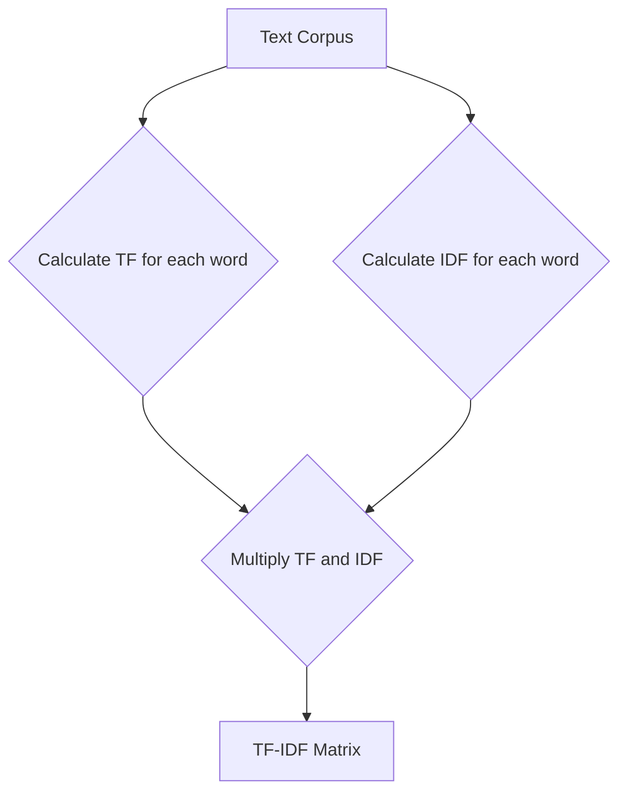

# ⏳ TF-IDF (Term Frequency-Inverse Document Frequency)

| Previous Material |         Current          |     Next Material        |
| :---------------: | :----------------------: | :----------------------: |
| [◁](./bow.md)     | "TF-IDF"                 |   [▷](./word2vec.md)     |

Mmmokay, **TF-IDF (Term Frequency-Inverse Document Frequency)**. This is the logical next step up from what we just did, [Bag-of-Words](./bow.md).

We saw that BoW had a big flaw (specifically, problem #4): common words like "the" get high scores just because they appear a lot, even though they're useless for figuring out a document's _topic_.

tf-idf is a clever way to fix this. It's a statistical approach that tries to find words that are important to _a_ document, but not to the _whole corpus_.

We build this off two simple ideas:

1.  **Term Frequency (TF):** how often a word appears in _one document_. (this is literally just the BoW count).
2.  **Inverse Document Frequency (IDF):** how _rare_ a word is across _all documents_.

the final score is just **TF $\times$ IDF**.

A word gets a high score only if it's common in this doc (high TF) but rare everywhere else (high IDF), which would make it a great "keyword" for that doc.

## The Flow

The process is about the same as BoW, but with one extra step to calculate the IDF weights.

---

To see it working, let's use the exact same corpus from the BoW section.

- **Corpus (D):**
  - **Doc 1:** "the quick brown fox"
  - **Doc 2:** "the lazy dog"
  - **Doc 3:** "the quick brown dog"
- **Vocabulary (V):**
  - $V = \{$ `"the"`, `"quick"`, `"brown"`, `"fox"`, `"lazy"`, `"dog"` $\}$
- **Total Documents (N):** 3

#### 1. Calculate TF (Term Frequency)

this is identical to BoW. it's just the count of each word in each document.

| Document  | "the" | "quick" | "brown" | "fox" | "lazy" | "dog" |
| :-------- | :---: | :-----: | :-----: | :---: | :----: | :---: |
| Doc 1     |   1   |    1    |    1    |   1   |   0    |   0   |
| Doc 2     |   1   |    0    |    0    |   0   |   1    |   1   |
| Doc 3     |   1   |    1    |    1    |   0   |   0    |   1   |

#### 2. Calculate IDF (Inverse Document Frequency)

This is the new term, we calculate this _once_ for each word in the _entire vocabulary_.

The formula is:
$\text{idf}(t) = \log\left(\frac{\text{Total number of documents } (N)}{\text{Number of documents containing term } t}\right)$

(assume that we're using the natural log, $\ln$, here)

- **"the"**: appears in 3 docs. $\rightarrow idf = \ln(3/3) = \ln(1) = 0$
- **"quick"**: appears in 2 docs. $\rightarrow idf = \ln(3/2) \approx 0.405$
- **"brown"**: appears in 2 docs. $\rightarrow idf = \ln(3/2) \approx 0.405$
- **"fox"**: appears in 1 doc. $\rightarrow idf = \ln(3/1) \approx 1.099$
- **"lazy"**: appears in 1 doc. $\rightarrow idf = \ln(3/1) \approx 1.099$
- **"dog"**: appears in 2 docs. $\rightarrow idf = \ln(3/2) \approx 0.405$

As you can see, the word `"the"`, which is in every document, gets a weight of **0**, it's been completely nullified. But `"fox"` and `"lazy"`, which are unique to their documents, get a _super high_ score.

#### 3. Calculate Final TF-IDF Matrix

now we just multiply our TF matrix (from step 1) by our IDF values (from step 2), element-by-element.

$\text{tfidf}(t, d) = \text{tf}(t, d) \times \text{idf}(t)$

- **Doc 1: `[1, 1, 1, 1, 0, 0]` (TF)**

  - `tf-idf = [1*0, 1*0.405, 1*0.405, 1*1.099, 0*1.099, 0*0.405]`
  - **Vector 1:** `[0, 0.405, 0.405, 1.099, 0, 0]`

- **Doc 2: `[1, 0, 0, 0, 1, 1]` (TF)**

  - `tf-idf = [1*0, 0*0.405, 0*0.405, 0*1.099, 1*1.099, 1*0.405]`
  - **Vector 2:** `[0, 0, 0, 0, 1.099, 0.405]`

- **Doc 3: `[1, 1, 1, 0, 0, 1]` (TF)**

  - `tf-idf = [1*0, 1*0.405, 1*0.405, 0*1.099, 0*1.099, 1*0.405]`
  - **Vector 3:** `[0, 0.405, 0.405, 0, 0, 0.405]`

#### 4. Final Representation

Here's our final matrix. It does a _much_ better job of representing the "topic" of each document.

| Document  | "the" | "quick" | "brown" |  "fox"  | "lazy"  | "dog"  |
| :-------- | :---: | :-----: | :-----: | :-----: | :-----: | :----: |
| Doc 1     |   0   |  0.405  |  0.405  |  1.099  |   0     |  0.405 |
| Doc 2     |   0   |   0     |   0     |   0     |  1.099  |  0.405 |
| Doc 3     |   0   |  0.405  |  0.405  |   0     |   0     |  0.405 |

you can clearly see doc 1 is about the "fox", doc 2 is about the "lazy", and doc 3 is a mix of "quick", "brown", and "dog".

After all this, a common final step is to apply **L2 normalization** to each document vector. This scales the vector so its length is 1. It helps prevent documents from having higher scores just because they're longer.

## ⚠️ The (Remaining) Downsides

tf-idf is a _huge_ improvement... but it's still just a clever counting method. It fixes the "stopword problem" (#4), but all the other problems from BoW are still here:

1.  **Sparsity:** this is still a massive, mostly-zero vector.
2.  **No Word Order:** "dog bites man" and "man bites dog" are _still_ identical.
3.  **No Semantic Meaning:** the model _still_ doesn't know that "fox" and "dog" are related (both animals). their vectors aren't "close" in any way. it also can't handle synonyms (e.g., "pup" and "doggo" would be treated as completely different, unrelated words to "dog").

To solve _these_ problems, we have to move _away_ from just "counting" and into the world of **learned embeddings**.

Next, check out the [**[Word2Vec]**](./word2vec.md) for our first learned embedding mechanism.
