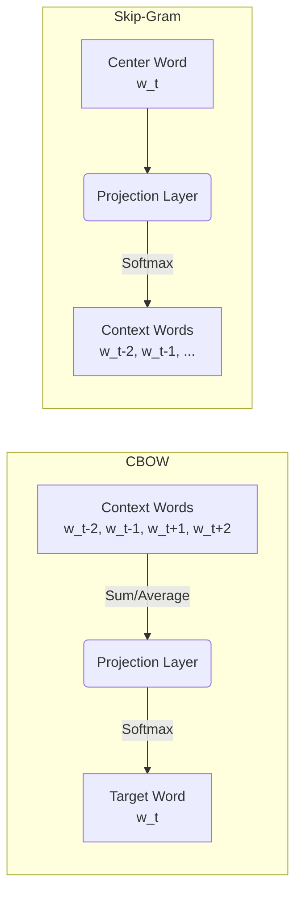
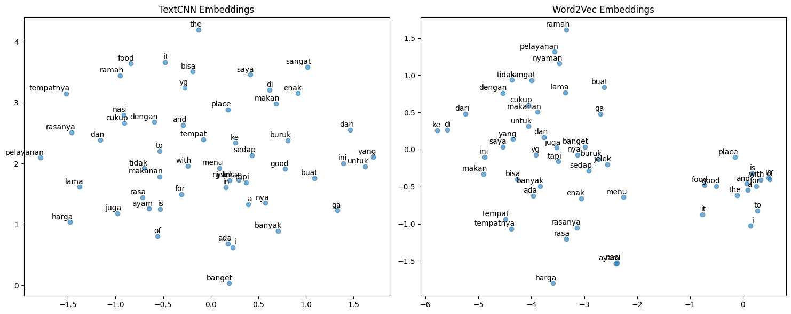
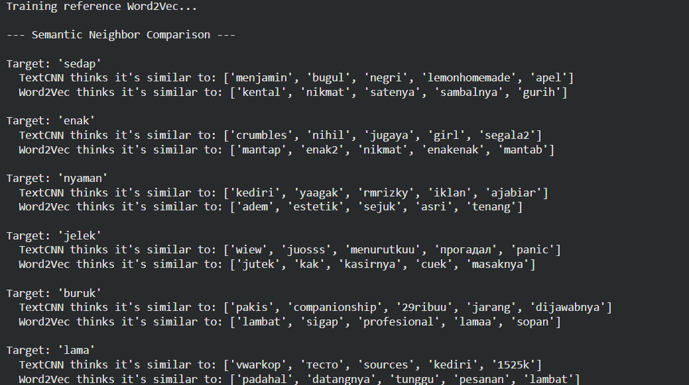
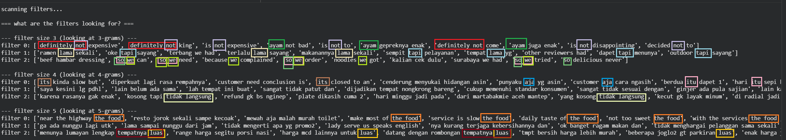

# 🗻 Word2Vec

|  Previous Material  |          Current           |       Next Material         |
| :-----------------: | :------------------------: | :-------------------------: |
| [◁](./tfidf.md)     | "Word2Vec"                 |   [▷](./nnembedding.md)     |

Word2Vec is a popular technique for learning word embeddings. The way it does this is a departure from what we've learned thus far, it does dense embeddings, as opposed to sparse embeddings. As we've explored in the [preamble](./README.md#the-solution-dense-representations), dense embeddings allow for the mapping of vocabulary into a higher dimensional space, putting them onto a low dimensional manifold within that higher dimensional latent space.

The way we can intuit this is by understanding how most information in linguistics
will not be directly orthogonal with one another, this is probabilistically-impossible to model.

> (While from a strictly information-theoretic POV we'd want the opposite (where all information is directly orthogonal), but I digress, we'll discuss this further in future chapters and down below)

First, let's try intuiting this by trying to represent all unique words within a given corpus each as vectors within a space $\R^d$ where $d$ is the number of dimensions. In this perspective, in order to ensure that a set $X$ of $N$ samples are represented as _a_ (unique) vector, we would need to ensure that for every $x_i$ and $x_j$ it's $||f(x_i)-f(x_j)||^2=||x_i-x_j||^2$, where $f$ is a mapping $f:\R^d \rightarrow \R^n$. What this means is that every point, each is represented as an orthogonal vector, where they exist on their own separate dimensions, in order to ensure that the distances are preserved perfectly.

This is... not ideal. And impractical. What one has to understand is that, when we're modelling linguistics, concepts are intertwined with one another and _cannot_ be modelled as simply independent indices.

Say we had $V$ words, and we wanted to learn a joint probability distribution $P$ which models a sequence of $L$ words, $P(w_1, \dots, w_L)$. As each word in $V$ is represented as an independent vector, we can model this as a multinoulli problem where for some $K$ possible sequences, we have to model a probability parameter $\theta_i$ for every sequence ($i \in \{1,\dots,K\}$) where, as every position there could be any of the words, it becomes $K=|V|^L$.

We're gonna get a bit math-heavy real quick, and this is not entirely necessary for u to understand, so [u can skip if you want.](#skiptonoogmygodimdyingmath)

We want to estimate the probability distribution $p=(p_1, \dots, p_K)$ such that $$E[||\hat{p} - p||_1]<\epsilon$$, where $\epsilon$ is our target error rate.

To figure out a lower bound $n$ of sample complexity, we can utilize a hypercube perturbation setup, where, starting from a uniform distribution $1/K$ for each sequence, we divide the sequences into $K/2$ pairs.

For each pair of $(2i, 2i+1)$, we obtain $z_i \in \{-1, +1\}$, where $\delta$ is a perturbation parameter $\delta \in [0, 1)$ we obtain a new distribution:

$$p_j = \frac{1}{K} \left( 1 + (-1)^{j} z_{\lfloor j/2 \rfloor} \delta \right)$$

From this, we now have a family of $2^{K/2}$ possible distributions. If we flip one $z_i$ the $L_1$ distance becomes

$$| \frac{1}{K}(1+\delta) - \frac{1}{K}(1-\delta) | = \frac{2\delta}{K}$$

for both odd and even indices, thus obtaining

$$\alpha = \frac{4\delta}{K}$$

for any one bit.

Using the approximation  
$$KL(p || q) \approx \chi^2(p || q) = \sum \frac{(p_i - q_i)^2}{q_i}\text{\qquad(Pearson's chi-squared divergence)}$$
we can substitute, thus roughly (assuming $\delta$ is small such that the denominator is roughly $1/K$),
$$KL(p || q) \approx \sum \frac{(p_i - q_i)^2}{q_i} \approx = 2 \cdot \frac{4\delta^2/K^2}{1/K} \approx \frac{8\delta^2}{K}$$

From here, we can apply a lemma known as Assouad's Lemma, where I'm gonna skip a bit of the definition here as it feels a bit out of scope (usually the statement looks something along the lines of $\inf_{\hat{\theta}} \sup_{\theta} \mathbb{E}[w(\hat{\theta}, \theta)] \ge \frac{m}{2} \cdot \min_{H(\theta, \theta')=1} \frac{\ell(\theta, \theta')}{2} \cdot \left(1 - \|\mathbb{P}_{\theta} - \mathbb{P}_{\theta'}\|_{TV}\right)$ lol, so many supremums and infinimums, mums... 🗿 we'll assume Pinsker’s Inequality here, where $TV \le \sqrt{\frac{1}{2} KL}$), but simply put,

> You cannot distinguish two distributions with probability $> 2/3$ unless you have enough samples to make the total KL divergence large (specifically, close to 1 bit).

As such, the minimax risk (basically the best performance the best estimator could get in the worst-case scenario) is bounded by

$$\text{Risk} \geq \frac{K}{2} \cdot \frac{\alpha}{2} \cdot (1 - \text{TV})$$

where $\text{TV} \le \frac{2}{3}$, thus

$$\text{Risk} \ge \frac{K}{2} \cdot \frac{\alpha}{2} \cdot \mathbf{\frac{1}{3}}$$

substituting,

$$
\begin{aligned}
\epsilon & \ge \frac{K}{2} \cdot \frac{1}{2} \left( \frac{4\delta}{K} \right) \cdot \frac{1}{3} \\
\epsilon & \ge \frac{K \cdot 4\delta}{2 \cdot 2 \cdot K \cdot 3} \\
\epsilon & \ge \frac{4\delta}{12} \\
\epsilon & \ge \frac{1}{3} \delta
\end{aligned}
$$

such,

$$\epsilon \gtrsim \delta$$

Assume that we constrain $n$ to be small enough that we can't distinguish the bits (to ensure the problem is "hard") such that $n \cdot KL \le c$,

$$\frac{n \delta^2}{K} \le c \implies \delta \approx \sqrt{\frac{K}{n}}$$

Substituting back,

$$\epsilon \gtrsim \sqrt{\frac{K}{n}}$$

rearranging for $n$, we get

$$
\begin{aligned}
n \gtrsim \frac{K}{\epsilon^2} \\
n \gtrsim \frac{|V|^L}{\epsilon^2} \\
\end{aligned}
$$

In practice, the number of samples needed becomes $N \propto |V|^L$, this is just-- impossible, no way you have that many samples lol.

Thus, what to do? We'll actually revisit this lemma again in a future chapter, so do keep it in mind, but the way we can view this is from a mathematical lemma known as the Johnson-Lindenstrauss (JL) lemma:

> "... a set of points in a high-dimensional space can be embedded into a space of much lower dimension in such a way that distances between the points are nearly preserved."  
> (this is from the wikipedia page, but gist of it works out so ygwim)

Under this lemma, what we can actually do is that we can achieve quasi-orthogonality, we can pack a large $|V|$ with a surprisingly small $d$, by assuming that we don't have to have "true" orthogonality. Assume that we allow some amount of error $0 < \epsilon < 1$, the lemma asserts that there exists some number $k \gtrapprox \frac{8\ln(|V|)}{\epsilon^2}$ (in most notations $|V|$ here is $N$, but I denoted it as such to not clash) such that the linear map $f : \R^d\rightarrow \R^k$ is

$$ (1+\epsilon)^{-1}\|f(x_i)-f(x_j)\|^{2} \leq\|x_i-x_j\|^{2} \leq(1-\epsilon)^{-1}\|f(x_i)-f(x_j)\|^{2} $$

> Side note random tangent, but this actually implies that, any random projection on a high-dimensional i.i.d distribution could effectively roughly preserve the structure. Though there are definitely caveats w.r.t the manifold structure.

Say that $k = d$, the lower bound becomes

$$d \approx \frac{8 \ln(|V|))}{\epsilon^2}$$

rearranging for $|V|$,

$$
\begin{aligned}
d \cdot \epsilon^2 &\approx 8 \ln(|V|) \\
\frac{d \cdot \epsilon^2}{8} &\approx \ln(|V|) \\
|V| &\approx e^{ \frac{\epsilon^2}{8} \cdot d }
\end{aligned}
$$

Assume that the $\frac{\epsilon^2}{8}$ is a constant $c$, we see that the number of words we can "pack" into this space boils down to roughly exponential,

$$|V|\approx e^d$$

This solves our curse of dimensionality. Instead of the space complexity exploding with the vocabulary size (like in the one-hot/sparse case), we can represent a massive vocabulary in a logarithmic amount of space ($d \propto \ln |V|$), while still keeping the vector for 'cat' distinct from 'car' (or 'dog', or whatever).

So above is the background to why we'd wanna do dense embeddings. In practice, this approach has been explored in the past by a waaay older work, mostly attributed to the one from Bengio et al. (2003) [^1], but here, we'll go over Word2Vec's approach to it because for the most part it's made the procedure efficient and more practical.

## The Flow

In Word2Vec, the "neural network" is actually quite simple: a shallow, two-layer neural network. We aren't actually interested in the _output_ of the network (which is just a classification task), but rather the **weights** of the hidden layer. These weights become our word embeddings.

The architecture comes in two flavors, depending on how you frame the prediction problem:

1.  **Continuous Bag-of-Words (CBOW):** You take the context words (surrounding words) and try to predict the _center_ (target) word. It smooths over the distributional information of the context.
2.  **Skip-Gram:** You take the _center_ word and try to predict the _context_ words. This is generally better for infrequent words because it treats each context-target pair as a new observation.

Here is how the flow looks for both:

## How to Do?

So, how do we actually train this efficiently?

If we were to use a standard Softmax function at the output layer to predict the probability of a word $w_O$ given a context $w_I$, it would look like this:

<!-- prettier-ignore -->
$$ P(w_O | w_I) = \frac{\exp({v'{w_O}}^\top v{w_I})}{\sum_{w=1}^{|V|} \exp({v'w}^\top v{w_I})} $$

See that denominator? That's a summation over the _entire_ vocabulary $|V|$. If you have 1 million words, you are calculating 1 million dot products _per training sample_.

That is computationally incredibly expensive (roughly $O(|V|)$). To solve this Word2Vec's authors, Mikolov et al., implemented Negative Sampling (NEG), which is a simplified version of Noise Contrastive Estimation (NCE).

Instead of trying to predict the exact word out of $|V|$ classes (a massive multi-class classification problem), we turn it into a binary classification problem. Is this pair of words $(w, c)$ a "real" pair from the text ($y=1$) or is it a "noise" pair we just randomly sampled? ($y=0$)

We want to maximize the probability that real words are identified as real, and random noise words are identified as noise.

The objective function for a specific word pair $(w, c)$ changes from the expensive Softmax to:

<!-- prettier-ignore -->
$$ J(\theta) = \log \sigma({v'_w}^\top v_c) + \sum_{i=1}^{k}\log \sigma(-{v'_{w_i}}^\top v_c) $$

where $\sigma$ denotes a sigmoid function and $v_c$ denotes the center word and $v_w$ the context words. Specifically, this is in t this objective, the first term maximizes the probability of the true pair and the second minimizes the probability of the negative samples (random noise words $w_i$), with $k$ the number of negative samples (usually 5-20).

By doing this, we only update the weights for the positive example and the small handful of negative examples (roughly $O(k)$), rather than the entire vocabulary. This makes training linear with the number of negative samples, rather than the vocabulary size.

> Note: Another crucial trick in Word2Vec is Subsampling of Frequent Words. Words like "the" or "a" occur millions of times but provide less information than rare words. Word2Vec aggressively discards words $w_i$ with probability $P(w_i) = 1 - \sqrt{\frac{t}{f(w_i)}}$, where $f(w_i)$ is the word frequency and $t$ is a threshold (e.g., $10^{-5}$). This improves the learning of rare words and creates a cleaner embedding space. [^2]

Specifically, what we went over up there is how Skip-Gram does it (SGNS, which would often be better due to it not requiring "compacting" the input window context down, but I digress). In CBOW, the loss scheme is still the same, but $\hat{v}$ denoting average/sum of context word vecs is used instead of $v_c$ and $v'_w$ would be $v'_c$ for the center word instead.

Once trained, we simply discard the output layer and keep the projection weights.

Though this worked, in practice, we might not want the latent space shape which this scheme forms. You may have seen that `king - man + woman = queen` example being thrown around a lot whenever we talk about dense embeddings, and that _is_ true in these "isolated" contexts. However, in practice, most models, e.g. LLMs, don't work with these assumptions.

Let's take a simple case, here's [an encoder model based on a CNN trained for sentiment classification](https://colab.research.google.com/drive/1Zp1qi3owP51ehuzNBTl8IOD3OfvWp4tu?usp=sharing) (note that this is overly-simplified, but the intuition generalizes). Here's how it looks like:

Essentially, each of the convolution layers run n-gram processing where n corresponds to the filter's size (of 3, 4, 5). This was trained on a dataset of Google Maps reviews scraped for the purpose of KCV lab's internal admin selection, where sampled for plotting are 50 most common words in the dataset, along with `['sedap', 'enak', 'nyaman', 'jelek', 'buruk', 'lama'] ` for a semantically-contrastive comparison.

Reduced into a 2-component T-SNE space, we see that the TextCNN has an embedding space which is much more normally distributed:

Where, in comparison, the Word2Vec model has this clustering behaviour which places the words near one another w.r.t more context-driven clues (i.e., see how the right cluster all has English words, while the left are all Indonesian, with the adjectives near others with similar semantical meaning).

The reasoning behind this is actually not that hard to understand: once we allow for processing by further layers down the line, there is no need for the first representation to be perfect, we rely on the inductive bias of the network's architecture to do the heavy lifting.

When we rely on the inductive bias, the embeddings simply become a "tool" that will later on be leveraged in task-specific processing. For example, in this case, let's try checking which (n-gram) sentences triggered, it looks like this:

See the highlighted parts? These are common grammatical features which activated each filter. _Grammatical_, which means that the "feature" extracted are essentially now entirely reliant on the convolution operation learned: it offloaded the "semantic" extraction to the multiplication that's done by the convolutional layers, thus "meaning" is now only relevant "contextually".

To see further how these behave in those more complex cases, we can move on to the [next chapter](./nnembedding.md) to see how we generalize this concept further in `nn.Embedding`.

[^1]: Bengio, Y., Ducharme, R., Vincent, P., & Janvin, C. (2003). A neural probabilistic language model. Journal of Machine Learning Research, 3(Mar), 1137-1155.

[^2]: Mikolov, T., Sutskever, I., Chen, K., Corrado, G. S., & Dean, J. (2013). Distributed representations of words and phrases and their compositionality. Advances in neural information processing systems, 26.
